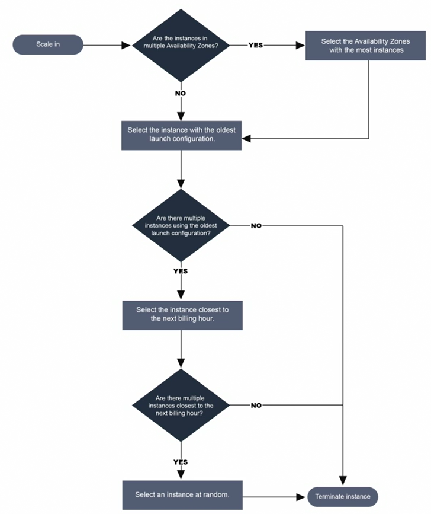

# 1. Introduction

* **IaaS**: Infrastructure as a Service: every server (**`EC2`**, **`VPC`**, **`RDS`**, **`S3`**) is in the cloud, but platform and software run on others' servers
* **PaaS**: Platform as a Service, applications, such as web hosting, **`Elastic Beanstalk`** or **`Lightsail`** 
* **SaaS**: Software as a Service, you use the software developed by others from the cloud, such as Gmail
* **FaaS**: Function as a Service (**`Lambda`**)
* **DaaS**: Desktop as a Service such as Windows or Linux, provide by **`WorkSpaces`**.

 Three different ways to access AWS:

 1. Programmatic, using the `aws` CLI (Command Line Interface)
 2. Using the Console ([https://rnietoe.signin.aws.amazon.com/console](https://rnietoe.signin.aws.amazon.com/console))
 3. Using SDK 

The three types of cloud deployments are:

* Public
* Hybrid
* On-premise

Traditional Computing VS Cloud Computing

* Build your systems to be scalable, use disposable resources, reduce infrastructure to code, and assume EVERYTHING will fail sooner or later.
* resiliency: capacity to recover quickly from difficulties
* **Scale Up** / Vertical Scaling: increase RAM, CPU
* **Scale Out** / Horizontal Scaling: adding EC2 isntances behind a ELB
* **Scale In**: removing instances based on oldest instances or configuration or close to the next billing hour:
    
    
* **Scale Down**. decrease the class of EC2 or RDS to a lower power
    
Global services (for every region):

* IAM
* Route53
* CloudFront
* SNS (Simple Notify Service)
* SES (Simple Email Service)

Regional Services with global view

* S3

Caching services:

* CloudFront
* API Gateway
* ElastiCache
* DynamoDB Accelerator (DAX)

High-level AWS service used on premises:

* DMS (Database **Migrations** Service) is the best choice for conventional database migrations to AWS.
    * homogenous: sample of Oracle to Oracle
    * heterogenous with **SCT** (Schema Conversion Tool): sample of SQL Server to Aurora
* SMS (Server **Migration** Service)
* Application Discovery Service: collect information about their on premises data centers. Data is available in the AWS **Migration** Hub
* **AWS DataSync** is used to move large amounts of data from on-premise to AWS S3, EFS, FSx, etc.
* VM import/export
* Download Amazon Linux 2 as an ISO

AWS Service used on premise:

* AWS Snow Family:
    * **Snowball** - to upload 50TB (200$) or 80TB (250$) to AWS in a week instead of three months. This allow S3 imports/exports
    * **Snowball Edge** - Local compute and storage only till 100TB
    * **Snowmobile** - a track with 100PB
    * First 10 days are free. 15$ per day later
    * Data transfer to S3 is free. Data transfer out is charged
* CodeDeploy - include applications
* Opsworks - include applications
* IoT greengrass

## Overview

* **Availability Zone** (AZ) is one or more data centers. AZs are randomized by AWS (us-east-1 can be different AZ for different accounts). 
* **Region** is a distinct location within a geographical area with 2 or more AZ, designed to provide high availability to a specific geography. Choosen by law, latency and AWS Services

    !!!info "US East (N. Virginia) us-east-1 was the first region and all new services are deployed here first" 

* **Edge Locations (edge areas)** are Amazon's **CDN** (Content Delivery Network) end points. Objects are cached for 48 hours by default (**TTL** - Time To Live). This not just read only. Types:
    * **Web Distribution** (websites)
    * **RTMD** (media streaming) - Discontinued support by CloudFront on December 31, 2020"

    !!!danger "Number of Edge Locations > Number of AZs > Number of Regions"

## CloudFront

**`AWS CloudFront`** distribution is a collection of Edge Locations. CloudFront content is **cached** in Edge Locations. This allows you to distribute content using a worldwide network of edge locations that provide low latency and high data transfer speeds. 

* From `AwS CloudFront` select `Create Distribution`
* The CloudFront origin can be an S3 bucket, an EC2 instance, an ELB or Route53.
* We can restrict viewer access using signed URLs for individual files or signed cookies for multiple files. Netflix or CloudGuru samples. 
    * **OAI** - Origin Access Identity
        * If the origin is EC2 then use CloudFront Signed url 
        * If the origin is S3 then use S3 signed url 
* We can `create invalidations` to remove origin objets on the edge location
* To delete a CloudFront distribution, you have to disable it first. This process takes 15 minutes	
* Pricing depends on:
    * traffic distribution
    * requests
    * data transfer out

!!!danger "We will be charged when deleting cached data from an edge location"
    
## Resource Groups and Tag Editor

* **Tags** allow to find AWS resources in a selected region, but it can not directly managing those resources. This can make it easier to search for and filter resources by purpose, owner, environment, or other criteria.

* **Resources groups** allow to execute operations from **`AWS Systems Manager`** to different resources (such as a EC2 fleet) based on resources groups
