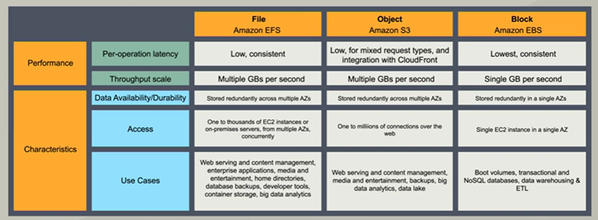

# 2. Storage



## S3

**`AWS S3`** (Simple Storage Service) is **object-based** for the safe storage of **flat files** such as text files, videos, pictures and any other flat file from 0 to 5 tb. The object has a key (filename), value (data), versionID, metadata, encryption, and security by **ACL** (Access Control Lists), torrent and Bucket Policies 

!!!info "Objects stored in S3 (no One Zone) are stored across at least three AZs"

**Buckets** are folders/containers for everything that you store in S3. S3 bucket names are **global**, and must be unique, but they are create in a region. Universal namespaces are like https://s3-region_name.amazonaws.com/bucket_name. 

* The response code is http 200 when file upload succeeds.
* Contact AWS to create more than 100 buckets
* minimum object size is 0 kb
* an object can have up to 10 tags

Both Virtual-host-Style (such as: https://bucket-name.s3.Region.amazonaws.com/key name) and Path-Style (such as https://s3.Region.amazonaws.com/bucket-name/key name) URLs are supported, but path-style URLs (soon to be retired) will be eventually depreciated in favor of virtual hosted-style URLs for S3 bucket access. DNS compliant names are also recommended.

!!!danger "Objetcs have eventual consistency: Create new files are read inmediately. Updates and deletes takes a little bit of time to propagate."

Many other services can store data in S3, including Kinesis Firehose, Storage Gateway and the AWS API

The S3 API is based in **REST** (Representational State Transfer) which uses CRUD methods

S3 classes order by pricing:

1. **S3 Standard**: Frequently accessed data. Availability of 99.99%
2. **S3 Standard - IA** (Infrequently Accessed). Availability of 99.9%
3. **S3 One Zone - IA** (when multiple AZ not required) . costs is 20% less than S3 Standard-IA
4. **S3 RRS** (Reduce Redundancy Storage). Availability of 99.5%. RRS is the only S3 Class that does not offer 99.999999999% **durability**. 
5.  **S3 Glacier** (low cost storage. Retrieval times from 3 minutes to 12 hours). archives stored in vaults(as buckets) with AES 256-bit encryption
    * Expedited access within 3-5 min
    * Standard access within 3-5 hours
    * Bulk access within 5-12 hours
    * Up to 5% retrieved at no change
    * **S3 Glacier Vault Lock Policy**: compliance controls for S3 Glacier with a Vault Lock policy. The policy can no longer be changed
    * Only empty vaults can be deleted
6. **S3 Glacier Deep Archive** (lowest-cost. Retrieval time of 12 hours is acceptable)

Enhanced features:

* **S3 - Intelligent Tiering**, using machine learning to move files to the most cost-effective access tier. It does not make sense to use S3 standard. Instead, use S3 - Intelligent Tiering to save money
* **S3 Batch Operations** create jobs to enable automatic actions
* **S3 on Outposts** store customer data generated on-premises before moving it to an AWS Region.
* **S3 Objetc lock** use **WORM** model (objects are Written Once and Read Many) during bucket creation. Objects (the whole bucket or individual files) became unmodificable and undeletable:

* Governance mode: some users are grant with permissions to alter settings or delete the object version
* Compliance mode: objects version cannot be modified or deleted, even by the root user

More features:

* Unlimited storage
* We can use the bucket to host a **static website** using S3 with option `static website hosting` enabled, with index.html and error.html. Dynamic website can not be hosted on S3.
* Encryption:
    * Encryption in Transit, using https (SSL/TLS)
    * Encryption at Rest:
        * In the server side - SSE (Server Side Encryption - 256-bit AES encryption - storage encryption, no transit encryption):
            * **SSE-S3**: An encryption key that Amazon S3 creates, manages, and uses for you.
            * **SSE-KMS**: An encryption key protected by AWS Key Managament Service
            * **SSE-C** with customer provided keys
        * In the client side - encrypted before uploading with a client library such as Amazon S3 Encryption Client.
* Versioning (disabled by default):
    * usefull as backup tool
    * **MFA Delete** setting: an additional layer of security that requires MFA for changing Bucket Versioning settings and permanently deleting object versions. To modify MFA delete settings, use the AWS CLI, AWS SDK, or the Amazon S3 REST API.
    * Versioning cannot be disabled once enabled
    * Uploaded new verions are **private** by default
    * Deleting a file create a new version (**deleted marker**), then restoring the file recovers all previous versions.
    * Integrated with lifecycle rules
* Use **S3 Lifecycle rules** to define actions you want AWS S3 to take during an object's lifetime such as **transitioning** objects to another storage class, archiving them, or deleting them after a specified period of time.
* **S3 Transfer Acceleration** takes advantage of Amazon CloudFront (edge location distribution) using Amazon internal network (no internet). It enables fast, easy and secure transfers of files to and from your bucket.

    * [Speed Comparison Tool](https://s3-accelerate-speedtest.s3-accelerate.amazonaws.com/en/accelerate-speed-comparsion.html)

* **Cross Region Replication**: replicate a bucket from a region to another:

    * From S3 Management tab, select `Create replication rule`
    * Create a new role and select the source bucket and destination bucket. Replicated buckets can be in different AWS accounts
    * Replication requires versioning to be enable on the source and destionation buckets.
    * we can change the storage class for the replicated objetcs

    !!!danger "replication starts when files are added and updated later. Deletes, permissions and previous versions are not replicated"

* **Multipart uploads** use multithreading to upload large files to S3 buckets **in parallel** (the parts of the file are uploaded in parallel). Recommended for > 100mb and required for > 5Gb
    * begin an upload before you know the final object size
    * quick recovery from network issues
    * improved throughput
    * allow pause and resume object uploads.
* [General S3 FAQs](https://aws.amazon.com/s3/faqs/)

To upload a file larger than 160 GB, use the AWS CLI, AWS SDK, or Amazon S3 REST API.

S3 Event notifications:

* Object Created
* Object Removed
* Object Restored
* RRS Object Lost
* Replication

[S3 Pricing](https://aws.amazon.com/s3/pricing/) depends on:

* Storage class
* Storage
* Requests
* Data transfer
* Transfer acceleration
* Cross region replication

S3 Security:

* managed in the AWS console and the AWS CLI
* Uploaded files are **private** by default
* When editing S3 bucket permissions (policies and ACLs), the concept of the **resource owner** refers to he AWS account that creates Amazon S3 buckets and objects.
* **Bucket ACLs**: Object policies applies to an individual file.
* **Bucket policies** applies to the entire bucket - like one hosting a static S3 website 
    * public sample:
    ```json
    {
        "Version": "2020-09-08", // identify the document structure
        "Statement": [
            {
                "Sid": "PublicReadGetObject", // statement id
                "Effect": "Allow", // allow | deny
                "Principal": "*",
                "Action": [
                    "s3:GetObject"
                ],
                "Resource": [
                    "arn:aws:s3:::BUCKET_NAME/*" 
                ]
            }
        ]
    }
    ```

S3 Performance:

* Use **prefixes** and **delimiters** to improve performance: path between the bucket and file
* Use SSE-KMS have limitations
* Use **Multipart uploads** 
* Use downloads with **S3 Byte-Range Fetches**
* Use **S3 Select**/**Glacier Select** using SQL to download only the subset of data we need from ZIP or CSV files 

## EFS

**`AWS EFS`** (Elastic File System) is a mountable **file** storage service for EC2 (**linux**), like a NAS (Network Attached Storage - **shared folder**), based on **NFSv4** (Network File System), but has no connection to S3 which is an **object** storage service.

* EFS is **shareable**. 
* there is folder hierarchy 
* no supported on windows instances
* Data is stored across multiple AZ's within a region

### How to create an EFS **shared** by two EC2 instances

1. `Create file system` from AWS EFS
2. Create EC2 instances with following user data: 

    ```shell
    #!/bin/bash
    yum update -y
    yum install httpd -y
    service httpd start
    chkconfig httpd on
    yum install amazon-efs-utils -y
    ```

3. default SG require inbound rule of type NFSv4 (port 2049) with source SG WebDMZ
4. connect to the EC2 instances, and then mount EFS using the command from `EFS - Amazon EC2 mount instructions from local VPC`:

    ```shell
    cd /var/www/html
    cd ..
    mount -t efs -o tls fs-9816b269:/ /var/www/html  
    cd html
    echo "<html><body><h1>using EFS</h1></body></html>" > index.html
    ```

## EBS

**`AWS EBS`** (Elastic Block Storage) is like a virtual hard disk in the cloud. This is a **block** service used for **durable** storage in EC2 instances and again has no connection to S3.

* EBS cannot be shared by two EC2 instances
* EBS volume can be attached to any EC2 instance in the same AZ
* EBS volume attached as an additional disk (not the root volume) can be detached without stopping the instance

EBS Types:

* **SSD** (Solid State Drive)
	* GP2 - General Purpose
	* IO1 - Provisioned IOPS - from 10.000 to 32.000 Input Output per second - high performance
* **HDD** (Hard Disk Drive)
	* ST1 - Throughtput optimised - Low cost for frequently access
	* SC1 - Cold HDD - Lowest cost for less frequently access
	* Magnetic - Previous generation

    HDD based volumes will always be less expensive than SSD types. 

    an **EBS-optimized** EC2 instance should be used for high performance. No availabled in EC2 free-tier
    


EBS Pricing depends on:

* Volumes
* Snapshots
* Data transfer
* volume recovery (attaching volumes from own intances to another)

Although there is no direct way to encrypt an existing unencrypted volume or snapshot, you can encrypt them by creating either a volume or a snapshot.

## FSx (File Systems)

* AWS FSx for **windows file server**
    * Based on **SMB** (Windows Server Message Block)
* AWS FSx for **Lustre**
    * Optimised file system
    * can store data on S3

can be deploy in single or multi AZ
    
windows authentication using Active Directory self manage or by AWS

## Storage gateway

connect on-premise software with cloud-based storage (S3) using AWS storage as local storage.

* **File Gateway**. Store files as objects in Amazon S3, with a local cache for low-latency access to your most recently used data.
* **Volume Gateway**: objects are hard disk drives. It looks like EBS snapshots. there are storage volumes (entire dataset) and cached volumes
    * Gateway-Cached volumes allow you to store your data in S3 and retain a copy of frequently accessed data subsets locally. Cached volumes offer a substantial cost savings on primary storage and minimize the need to scale your storage on-premises. You also retain low-latency access to your frequently accessed data. 
* **Tape gateway**: Back up your data to Amazon S3 using your existing tape-based processes as public or VPC (private)
    * **VTL** (Virtual Tape Library) is a library/collection of backup tapes that can be backed up