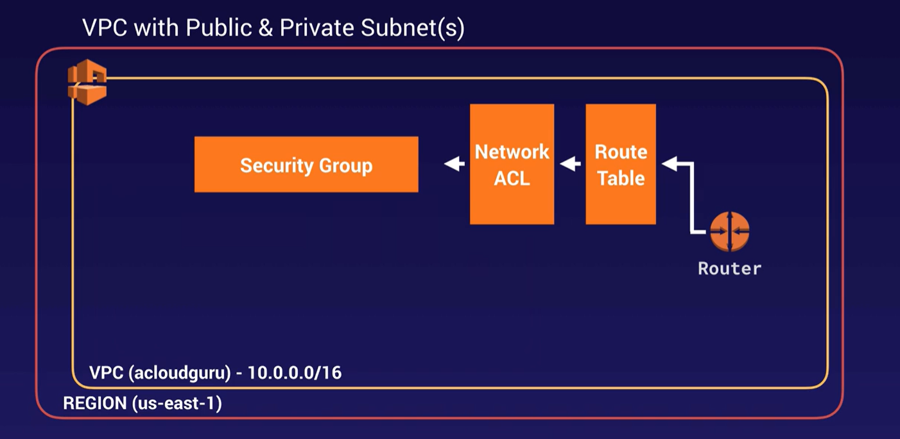
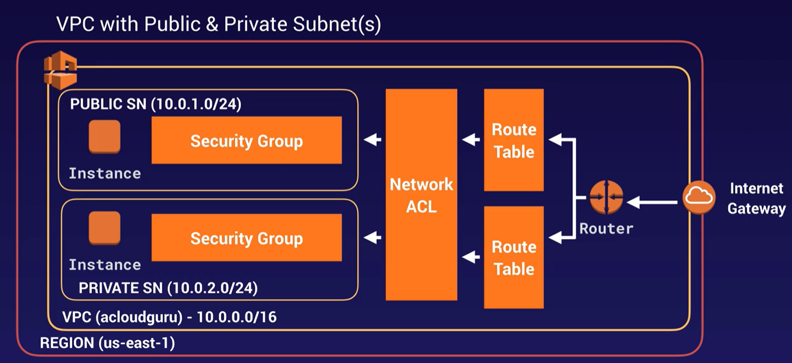
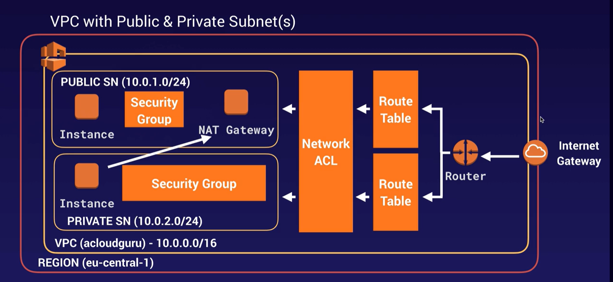

# 3. Network

* **ENI** - Elastic Network Interface - virtual network card for basic networking. It can include multiple attributes, such as security groups, IPv6 and IPv4 addresses, MAC addresses, and more.
* **ENA** - Enhanced Networking Adapter - use **SR-IOV** (Single Root I/O Virtualization) to allow speeds between 10 and 100 Gbps requirement
* **EFA** - Elastic Fabric Adapter - machine learning or **HPC** (High Performance Computing) requirement

## VPC

An interactive IP address and CIDR range visualizer [here](https://cidr.xyz/)

* **`AWS VPC`** (Virtual Private Cloud) is like a logical datacenter in AWS. A VPC is an isolated portion of the AWS cloud dedicated to a single AWS account where you can launch AWS resources. You define a VPC’s IP address space from ranges you select (10.0.0.0/16).
* **Subnets** are segments of a VPC’s IP address range where you can place groups of isolated resources (10.0.1.0/24).
    * 1 subnet = 1 AZ
    * each default subnet is a public subnet. Each instance that you launch into a default subnet has a private IPv4 address and a public IPv4 address
    * each nondefault subnet has a private IPv4 address, but no public IPv4 address
    * You can enable internet access for an instance launched into a nondefault subnet by attaching an internet gateway to its nondefault VPC and associating an Elastic IP address with the instance.
    * a public subnet within a VPC is one that has at least one route in its routing table that uses an Internet Gateway (IGW).
* **Route tables** are a set of rules, called routes, that are used to determine where network traffic is directed.
* **Internet Gateway** allow communication between your VPC and the internet. An IG serves two purposes: to provide a target in your VPC route tables for internet-routable traffic, and to perform network address translation (NAT) for instances that have been assigned public IPv4 addresses
    * 1 VPC = 1 IG
* **egress-only internet gateway** allows IPv6 based traffic within a VPC to access the internet, whilst denying any internet based resources to connection back into the VPC.
* **VPG** (Virtual Private Gateway) is the VPN concentrator of the Site-to-Site VPN connection on the Amazon side.
* **customer gateway** is a resource that is installed on the customer side and provides a customer gateway inside a VPC.
* **VPC peering** creates a connection between two VPCs using same or different accounts and regions.
    * VPC peering only routes traffic between source and destination VPCs.
    * no transitive peering VPC-A <=> VPC-B <=> VPC-C ... VPC-A <> VPC-C  
* **VPC Endpoints**: Enables private connectivity to services hosted in AWS, from within your VPC without using an Internet Gateway, VPN, Network Address Translation (NAT) devices, or firewall proxies.

VPC pricing:

* traffic in the VPC is free
* using same AZ with private IP is free
* using different AZs and public IP has a cost

Some **scans** can be performed without alerting AWS, some require you to alert, such as Penetration Testing

You can have up to **5** non-default VPCs per account and region, but you can place a support request to increase the number.

Once a VPC is set to Dedicated hosting, it can be changed back to default hosting via the CLI, SDK or API. Note that this will not change hosting settings for existing instances, only future ones. Existing instances can be changed via CLI, SDK or API modifying the `Instance Placement` attribute but need to be in a stopped state to do so.


### How to create a VPC

[Creating a Basic VPC and Associated Components in AWS](https://learn.acloud.guru/handson/2cc3cf9e-61ce-475d-a00e-03306e9ba285/course/aws-certified-solutions-architect-associate)

1. `Create VPC` with IPv4 CIDR block equals 10.0.0.0/16 and IPv6 CIDR block provided by Amazon.
    * Note that **only a RT, a NACL and a SG are created**

    

2. `Create subnet` with IPv4 CIDR block equals 10.0.1.0/24 (public) and 10.0.2.0/24 (private) with different AZs.
    * [AWS](https://docs.aws.amazon.com/vpc/latest/userguide/VPC_Subnets.html) reserves both the first four and the last IP address (5) in each subnet's CIDR block, so there are 251 available IPv4 addresses instead of 256

    

3. Select the public subnet and from Actions, clic on `Modify auto-assign IP settings` to automatically request a public IP for a new network interface in this subnet.
4. `Create internet gateway` as the virtual router that connects the VPC to the internet.
5. Select the IG and from Actions, clic on `attach to VPC` 
    ```shell
    aws ec2 attach-internet-gateway --vpc-id "vpc-05fa9d6e7085db9bf" --internet-gateway-id "igw-0e2c1cfa68b4dfc76" --region us-east-2
    ```
6. `Create route table` to specify how packets are forwarded between the subnets within your VPC, the internet, and your VPN connection. 
    * New subnets will be associated to the main RT instead of this public RT.
7. Allow the internet access selecting the public RT and `Edit routes` button and `add route` with destination 0.0.0.0/0 (IPv4) and ::/0 (IPv6) and our IG as the target 
8. `Edit subnet associations` and select 10.0.1.0/24 to associate the public subnet with the public RT
9. Create first EC2 instances as WebServer with network equals our VPC 
    * select public subnet and `auto-assign public ip` equals `use subnet settings (enabled)` for the first instance
    * Create new SG as WebDMZ with rules SSH and HTTP
    * Create a new key-pair as rnietoe-ohio
    ```shell
    chmod 400 rnietoe-ohio.pem # set read permissions to the user
    ssh ec2-user@3.16.203.67 -i rnietoe-ohio.pem
    ```
10. Create second EC2 instances as DBServer with network equals our VPC 
    * select private subnet and `auto-assign public ip` equals `use subnet settings (disabled)` for the second instance
    * Select default SG instead of WebDMZ
    * there is no public IP so we can't connect to this instance
    
11. Create new SG as DBSG with our VPC
    * Add inbound rules of type `All ICMP - IPv2` with source 10.0.1.0/24 to allow WebDMZ to ping EC2 instance inside this SG, HTTP, HTTPS, SSH and MySQL/Aurora
12. Set DBSG to DBServer from actions : security : `change security group`. Remove default SG too
    * Ping the DBServer private IP from WebServer
    ```shell
    ping 10.0.2.200
    ```
13. Copy private key (rnietoe-ohio.pem) to WebServer and check the connection from WebServer to DBServer
    ```shell
    nano rnietoe-ohio.pem
    chmod 400 rnietoe-ohio.pem
    ssh ec2-user@10.0.2.200 -i rnietoe-ohio.pem
    yum update -y # this fail because private instance does not have access to internet 
    ```

!!!danger "By default, instances in new subnets in a custom VPC can communicate with each other across AZs."

### How to create a NAT Gateway

* [NAT instances](https://docs.aws.amazon.com/vpc/latest/userguide/VPC_NAT_Instance.html) (Network Address Transaction) are single EC2 instances.
* NAT Gateway is a highly available gateway that allows you to get your private subnets communicate out to the internet without becaming public
* NAT gateway enable instances in a private subnet to connect to the internet or other AWS services, but prevent the internet from initiating a connection with those instances.
* **source/destination checks** on the NAT instance must be disabled to allow the sending and receiving traffic for the private instances
* NAT gateway are redundant inside the AZ
    * 1 NAT gateway per AZ
* not need to patch
* not associated with SGs
* no need to disable source/destination check



1. Launch EC2 instance choosing `Amazon Linux 2 AMI 2.0.20201126.0 x86_64 HVM gp2` from `Community AMIs`
2. Select rnietoeVPC and public subnet
3. Select WebDMZ as SG and the same key pair
4. Select EC2 instance and clic on actions : networking : `change source/destination check`
and disable all the traffic it sends and receives, as NAT gateway requirement
    ```shell
    aws ec2 modify-instance-attribute --instance-id=i-0cdece2dd619e009b --no-source-dest-check
    ```
5. Edit private route table and create a route (from `edit routes`) to allow connections (0.0.0.0/0) to the NAT instance
    ```shell
    ssh ec2-user@10.0.2.200 -i rnietoe-ohio.pem
    yum update -y # should work now, but it does not
    ```

we have created a small VM that will not work for thouthands of EC2 instances. To use a NAT gateway, create one in a public subnet and assign it an Elastic IP address. Then, update the route tables for your private subnets to point internet traffic to the NAT gateway.

1. Terminate EC2 NAT instance
2. From VPC, `create NAT gateway`
3. Select public subnet and allocate a new Elastic IP
4. Edit private route table and create a route (from `edit routes`) to allow connections (0.0.0.0/0) to the NAT gateway
    ```shell
    ssh ec2-user@10.0.2.200 -i rnietoe-ohio.pem
    yum update -y # this work successfully
    yum install mysql -y 
    ```

!!!danger "Elastic IP / NAT Gateway are not free"

### Network ACLs

SG are statefull while network ACLs are stateless (inbounds settings are not applied to outbound settings implicitly)

!!!danger "Block IP addresses using NACL instead of SG"

!!!danger "NACLs act on the subnet level, while security groups act on the instance level."

0. Default NACL allow all traffic
1. `Create Network ACL` as WebNACL using our VPC. All inbound rules are denied by default
2. Create a Web page in the EC2 WebServer and check the valid connection:
```shell
service httpd status # Unit httpd.service could not be found
sudo su
yum install httpd -y
chkconfig httpd on
service httpd start
cd /var/www/html
nano index.html
<html><body><h1>This is server 1</h1></body></html>
```
3. `Edit subnet associations` for our NACL named WebNACL and select the public subnet
    * public subnet is disassociate from the default NACL because a subnet can be associated to a NACL only
    * 1 NACL - 1 subnet
    * web page is not accessible now
4. `Edit inbound rules` adding new rules (100, 200, 300) allowing ports 80, 443 and 22
    * Rule Number increase in 100 units, like 100, 200, 300...
    * inbound rules work order by rule number, so firt allow some ports and then deny everything else
5. `Edit outbound rules` adding new rules allowing ports 80, 443 and 1024-65535
    * NACL are stateless: outbound rules have to be defined explicitly
    * [Ephemeral ports](https://docs.aws.amazon.com/vpc/latest/userguide/vpc-network-acls.html#nacl-ephemeral-ports)
    * Requests originating from Elastic Load Balancing use ports 1024-65535.
6. `Edit inbound rules` adding new rule 400 denying port 80 to my public Ip 92.189.102.194/32
    * Web page still accessible since rule 100 allow the traffic
7. `Edit inbound rules` editing rule 400 as 99
    * Web page no accessible since rule 99 deny the traffic before rule 100 allow all traffic
    * This is not working in my demo
8. `Edit inbound rules` removing rule 99 and add new rule 400 to allow traffic on ports 1024-65535
```shell
yum update -y # it should works again```
```

### VPC FlowLogs

* VPC Flow Logs is a feature that enables you to capture information about the IP traffic going to and from network interfaces in your VPC. 
* VPC Flow Logs can be created at the VPC, subnet, and network interface levels. 
* you can enable flow logs if VPC is in the same aws account
* you can not edit flow logs

not all ip traffic is monitored such as:

* Amazon DNS Server
* Windows license activation
* 169.254.169.254
* DHCP traffic
* VPC reserved ports

How to configure VPC FlowLogs:

1. `Create VPC` with ipv4 CIDR block as 10.0.0.0/16
2. `Create subnet` with ipv4 CIDR block as 10.0.1.0/24 and enable auto-assign public IPv4 address
3. `Launch EC2 instance` with VPC, subnet and a new SG with HTTP and SSH rules
4. Create internet gateway and associate it to the default VPC RT
5. `Create flow log` in the ENI (Elastic Network interface)
    * specify the filter: accepted traffic only, rejected traffic only or capture all traffic
    * set Maximum aggregation interval to 1 min
    * flow log data destination can be CloudWatch Logs or S3 bucket. Select S3 bucket
    * `Create bucket` as arn:aws:s3:::rnietoeflowlogs
    * Specify AWS default format
6. `Create log group` from CloudWatch as VPCFlowLogs
7. `Create flow log` again
    * specify the filter with all tthe traffic
    * set Maximum aggregation interval to 1 min
    * set flow log data destination as CloudWatch Logs
    * select  the destination log group as VPCFlowLogs
    * `set up permissions` to define the IAM role that has permission to publish to the Amazon CloudWatch log group. Create new role as flowlogsRole with the following policy:
    ```json
    {
        "Statement": [
            {
            "Action": [
                "logs:CreateLogGroup",
                "logs:CreateLogStream",
                "logs:DescribeLogGroups",
                "logs:DescribeLogStreams",
                "logs:PutLogEvents"
            ],
            "Effect": "Allow",
            "Resource": "*"
            }
        ]
    }
    ```
8. Go to CloudWatch : Log groups : VPCFlowLogs : Log stream and check results
9. `Create filter pattern` as (protocol 6 is TCP):
    ```
    [version, account, eni, source, destination, srcport, destport="22", protocol="6", packets, bytes, windowstart, windowend, action="ACCEPT", flowlogstatus]
    ```
    * test pattern
    ```
    2 086112738802 eni-0d5d75b41f9befe9e 61.177.172.128 172.31.83.158 39611 22 6 1 40 1563108188 1563108227 REJECT OK
    2 086112738802 eni-0d5d75b41f9befe9e 182.68.238.8 172.31.83.158 42227 22 6 1 44 1563109030 1563109067 REJECT OK
    2 086112738802 eni-0d5d75b41f9befe9e 42.171.23.181 172.31.83.158 52417 22 6 24 4065 1563191069 1563191121 ACCEPT OK
    2 086112738802 eni-0d5d75b41f9befe9e 61.177.172.128 172.31.83.158 39611 80 6 1 40 1563108188 1563108227 REJECT OK
    ```
    * set metric details
10. `Create alarm` for above metric filter
    * set period to 1 min
    * Whenever SSHAccept is greater/equal than 1
11. `Run query` from CloudWatch Logs Insights using VPC Flow Logs sample queries (right panel)
12. Go back to S3 and check a new folder named `AWSLogs` has been created in our rnietoeflowlogs bucket
13. Go to AWS Athena and set up a query result location in AWS S3 with the arn:
```
s3://rnietoeflowlogs/AWSLogs/065275835852/vpcflowlogs/us-east-1/2020/12/12/
```
14. Run query to create Athena Table
```sql
CREATE EXTERNAL TABLE IF NOT EXISTS default.vpc_flow_logs (
  version int,
  account string,
  interfaceid string,
  sourceaddress string,
  destinationaddress string,
  sourceport int,
  destinationport int,
  protocol int,
  numpackets int,
  numbytes bigint,
  starttime int,
  endtime int,
  action string,
  logstatus string
) PARTITIONED BY (
  dt string
) ROW FORMAT DELIMITED FIELDS TERMINATED BY ' ' LOCATION 's3://rnietoeflowlogs/AWSLogs/065275835852/vpcflowlogs/us-east-1/' TBLPROPERTIES ("skip.header.line.count"="1");
```
15. Create Partitions
```sql
ALTER TABLE default.vpc_flow_logs
ADD PARTITION (dt='2020-12-12') location 's3://rnietoeflowlogs/AWSLogs/065275835852/vpcflowlogs/us-east-1/2020/12/12';
```
16. Analyze Data
```sql
SELECT day_of_week(from_iso8601_timestamp(dt)) AS
  day,
  dt,
  interfaceid,
  sourceaddress,
  destinationport,
  action,
  protocol
FROM vpc_flow_logs
WHERE action = 'ACCEPT' AND protocol = 6
order by sourceaddress
LIMIT 100;
```

### Bastion host

* a bastion (jump box) is used to securely administer/manage EC2 instances in the private subnet using **SSH** or **RDP**
* NAT gateway cannot be used as a bastion host

For high availability:

* create two public subnets in two different AZs with a bastion host each, and a Network Load Balancer with static IP address or Auto scaling group (cheaper)
* cannot use an Application Load Balancer as it is layer 7 and you need to use layer 4.

### Direct Connect

Dedicated line from on premise to AWS to improve the network connection (security and performance)

1. `Create virtual interface` from AWS Direct Connect : Virtual interfaces as Public
2. `Create Customer Gateway` from VPC : Customer Gateways
3. `Create Virtual Private Gateway` from VPC : Virtual Private Gateways
    * attach the VPG to the VPC
4. `Create VPN Connection` from VPC : Site-to-Site VPN Connections using the VPG and Customer Gateway
5. Set up the VPN on the customer gateway

[How do I configure a VPN over AWS Direct Connect?](https://www.youtube.com/watch?v=dhpTTT6V1So&feature=youtu.be)

### Global Accelerator

improves the availability and performance of your applications for local or global users

1234567890abcdef.awsglobalaccelerator.com

1. `Create accelerator` from AWS Global Accelerator 
2. Add a **listener** to checks for connection requests that arrive to an assigned set of static IP addresses on a port or port range that you specify. (80, 443)
    * Leave client affinity setting as none
3. Add **endpoint groups** where the accelerator direct traffic to from one or more listeners. An endpoint group includes endpoints, such as load balancers.
4. Add **endpoints** to each endpoint group
    * Endpoints can be Network Load Balancers, Application Load Balancers, EC2 instances, or Elastic IP addresses.
5. two static IP addresses are assign

Disable Global Accelerator before removing is required

**Network zones** are simliar to AZs. They are isolated units with their own set of physical infrastructure and service IP addresses from a unique IP subnet. If one IP address from a network zone becomes unavailable, due to network disruptions or IP address blocking by certain client networks, your client applications can retry using the healthy static IP address from the other isolated network zone.

### VPC endpoints

VPC endpoint is a service that replace NAT gateway and allow connections from the private subnet to other AWS services, such as S3 


* Interface endpoints: ENI (Elastic Network Interface) with private IP as entry point
* Gateway endpoints support S3 and DynamoDB

1. `Create Endpoint` from VPC : Endpoints
2. select service `com.amazonaws.us-east-2.s3`, our VPC, our main route table and the full access policy
    * the update in the route table could take some time

### AWS Private Link

To open up our apps to other VPCs, we can try:

* Open up the VPC to the internet. everything will be public
* use **VPC peering**. However, many relationships will be required
* AWS Private Link peers many VPCs. They only require a NLB on the AWS VPC and a ENI on the customer VPC

### Transit Gateway

TGW (Transit GateWay) is a network transit hub that interconnects attachments (VPCs and VPNs) within the same account or across accounts. 

* Cross region is allowed
* support **IP multicast**

### VPN CloudHub

AWS VPN CloudHub manage multiple sites with own VPN connections

## Route 53

**`AWS Route 53`** service name comes from port 53, where **DNS** work on 

we can register a DNS using `Route53` - `Register domain`. You can purchase and manage domain names such as example.com, and Route 53 will automatically configure DNS settings for your domains

!!!tip "Ensure there is a free bucket with the same domain name"

* **Failover Routing policy** routes data to a second resource if the first is unhealthy. Route 53 can be used for Disaster Recovery by simply shifting traffic to the new region.
* **Latency-based Routing policy** routes data to resources that have better performance

**Route 53 Traffic Flow** makes it easy for you to manage traffic globally through a variety of routing types, including Latency Based Routing, Geo DNS, Geoproximity, and Weighted Round Robin—all of which can be combined with DNS Failover to enable a variety of low-latency, fault-tolerant architectures. Using Route 53 Traffic Flow’s simple visual editor, you can easily manage how your end-users are routed to your application’s endpoints—whether in a single AWS region or distributed around the globe. 

.com => **NS** (Name Server) Records => **SOA** (Start Of Authority)

DNS changes can take 48 hours to take effect due to the cache

* **CName** (Canonical Name) maps to the host name: https://mobile.acloud.guru = https://m.acloud.guru 
* **Alias Record** provide a Route 53–specific extension to DNS functionality. An alias could be created for the ELB. Alias Records can also point to AWS Resources that are hosted in other accounts by manually entering the ARN

!!!tips "ELB resolve DNS names instead of IPv4 addresses"

Routing Policies:

* **Simple** Routing: one dns record with multiple IP addresses
* **Weighted** Routing: traffic based on weighting (ponderaciones 20%-30%-50%)
* **Latency-based** Routing: traffic based on the lowest latency
* **Failover** Routing: route the traffic to the primary or secondary site defined based on health checks
* **Geolocation** Routing: traffic based on the user's location
* **Geoproximity** Routing: traffic based on the users' and resources' location. Available in traffic **flow-only** mode using **bias**
* **Multivalue Answer** Routing, similar to simple routing, but using health checks on each record sets to serve traffic to **random** web servers

1. `Register domain` from Route53 takes between 2 hours and 3 days
2. `Create Record Set` of type IPv4 address with the three EC2 public IPs. Set TTL (Time to Live) to 1 min to clear from cache
3. `Create healthcheck` and associate it to each record set, so it will be removed from Route53 until it passes the health check
4. `Create traffic policy` to configure Geoproximity Routing

```shell
ipconfig /flushdns # to remove saved ip from cache from the client side
```

!!!danger "With Route 53, there is a default limit of **50** domain names. However, this limit can be increased by contacting AWS suppor"

## API Gateway

[API Gateway vs Application Load Balancer](https://serverless-training.com/articles/api-gateway-vs-application-load-balancer-technical-details/)

!!!danger "API Gateway + Lambda + DynamoDB (serverless) instead of ELB + EC2 + RDS"

API Gateway is like a door for your AWS environment. Targets are:

* Lamda
* EC2
* DynamoDB

scaling is automatic

enable **api gateway caching** to cache API gateway endpoint's responses for a TTL period in seconds

!!!danger "If a cache is configured, then Amazon API Gateway will return a cached response for duplicate requests for a customizable time, but only if under configured throttling limits"

same origin policy to prevent cross site scripting (XSS) attacks. Cross origin resource sharing (CORS) allow restricted resources in a web page to be requested from a different domain. Enable **CORS** in Apigateway when the error message is "Origin policy cannot be read at the remote resource"