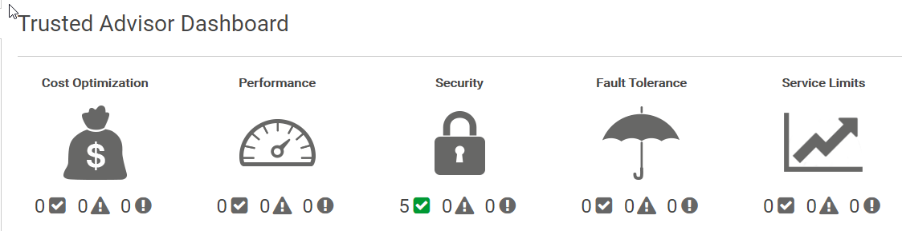
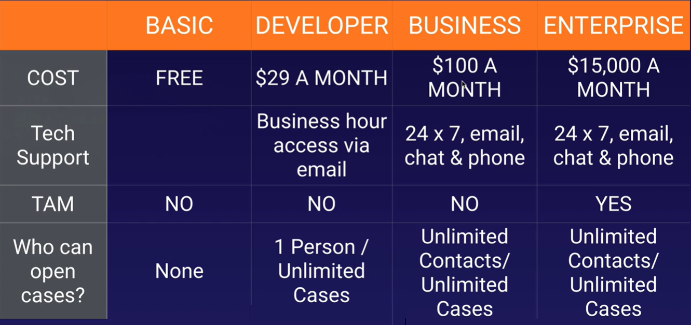

# 6. Management and Governance

## OpsWorks

AWS OpsWorks implemet a **configuration management** system for automated deployment of instances, services and applications

* OpsWorks **Stacks**: (default) collection of layers on-premises
* OpsWorks for **Chef** Automate: cookbooks contain **recipes**/layers in the cloud
* OpsWorks for **Puppet**: master servers with preconfigured **modules**/layers in the cloud

pre-built layers

* Ruby
* PHP
* Node.js
* Java
* Amazon RDS
* HA Proxy
* MySql

## EMR (Elastic MapReduce)

web service that makes it easy to process large amounts of data efficiently, **mapping** the process to multiple processors to reduce **computing**. Sample of **big data**

clusters nodes:

* **master**: coordinates job distribution and store logs by default
* **core**: run tasks assigned by the master node and **store** data in the cluster
* **task** (optional): runs only task that do not store data

logs must be defined on cluster creation

## Systems Manager

View and manage AWS resources in the cloud (EC2 fleets) or on premise (virtual machines)

## SSM (Systems Manager) Parameter Store

Centralized storage and management of your secrets and configuration data such as passwords, database strings, and license codes. You can encrypt values using KMS, or store as plain text, and secure access at every level.

organize parameters into hierarchies

`Create Parameter` from SSM Parameter Store

```json
{
  "Version": "2012-10-17",
  "Statement": [
    {
      "Effect": "Allow",
      "Action": [
        "logs:CreateLogGroup",
        "logs:CreateLogStream",
        "logs:PutLogEvents",
        "ssm:GetParameter*",
        "ssm:GetParametersByPath"
      ],
      "Resource": "*"
    }
  ]
}
```

```python
import json
import os
import boto3

client = boto3.client("ssm")
env = os.environ["ENV"] # env variable value = "prod"
app_config_path = os.environ["APP_CONFIG_PATH"] # env variable value = "acg"
full_config_path = "/" + env + "/" + app_config_path # /prod/acg


def lambda_handler(event, context):

    print("Config Path: " + full_config_path)

    param_details = client.get_parameters_by_path(
        Path=full_config_path, Recursive=True, WithDecryption=True
    )

    print(json.dumps(param_details, default=str))
```

## CloudWatch

Monitor resources and applications **performances** from the cloud and on-premises systems based on logs and events:

* compute
	* ec2 instances - every 5 minutes by default
	* autoscaling groups
	* ELB
	* Route53 health checks
* storage and content delivery
	* EBS - virtual hard disk
	* Storage gateways
	* CloudFront
* network

AWS can see that you have Memory, but a custom metric is required to see how much of the memory is being used 

AWS can see how much of CPU you are using in a EC2, but cannot see what you are using if for.

**CloudWatch logs insights** adds cross log group querying

## CloudTrail

Continuously log your AWS account **activity** monitoring API calls per account and region

* data is retained for 90 days
* logs can be stored in a single S3 bucket
* read activity in the S3 bucket will be easier than using the API 

## Trusted Advisor

**Recomendations** and advices (not only EC2 instances). It helps you optimize cost, fault-tolerance, perfoemance, security and more.



## Organisations

**`AWS Organizations`** enables you to centrally manage billing, control access, compliance, and security, and share resources across **multiple accounts** in the AWS Cloud.

You can consolidate all your AWS accounts into an organization, and arrange all AWS accounts into distinct **OUs** (Organizational Units).

* Provides single payer and centralized cost tracking
* Lets you create and invite accounts
* Allows you to apply policy-based controls
* Helps you simplify organization-wide management of AWS services
* Or you can create an organization with only **consolidated billing** features.

After you create an organization, you cannot join this account to another organization until you delete its current organization.

1. From AWS Organisations, `create organisation`

Enable AWS Single Sign On to centrally manage access to multiple AWS accounts and business applications.
Create an **organization trail** in AWS CloudTrail to log all events for all AWS accounts in your organization.

2. From `Organize Accounts` Tab, we create a new organisational units
3. From `Policies` tab, enable service control policies and create a sample policy to block EC2 usage.
	* Select Amazon EC2 statement and deny effect
4. Apply the new policy to organisational units or to AWS Accounts

Maximum of 20 Link accounts. Contact AWS for more

!!!danger "Assuming all instances are in the same AWS Organization, the reserved instance pricing for the unused on demand instances will be applied."

[Landing Zone](https://aws.amazon.com/solutions/implementations/aws-landing-zone/) helps to quickly setup a secure, multi-account AWS environment based on AWS best practices.

**services control policies** for central control over all of the permissions

## AWS Config

`AWS Config` provides an inventory of your AWS resources and a history of configuration changes to these resources.  
 You can use AWS Config to define rules that evaluate these configurations for compliance.

 How to get started:

 1. Specify the types of AWS resources you want AWS Config to record
 2. Define the Amazon S3 bucket to which it sends files
 3. Set the Amazon SNS topic to which it sends notifications
 4. Define config rules
 5. Restart EC2 instances and check AWS Config results

You are charged based on the number of configuration items recorded, the number of active AWS Config rule evaluations and the number of conformance pack evaluations in your account

## Pricing

* Capex: Capital Expenditure: you pay up front. It's a fixed cost
* Opex: Operational Expenditure: you pay for what you use, like electricity, gas or water

* **Budgets** predict costs **before** they are incurred. Alarms can be set to monitor spending on your AWS account from `AWS Billing` service - [Budgets](https://console.aws.amazon.com/billing/home#/budgets)

    !!!info "`Receive Billing Alerts` must be enabled at [Billing Preferences](https://console.aws.amazon.com/billing/home?region=us-east-1#/preferences)."

* **Cost explorer** is use to explore costs **after** they have been incurred. See [Billing & Cost Management Dashboard](https://console.aws.amazon.com/billing/home#/).

* [Creating a billing alarm](https://docs.aws.amazon.com/AmazonCloudWatch/latest/monitoring/monitor_estimated_charges_with_cloudwatch.html) at `ClouldWatch/Alarms/Billing` using **SNS** (Simple Notification Service) topic to monitor estimated AWS charges.

`Application Integration/SNS` is a messaging service that enables you to decouple microservices, distributed systems, and serverless applications. Using AWS SNS topics, your publisher systems can fan-out messages to a large number of subscriber endpoints for parallel processing, including Amazon SQS queues, AWS Lambda functions, and HTTP/S webhooks. Additionally, SNS can be used to fan out notifications to end users using mobile push, SMS, and email.

`Application Integration/SQS` (**S**imple **Q**ueue **S**ervice) offers a queue that lets you integrate and decouple distributed software systems and components.

Support Plans:

!!!info "All accounts receive billing support"




Pricing policies

* pay as you go
* pay less when you reserve
* pay even less per unit by using more
* pay even less as AWS grows
* custom pricing

cost drivers:

* compute
* storage
* data outbound (data leavingn, not data entering)

free services

* VPC
* Elastic Beanstalk
* Cloud Formation
* IAM
* Autoscaling
* Opsworks
* Consolidated billing

Create a paying account for billing purposes only. Do not deploy resources into the paying account.

Consolidated billing allows you to get volume discounts on all your accounts

## AWS Cost Calculators

* [AWS Simple Monthly Calculator](https://calculator.s3.amazonaws.com/index.html) (**DEPRECATED**)
* AWS Total Cost of Ownership Calculator (**DEPRECATED**): comparing AWS VS on premise
* [AWS Pricing Calculator](https://calculator.aws/#/)

## AWS X-Ray

`Developer Tools - X-Ray` helps developers analyze and **debug** production, distributed applications, such as those built using a microservices architecture. With X-Ray, you can understand how your application and its underlying services are performing to identify and troubleshoot the root cause of performance issues and errors. X-Ray provides an end-to-end view of requests as they travel through your application, and shows a map of your application’s underlying components.
