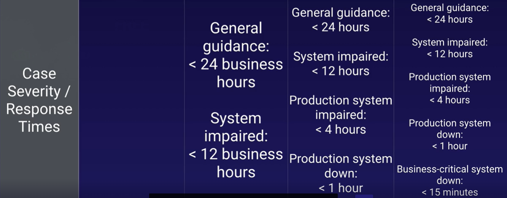

# 6. Management and Governance

## (AWS Systems Manager) SSM Parameter Store

Centralized storage and management of your secrets and configuration data such as passwords, database strings, and license codes. You can encrypt values using KMS, or store as plain text, and secure access at every level.

organize parameters into hierarchies

`Create Parameter` from SSM Parameter Store

```json
{
  "Version": "2012-10-17",
  "Statement": [
    {
      "Effect": "Allow",
      "Action": [
        "logs:CreateLogGroup",
        "logs:CreateLogStream",
        "logs:PutLogEvents",
        "ssm:GetParameter*",
        "ssm:GetParametersByPath"
      ],
      "Resource": "*"
    }
  ]
}
```

```python
import json
import os
import boto3

client = boto3.client("ssm")
env = os.environ["ENV"] # env variable value = "prod"
app_config_path = os.environ["APP_CONFIG_PATH"] # env variable value = "acg"
full_config_path = "/" + env + "/" + app_config_path # /prod/acg


def lambda_handler(event, context):

    print("Config Path: " + full_config_path)

    param_details = client.get_parameters_by_path(
        Path=full_config_path, Recursive=True, WithDecryption=True
    )

    print(json.dumps(param_details, default=str))
```

## CloudFormation

**`AWS CloudFormation`** is IaaS tool to **create**, **update** and **delete** resources with **templates** (json or yaml). While Elastic Beanstalk we can create and manage resources based on code...

1. Create **stack** using the sample template Wordpress blog, where stack is a set of related resources.
3. Select instance type t2.micro and our key value pair rnietoe
4. `Create stack`. This will create and configure an EC2 instance based on the wordpress template
5. from `Output` tab, click on the value link.
6. from `Template` tab, clik on `View in Designer`

CloudFormation service is free, but the resources that it provisions have a cost

CloudFormation has a wide set of supported resources, but does not support the creation of all AWS resources.

[AWS Quick Start](https://aws.amazon.com/quickstart/?nc1=h_ls&quickstart-all.sort-by=item.additionalFields.sortDate&quickstart-all.sort-order=desc) is a way of deploying environments quickly using CloudFormation templates built by experts AWS Solucions Architects.

[Template anatomy](https://docs.aws.amazon.com/AWSCloudFormation/latest/UserGuide/template-anatomy.html):

```yaml
AWSTemplateFormatVersion: "optional version date. sample: 2010-09-09"
Description: optional string
Metadata:
  # optional template metadata
Parameters:
  # optional set of parameters
Mappings:
  # optional set of mappings
Conditions:
  # set of conditions
Transform:
  # set of transforms
Resources:
  # required set of resources
Outputs:
  # optional set of outputs
```

When updating a stack, a change set (such as tags) is created with the summary of proposed changes. This change set is executed to update the stack. Only the change set is executed instead of all resources defined in the template.

At the other hand, when adding a new resource (such as SecurityGroup) for our previous deployed resource (EC2), a new EC2 instance in created with the SecurityGroup, and the old EC2 instance is deleted automatically

### Resources

[Resources](https://docs.aws.amazon.com/AWSCloudFormation/latest/UserGuide/resources-section-structure.html)

**UserData** property:

* perform actions on system startup
* only runs on the first boot cycle
* execution time impact on the startup time
* Base64 encoded

on Windows:

* Run as local admin
* Batch commands and/or powersheel support
* Executed by EC2Config or EC2Launch

```shell
#script
echo Current date and time >> %SystemRoot%\Tem\test.log
echo %DATE% %TIME% >> %SystemRoot%\Tem\test.log
#powershell
$file = $env:SystemRoot + "\Temp\" + (Get=Date).ToString("MM-dd-yy-hh-mm")
New-Item $file -ItemType file
```

on Linux:

* Run as root (no need for sudo)
* Not run interactively (no user feedback)
* Logs output to /var/log/cloud-init-output.log

```bash
#!/bin/bash # interpreter
yum update -y
yum install -y httpd
service httpd start
```

Sample template:

```yml
Resources:
  EC2Instance:
    Type: AWS::EC2::Instance
    Properties:
      UserData:
        !Base64: |
          #!/bin/bash -xe
          yum update -y
          yum install httpd -y
          service httpd start
```

### Mappings

[Mappings](https://docs.aws.amazon.com/AWSCloudFormation/latest/UserGuide/mappings-section-structure.html)

```yaml
Mappings:
  RegionMap:                # MapName
    us-east-1:              # TopLevelKey 1
      AMI: ami-1853ac65     # SecondLevelKey 1
    us-west-1:              # TopLevelKey 2
      AMI: ami-bf5540df     # SecondLevelKey 2
Resources:
  MyEc2Instance:
    Type: AWS::EC2::Instance
    Properties:
      InstanceType: t2.micro
      ImageId:
        !FindInMap:
        - RegionMap         # MapName
        - !Ref AWS::Region  # TopLevelKey
        - AMI               # SecondLevelKey
```

### Input Parameters

[Parameters](https://docs.aws.amazon.com/AWSCloudFormation/latest/UserGuide/parameters-section-structure.html) enable you to input custom values to your template each time you create or update a stack.


Supported parameter types:

* String
* Number
* List<Number>
* CommaDelimitedList
* AWS-specific types(AWS::ec2::Image::Id)

```yaml
Parameters:
  InstanceTypeParameter:                        # Parameter ID
    Type: String                                # Parameter Type
    Default: t2.micro                           # Parameter Property 1
    AllowedValues:                              # Parameter Property 2
      - t2.micro
      - m1.small
      - m1.large
    Description:                                # ParameterProperty 3
      EC2 Instance Type
Resources:
  Ec2Instance:
    Type: AWS::EC2::Instance
    Properties:
      InstanceType: !Ref: InstanceTypeParameter # Parameter
```

### Metadata

[Metadata](https://docs.aws.amazon.com/AWSCloudFormation/latest/UserGuide/metadata-section-structure.html)

### Conditions

[Conditions](https://docs.aws.amazon.com/AWSCloudFormation/latest/UserGuide/conditions-section-structure.html)

### Transform

[Transform](https://docs.aws.amazon.com/AWSCloudFormation/latest/UserGuide/transform-section-structure.html)

### Outputs

[Outputs](https://docs.aws.amazon.com/AWSCloudFormation/latest/UserGuide/outputs-section-structure.html) information about resources, within a cloudformation stack. For example:

* the public IP or DNS of a EC2 instance
* the S3 bucket name for a stack

```yml
Outputs:
  ServerDns:            # OutputID
    Value: !GetAtt      # Value to return
      - Ec2Instance
      - PublicDnsName
    Export:
      Name:             # Value to export
```


### Intrinsic functions

[Intrinsic functions](https://docs.aws.amazon.com/AWSCloudFormation/latest/UserGuide/intrinsic-function-reference.html)

* **Join**: appends a set of values into a single value
```json
{ "Fn::Join" : [ ":", [ "a", "b", "c" ] ] }
```
```yml
!Join [ ":", [ a, b, c ] ]
```

* **Ref**: : returns the value of the specified resource.
```json
{ "Ref" : "resourceId" }
```
```yml
!Ref resourceId
```

* **FindInMap**: returns the value corresponding to keys in a two-level map that is declared in the Mappings section.
```json
{ "Fn::FindInMap" : [ "MapName", "TopLevelKey", "SecondLevelKey"] }
```
```yml
!FindInMap [ MapName, TopLevelKey, SecondLevelKey ]
```

* **GetAtt**: returns the value of an attribute from a resource in the template
```json
{ "Fn::GetAtt" : [ "logicalNameOfResource", "attributeName" ] }
```
```yml
!GetAtt logicalNameOfResource.attributeName
```

* **Sub**: substitutes variables in an input string with values that you specify when you create or update a stack, such as ${AWS::StackName} or ${AWS::Region}
```json
{ "Fn::Sub" : String }
```
```yml
!Sub String
```

* **GetAZs**:  returns an array that lists AZs for a specified region in alaphabetical order. Specifying an empty string is equivalent to specifying AWS::Region.
```json
{ "Fn::GetAZs" : "region" }```
```yml
!GetAZs region
```

### Pseudo parameters

[Pseudo parameters](https://docs.aws.amazon.com/AWSCloudFormation/latest/UserGuide/pseudo-parameter-reference.html)

* **AWS::AccountId**: Returns the AWS account ID of the account in which the stack is being created
* **AWS::NotificationARNs**: Returns the list of notification ARNs (**A**mazon **R**esource **N**ames) for the current stack.
* **AWS::StackId**: Returns the ID of the stack
* **AWS::StackName**: Returns the Name of the stack
* **AWS::Region**: Returns the AWS Region in which the resource is being created

### CloudFormation helper scripts

Pyhon based helper scripts preinstalled on Amazon Linux (to avoid scripting):

* **cfn-init:**: read Metadata to execute AWS::CloudFormation::Init
* **cfn-signal**: signal with a CreationPolicy or WaitCondition when the resource or application is ready.
* **cfn-get-metadata**: retrieve metadata based on a specific key.
* **cfn-hup**: check for updates to metadata and execute custom hooks when changes are detected.

single config key sample:

```yml
AWS::CloudFormation::Init:
  config: 
    packages: download and install pre-packaged applications and components
    groups: create Linux/Unix groups and assign group IDs
    users: create Linux/UNIX users on the EC2 instance
    sources: download an archive file and unpack it in the target directory on EC2
    files: create files on the EC2 instance
    services: define enabled and siabled services when the instance is launch
    commands: execute commands on the EC2 instance
```

**configSets** sample to install a web server:

```yml
installweb:
  packages:
    yum:
      httpd: []
  services:
    sysvinit:
      httpd:
        enabled: true
        ensureRunning: true

installphp:
  packages:
    yum:
      php: []

Resources:
  EC2Instance:
    Metadata: 
      AWS::CloudFormation::Init:
        configSets: 
          webphp:
          - "installphp"
          - "installweb"
```

How to setting up a full stack:

1. From `CloudFormation`, create stack uploading the following template file:

```yml
Parameters:
  myKeyPair: 
    Description: Amazon EC2 Key Pair
    Type: AWS::EC2::KeyPair::KeyName
  VpcId:
    Description: Enter the VpcId
    Type: AWS::EC2::VPC::Id
  SubnetIds:
    Description: Enter the Subnets
    Type: List<AWS::EC2::Subnet::Id>
Mappings:
  RegionMap:
    us-east-1:
      AMI: ami-1853ac65
    us-west-1:
      AMI: ami-bf5540df
    eu-west-1:
      AMI: ami-3bfab942
    ap-southeast-1:
      AMI: ami-e2adf99e
    ap-southeast-2:
      AMI: ami-43874721
Resources:
  LoadBalancer: # Application Load Balancer
    Type: AWS::ElasticLoadBalancingV2::LoadBalancer
    Properties:
      SecurityGroups:
        - !Ref ALBSecurityGroup
      Subnets: !Ref SubnetIds
  LoadBalancerListener: # Port 80 Listener for ALB
    Type: AWS::ElasticLoadBalancingV2::Listener
    Properties:
      LoadBalancerArn: !Ref LoadBalancer
      Port: 80
      Protocol: HTTP
      DefaultActions:
        - Type: forward
          TargetGroupArn:
            Ref: TargetGroup
  TargetGroup:
    Type: AWS::ElasticLoadBalancingV2::TargetGroup
    Properties:
      Port: 80
      Protocol: HTTP
      VpcId: !Ref VpcId
  AutoScalingGroup:
    Type: AWS::AutoScaling::AutoScalingGroup
    Properties:
      AvailabilityZones: !GetAZs
      LaunchConfigurationName: !Ref LaunchConfiguration
      MinSize: 1
      MaxSize: 3
      TargetGroupARNs: 
        - !Ref TargetGroup
  LaunchConfiguration:
    Type: AWS::AutoScaling::LaunchConfiguration
    Metadata: 
      Comment: Install php and httpd
      AWS::CloudFormation::Init:
        config: 
          packages: 
            yum:
              httpd: []
              php: []
          files: 
            /var/www/html/index.php:
              content: !Sub |
                <?php print "Hello world Abs was here!"; ?>
          services: 
            sysvinit:
              httpd:
                enabled: true
                ensureRunning: true
    Properties:
      KeyName: !Ref myKeyPair
      InstanceType: t2.micro
      SecurityGroups:
        - !Ref EC2SecurityGroup
      ImageId:
        Fn::FindInMap:
        - RegionMap
        - !Ref AWS::Region
        - AMI
      UserData:
        'Fn::Base64': 
          !Sub |
            #!/bin/bash -xe                        
            # Ensure AWS CFN Bootstrap is the latest
            yum install -y aws-cfn-bootstrap
            # Install the files and packages from the metadata
            /opt/aws/bin/cfn-init -v --stack ${AWS::StackName} --resource LaunchConfiguration --region ${AWS::Region}
  ALBSecurityGroup:
    Type: AWS::EC2::SecurityGroup
    Properties:
      GroupDescription: ALB Security Group
      VpcId: !Ref VpcId
      SecurityGroupIngress:
        - IpProtocol: tcp
          FromPort: 80
          ToPort: 80
          CidrIp: 0.0.0.0/0
  EC2SecurityGroup: 
    Type: AWS::EC2::SecurityGroup
    Properties:
      GroupDescription: EC2 Instance
  EC2InboundRule: # EC2 can only accept traffic from ALB
    Type: AWS::EC2::SecurityGroupIngress
    Properties:
      IpProtocol: tcp
      FromPort: 80
      ToPort: 80
      SourceSecurityGroupId:
        !GetAtt
        - ALBSecurityGroup
        - GroupId
      GroupId:
        !GetAtt
        - EC2SecurityGroup
        - GroupId
Outputs:
  PublicDns:
    Description: The Public DNS
    Value: !Sub 'http://${LoadBalancer.DNSName}'
```

2. Set stack name and parameters and finally create the stack
3. Stak is created with defined resources


4. Check the stack outputs and browse to the EC2 instance uri:


### ChangeSets

Allow to preview how changes will impact to the resources. There are 4 changeSets operations:

* **Create**: create a change set. This operation does not modify the stack
* **View**: view proposed changes after creating
* **Execute**: execute the change set to update the stack
* **Delete**: delete change set. This operation does not modify the stack

how to `create` a change set for current stack to update security groups:

1. We are going to remove port 22 from security group in this sample
2. From CloudFormation, select the stack and from stack actions, Create change sets for current stack
3. Upload the template with changes and create
4. See the JSON Changes result:

```json
[
  {
    "resourceChange": {
      "logicalResourceId": "MySecurityGroup",
      "action": "Modify", // Add | Modify | Remove
      "physicalResourceId": "MyFirstStack-MySecurityGroup-1AT0XTT24PZNP",
      "resourceType": "AWS::EC2::SecurityGroup",
      "replacement": "False",
      "moduleInfo": null,
      "details": [
        {
          "target": {
            "name": "SecurityGroupIngress",
            "requiresRecreation": "Never",
            "attribute": "Properties"
          },
          "causingEntity": null,
          "evaluation": "Static",
          "changeSource": "DirectModification"
        }
      ],
      "changeSetId": null,
      "scope": [
        "Properties"
      ]
    },
    "type": "Resource"
  }
]
```

4. Finally we can `delete` or `execute` the change set

The actions depends on the resource. we should predict if replacement will be necesary based on these documents:

* [AWS resource and property types reference](https://docs.aws.amazon.com/AWSCloudFormation/latest/UserGuide/aws-template-resource-type-ref.html)
* [Update behaviors of stack resources](https://docs.aws.amazon.com/AWSCloudFormation/latest/UserGuide/using-cfn-updating-stacks-update-behaviors.html)

## CloudWatch

Monitor resources and applications **performances**:

* compute
	* ec2 instances - every 5 minutes by default
	* autoscaling groups
	* ELB
	* Route53 health checks
* storage and content delivery
	* EBS - virtual hard disk
	* Storage gateways
	* CloudFront
* network

AWS can see that you have Memory, but a custom metric is required to see how much of the memory is being used 

AWS can see how much of CPU you are using in a EC2, but cannot see what you are using if for.

## CloudTrail

Continuously log your AWS account **activity** monitoring API calls per account and region

* data is retained for 90 days
* logs can be stored in a single S3 bucket
* read activity in the S3 bucket will be easier than using the API 

## Systems Manager

View and manage AWS resources in the cloud (EC2 fleets) or on premise (virtual machines)

## AWS Organisations

AWS Organizations enables you to centrally manage billing, control access, compliance, and security, and share resources across multiple accounts in the AWS Cloud.

You can consolidate all your AWS accounts into an organization, and arrange all AWS accounts into distinct organizational units.

* Provides single payer and centralized cost tracking
* Lets you create and invite accounts
* Allows you to apply policy-based controls
* Helps you simplify organization-wide management of AWS services
* Or you can create an organization with only **consolidated billing** features.

After you create an organization, you cannot join this account to another organization until you delete its current organization.

1. From AWS Organisations, `create organisation`

Enable AWS Single Sign On to centrally manage access to multiple AWS accounts and business applications.
Create an **organization trail** in AWS CloudTrail to log all events for all AWS accounts in your organization.

2. From `Organize Accounts` Tab, we create a new organisational units
3. From `Policies` tab, enable service control policies and create a sample policy to block EC2 usage.
	* Select Amazon EC2 statement and deny effect
4. Apply the new policy to organisational units or to AWS Accounts

Maximum of 20 Link accounts. Contact AWS for more

!!!danger "Assuming all instances are in the same AWS Organization, the reserved instance pricing for the unused on demand instances will be applied."

[Landing Zone](https://aws.amazon.com/solutions/implementations/aws-landing-zone/) helps to quickly setup a secure, multi-account AWS environment based on AWS best practices.

## AWS Config

`AWS Config` provides an inventory of your AWS resources and a history of configuration changes to these resources.  
 You can use AWS Config to define rules that evaluate these configurations for compliance.

 How to get started:

 1. Specify the types of AWS resources you want AWS Config to record
 2. Define the Amazon S3 bucket to which it sends files
 3. Set the Amazon SNS topic to which it sends notifications
 4. Define config rules
 5. Restart EC2 instances and check AWS Config results

You are charged based on the number of configuration items recorded, the number of active AWS Config rule evaluations and the number of conformance pack evaluations in your account

## Pricing

* Capex: Capital Expenditure: you pay up front. It's a fixed cost
* Opex: Operational Expenditure: you pay for what you use, like electricity, gas or water

* **Budgets** predict costs **before** they are incurred. Alarms can be set to monitor spending on your AWS account from `AWS Billing` service - [Budgets](https://console.aws.amazon.com/billing/home#/budgets)

    !!!info "`Receive Billing Alerts` must be enabled at [Billing Preferences](https://console.aws.amazon.com/billing/home?region=us-east-1#/preferences)."

* **Cost explorer** is use to explore costs **after** they have been incurred. See [Billing & Cost Management Dashboard](https://console.aws.amazon.com/billing/home#/).

* [Creating a billing alarm](https://docs.aws.amazon.com/AmazonCloudWatch/latest/monitoring/monitor_estimated_charges_with_cloudwatch.html) at `ClouldWatch/Alarms/Billing` using **SNS** (Simple Notification Service) topic to monitor estimated AWS charges.

`Application Integration/SNS` is a messaging service that enables you to decouple microservices, distributed systems, and serverless applications. Using AWS SNS topics, your publisher systems can fan-out messages to a large number of subscriber endpoints for parallel processing, including Amazon SQS queues, AWS Lambda functions, and HTTP/S webhooks. Additionally, SNS can be used to fan out notifications to end users using mobile push, SMS, and email.

`Application Integration/SQS` (**S**imple **Q**ueue **S**ervice) offers a queue that lets you integrate and decouple distributed software systems and components.

Support Plans:

!!!info "All accounts receive billing support"





Pricing policies

* pay as you go
* pay less when you reserve
* pay even less per unit by using more
* pay even less as AWS grows
* custom pricing

cost drivers:

* compute
* storage
* data outbound (data leavingn, not data entering)

free services

* VPC
* Elastic Beanstalk
* Cloud Formation
* IAM
* Autoscaling
* Opsworks
* Consolidated billing

Create a paying account for billing purposes only. Do not deploy resources into the paying account.

Consolidated billing allows you to get volume discounts on all your accounts

## AWS Cost Calculators

* [AWS Simple Monthly Calculator](https://calculator.s3.amazonaws.com/index.html) (**DEPRECATED**)
* AWS Total Cost of Ownership Calculator (**DEPRECATED**): comparing AWS VS on premise
* [AWS Pricing Calculator](https://calculator.aws/#/)

## AWS X-Ray

`Developer Tools - X-Ray` helps developers analyze and **debug** production, distributed applications, such as those built using a microservices architecture. With X-Ray, you can understand how your application and its underlying services are performing to identify and troubleshoot the root cause of performance issues and errors. X-Ray provides an end-to-end view of requests as they travel through your application, and shows a map of your application’s underlying components.
