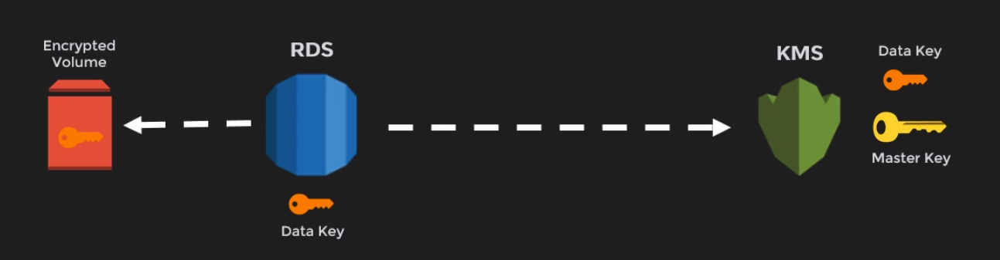
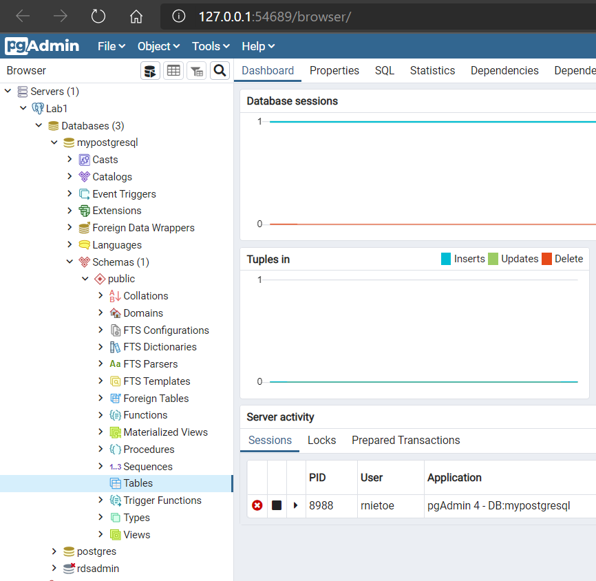

# 8. Databases

## RDS

**`AWS RDS`** (Relational Database Service): 

* **MS SQL Server** (port 1433) (up to 16TB of storage when using the Provisioned IOPS and General Purpose SSD storage)
* **Oracle**. Includes license model (BYOL - Bring your own license)
* **MariaDB**
* **MySQL** (port 3306)
* **PostgreSQL** (port 5432)
* **Amazon Aurora**. MySQL and PostgreSQL compatibility. **No free** tier. This is up to 5X **faster** than a traditional MySQL database

Some features: 

* Enable deletion protection: delete require this feature disabled. if enable, modify to disable first
* **Multi-AZ** for disaster recovery and **high availability**. By default in production RDS. Primary host replicates to a secondary host when failover. Enable multiAZ impact to the RDS instance if running
```shell
host -t NS database_endpoint # Query DNS Records on Linux
nslookup database_endpoint # Query DNS Records on Windows
```
* **Multi-Region** deployment will best ensure **global availability**.
* Backup retention from 0 days (disable) to **35 days**
* **Read Replicas** for performance improvement. Quering read replica can have a delay of less than a minute. They are usefull when:
    * scaling due to excess read traffic
    * source db unavailable
    * reporting and data warehousing
    * disaster recovery
    * hosting a cross region with lower latency
    * MS SQL Server cannot be read replica
    * `Create read replica` from the RDS instance (must have **backups** turned on and check the option **Public** accesible)
    * A read replica can be promoted as a standalone instance. Note that the promotion process is irreversible.  
* Use of **AWS EBS** volumes for database and log storage. Only Aurora uses its **storage system**.
* We can manage RDS instances (CPU and Memory) using AWS CLI, AWS RDS API or management console.  
* RDS run on VM, but login is not allowed.
* Patching RDS is Amazon's responsability

Scaling

* vertical scaling (storage, CPU, memory or network) with a new RDS instance of DB instance class. Instance may shutdown
    * multiAZ takes more time for vertical scaling, but RDS is shutted down less time than working on a single AZ
* horizontal scaling with read replicas
* scaling with AWS EBS storage


Backup options

* backups in S3 are stored in an RDS own bucket. 
* backup is for the db host, not only the databases.
* only the differences are stored in the new snapshot.
* in multiAZ there should not be impact. In single AZ, I/O is suspend from few seconds to few minutes.
* restoring a backup create a new RDS instance. you cannot restore to an existing db instance.

    !!!tip "retain DB Parameter Group and SG. Inbound rules should allow the connection using the DB port"

* Backup types:
    * **automated** backup: in a multiAZ scenario, data is backed up dialy taking a snapshot from the EBS volume of the secondary RDS instance 
        * scheduled window
        * retention
        * data can be restored to point in time on intervals of **5 minutes** based on **transactions logs**. 
    * **manual** snapshots. `Take DB Snapshot` from RDS instance
        * kept till deleted
        * only recommended before large changes
        * we can copy snapshot to different regions (crossregion copy)
        * we can share snapshots as public or private with other aws accounts

To mitigate the slow restore process:

* Restore a RDS instance with high I/O capacity
* Maximize the I/O during the restore process

Pricing

* DB Engine and version
* License model
* DB Engine class
* Multi-AZ: the price is twice
* Storage type and allocation

* Instance hours
* Database Storage: EBS VS Aurora
* Size of bakcup storage
* Data transfer out
* Data transferred between AZs for replication of Multi-AZ deployments is free

!!!tip "Reserve instance when long terms for both Multi-AZ and Single-AZ configurations"

Security

* Network isolation, using VPC:
    * Private subnet
    * Security group (firewall)
    * Public accessibility (turn off)
    * ClassicLink
    * **Direct Connect**: dedicated line from on premise to AWS to improve the network connection
    * VPC Peering
* IAM for access control:
    * Do not use AWS root credentials
    * IAM for RDS management
    * MFA for extra level of protection
    * Integrated security
        * Active directory for SQL Server
        * IAM Authentication MySQL, PostgreSQL, Aurora
* Encryption at Rest:
    * must be defined at creation or restoration time
    * it is free to encrypt data using KMS (Key Management System) and AES-256
    * encryption is replicated to all nodes, backups and snapshots
    * cannot decrypt once encrypted
    * two tier encryption: enable key rotation

        

* SSL for db conectivity  

Monitoring

* RDS sends metrics to `CloudWatch`
* 15-18 metrics based on the instance class (CPU, free storage space, network traffic, database connections and IOPS)
* [**Performance Insights**](https://console.aws.amazon.com/rds/home?region=us-east-1#performance-insights-v20206:) is a free database performance dashboard, but it is not available for db.t2 instances. Only Aurora, MySql and PostgreSql support.
* AWS RDS Events to be notified when events occurs

Script to test monitoring:
```sql
CREATE TABLE scale_data (
   section NUMERIC NOT NULL,
   id1     NUMERIC NOT NULL,
   id2     NUMERIC NOT NULL
);
INSERT INTO scale_data
SELECT sections.*, gen.*
     , CEIL(RANDOM()*100) 
FROM GENERATE_SERIES(1, 300)     sections,
       GENERATE_SERIES(1, 900000) gen
WHERE gen <= sections * 3000;
```

### How to create an RDS instance (PostgreSQL)

1. Download [pgAdmin](https://www.postgresql.org/ftp/pgadmin/pgadmin4/v4.27/windows/) and install -> [http://127.0.0.1:54689/browser](http://127.0.0.1:54689/browser)
2. Create a VPC using the wizard:
    * Select VPC with Public and Private Subnets
    * Select all default settings but Elastic IP Allocation ID. If not found, copy and paste
3. Configure RDS subnet groups:
    * Create DB Subnet groups (public and private)
    
    !!! error "DB Subnet Group doesn't meet AZ coverage requirement. Please add subnets to cover at least 2 AZs. Current coverage: 1"

    * Create a new public (10.0.2.0/24) and private (10.0.3.0/24) subnets in a different AZ. Then try to create the subnet group again
    * Edit route table association for the two new subnets. private subnets with NAT and public subnets with IGW (internet gateway)

4. From `RDS`, click `Create Database` button
5. Select PostgreSQL engine type, previous to last version, free tier template, db.t2.micro as db instance class, no multi-AZ
6. Select the VPC created above and the public subnet group. **Public access**
7. **Security groups are required for publicly accessible databases**. Create new VPC security group, so port 5432 will be opened to allow the PostgreSQL access.
8. Run pgAdmin and create a new server Lab1 using the RDS endpoint as hostname (`mypostgresql.cmr9irlg1qe3.us-east-1.rds.amazonaws.com`), and the user and pwd



```sql
CREATE TABLE test_data (
   section NUMERIC NOT NULL,
   id1     NUMERIC NOT NULL,
   id2     NUMERIC NOT NULL
);

INSERT INTO test_data
SELECT sections.*, gen.*, CEIL(RANDOM()*100) 
  FROM GENERATE_SERIES(1, 30) sections,
       GENERATE_SERIES(1, 90) gen
 WHERE gen <= sections * 3000;
```

### How to create a secured RDS instance

1. `Create a *parameter group*` from RDS with family postgres10 named PostgresSSL.
2. Edit PostgresSSL **parameter group** to enable and enforce ssl (ssl and rds.force_ssl = 1)

    !!!warning "Encryption at rest is not enabled for a db.t2.micro, so a dev/test RDS is required"

3. Set No Public Accessible and enable encryption
4. Edit SG rules filling our private subnet (10.0.1.0/24 and 10.0.3.0/24) as source for PostgreSQL type
5. From IAM, create a new Lambda Role using policy `AWSLambdaVPCAccessExecutionRole` named LambdaVPC
6. From Lambda, `create function` called ConnectSecureRDS with runtime as node.js 10.x and LambdaVPC role 
7. Select our VPC with private subnets and the SG already edited with inbound/outbound rules filling our private subnet (10.0.1.0/24 and 10.0.3.0/24) as source for PostgreSQL type
8. Upload the .zip file for the function code:

    ```js
    const { Client } = require('pg') // import node.js Postgres library

    exports.handler = function(event, context, callback) {   

      const client = new Client()

      client.connect()

      client.query('SELECT $1::text as message', ['Hello world!'], (err, res) => {
        console.log(err ? err.stack : res.rows[0].message) // Hello World!
        client.end()    
        callback(err, res);
      });
    }
    ```

9. Edit Environment variables 
    * PGHOST=RDS instance endpoint
    * PGUSER=acgrds
    * PGPASSWORD=test123123
    * PGDATABASE=ACGRDS
    * PGSSLMODE=require
10. Test the lambda function
11. Change VPC and test again
12. Change VPC subnet and test again.
13. Remove PGSSLMODE variable and test again.

### How to create an RDS instance for WordPress

1. `Create Database` from `RDS`.
2. Select MySQL engine type, free tier template (without Multi-AZ) and fill the database name (db instance identifier)
3. Set initial db name in the additional configuration. 
    * If you do not specify a database name, Amazon RDS does not create a database.
    * When creating an RDS instance, you can select the AZ into which you deploy it.
    * automated backups are enabled by default, till **35** days

4. Create a new EC2 instance with our WebDMZ security group, our key pair and the following advanced details:

	```shell
	#!/bin/bash
	yum install httpd php php-mysql -y
	amazon-linux-extras install -y php7.2
	cd /var/www/html
	wget https://wordpress.org/wordpress-5.4.1.tar.gz
	tar -xzf wordpress-5.4.1.tar.gz
	cp -r wordpress/* /var/www/html/
	rm -rf wordpress
	rm -rf wordpress-5.4.1.tar.gz
	chmod -R 755 wp-content
	chown -R apache:apache wp-content
	service httpd start
	chkconfig httpd on
	```
    
5. Allow connection between EC2 and RDS clicking on defult VPC security group, `inbound rules`, edit to add a rule with:
	* MySQL/Aurora type
	* protocol TCP 
	* port 3306
	* WebDMZ security group

6. Browse to the EC2 public IP and see the wordpress home page. Fill db name, user name, pwd and RDS endpoint (rnietoe.cmr9irlg1qe3.us-east-1.rds.amazonaws.com)
7. Create the wp-config.php file manually:

	```shell
	ssh ec2-user@52.87.161.80 -i rnietoe.pem
	cd /var/www/html
	nano wp-config.php
	# here paste wp-config.php from the wordpress home page. Ctrl+X to save it
	```

8. From the wordpress home page, `Run the installation`, fill the same credentials and `Install WordPress`
9. Login to wordpress
10. Configure a ELB target group to set WordPress settings URL with a DNS address instead of a public IP

Finally we create a EC2 instance image, like a **snapshot**. this is called **AMI** (Amazon Machine Image)

### How to create a fault-tolerance wordpress app

1. Create `Launch Configuration` named MyLaunchConfigurationGroup
2. select AMI MyworkPressTemplate
3. select instance type t2.micro
4. advance settings:

	```
	#!/bin/bash
	yum update -y
	```

5. select our Security group (virtual firewall) and key pair

6. Create `Auto Scaling Group` named MyAutoScalingGroup
7. Select MyLaunchConfigurationGroup
8. Select all subnets (AZ)
9. Enable ELB and select my target group
10. Scale between 2 and 3 instances (group size)
11. Set a scaling policy. for example, when CPU is 90%
12. notifications and tags not required here
13. Select the **ASG** (Auto Scaling Group) created and see the `Activity` tab. Two instances are created. 
14. Browse to the ELB DNS adress and create new post in wordpress . Delete instances, wait ASG create new instances and check the post is still there

## Amazon Aurora

* Hight performance with a low cost. 2-3x faster thant postgreSQL and 5x faster than MySQL
* Move **Logging** and **Storage** layers into a multi tented scale out database optimized service
* Storage **from 10gb to 64tb**
* Max of 32 CPUs and 244 GiB RAM
* Continuous backup to S3
* Aurora DB Cluster till 15 read-replicas
    * **Cluster** endpoint connection allow **write** operations
    * **Reader** endpoint connection allow **read** operations
    * **Custom** endpoint connection allow **load balancer**
    * **Instance** endpoint connection to a **specific instance**
* Aurora global databases
    * primary region - read and write
    * secondary region - read only. Promoted when failure
* Aurora store by default 6 copies of my data (3x2). Default availability is a minimum of 3 AZs with 2 db copies in each one

Create Amazon Aurora database with PostgreSQL compatibility from `RDS` 

* Three instances are created:
    * regional - with writer and read endpoints
    * writer
    * reader
* Create aurora read replica from actions (writer and reader node) 

### Aurora Serverless

* You specify the minimum and maximum amount of resources needed, and Aurora scales the capacity based on database load. This is a good option for **intermittent or unpredictable workloads**.
* only an endpoint is created

```js
//test lambda function
var mysql = require('mysql');

exports.handler = (event, context) => {

  var connection = mysql.createConnection({
    host     : '',
    user     : '',
    password : ''
  }); 

  connection.connect(function(err) {
    if (err) throw err;
    console.log("Connected!");
  });

  connection.query("SELECT 'Hello World!';", function (err, result) {
    if (err) throw err;
    console.log(result);
    context.succeed('Success');
  });    
};
```

## DynamoDB

DynamoDB (Non Relational Databases - **faster** due to small transactions) is a key-value and document database that delivers single-digit millisecond performance at any scale.

DynamoDB allows for the storage of large text and binary objects, but there is a limit of **400 KB** for the combined Value and Name

* Data is stored on SSDs (Solid State Drives).
* DynamoDB provide automatic replication across AZs. It is a regional service, there is no need to explicitly create a multi-AZ deployment.
* DynamoDB is distributed across 3 geographically distinct datacentres by default
* **DAX** (DynamoDB Accelerator) is an advanced DynamoDB
* There will always be a charge for:
    1. provisioning read and write capacity 
    2. the storage of data: $0.25Gb per month

Consistency types (database will not be consistent in one moment, but it will be in another moment):

* Eventual consistent reads (default) sample of 2 seconds  
* Strongly consistent reads. sample of less than 1 second. some disadvantages such as :
    * read might not be available if there is a network delay or outage
    * higher latency
    * global secondary indexes not supported
    * use of more throughput capacity

Create DynamoDB table:

1. `Create a table` instead of a database
2. Set table name and primary key

## RedShift 

Quick start to [Deploy an Amazon Redshift data warehouse on the AWS Cloud for big data and analytics](https://aws.amazon.com/quickstart/architecture/amazon-redshift/)

* **Amazon's Data WareHousing** database (columnar data store) used for **OLAP** (OnLine Analytics Processing)
* Used for Business Intelligence
* availabled in 1 AZ
* single node of 160 gb up to 160tb
* $0.25 per hour or $1.000 per Tb per year

security:

* SSL transit encryption
* AES-256 storage encryption usin AWS KMS

## ElastiCache

Improve performance with **in-memory cache** for the most common queries:

* Memcached. Simplest model for implementation. hight performance. It does not offer a native encryption service
* **Redis** (muti AZ) 
    * Pub/Sub
    * Sorted Sets 
    * In-Memory Data Store
    * HIPPA or PCI-DSS **compliance**

!!!important "ElastiCache is only a key-value store and cannot therefore store relational data."


## Graph Databases

Amazon Neptune