# 1. Cloud Services Overview

## Could Computing D efinition

* Could computing is proccessing on the internet or a private network where the exact processor location is unknown.
* Cloud computing still uses servers, they are simply hidden from view.

## AWS Benefits

* Reduce hardware, operational and deployment costs.
* Increase resiliency (recoverability from a failure or a problem, performance (with auto scaling and capacity (storage, users, etc.)

## Cloud Computing Terms

* IaaS (Infrastructure as a Service): you manage the entire infrastructure (network, databases, storage) in the cloud, but platform and software run on others' infrastructure
* PaaS (Platform as a Service): you simply manage applications instead of manage the infrastructure, such as web hosting
* SaaS (Software as a Service): you use the software developed by others from the cloud, such as emails 

## History

* 2004 AWS publish lunch with SQS (Simple Q Service)
* 2006 - republished using  S3 (Simple Storage Servive) and EC2 (allow running virtual servers in the cloud)
* 2007 - Simple DB
* 2008 - elastic IP (static IP for EC2 instances)
* 2009-  management console and VPC (virtual private cloud)
* 2010 - Route 53 (DNS and domain registration), SNS and IAM
* 2011 - ElastiCache and CloudFormation
* 2012 - SWF and DynamoDb (no SQL DB)
* 2013 - OpsWorks, Kineses, CloudHSM, AWS certification program 
* 2014 - Redshift (SSD-Storage)
2015 - CloudTrail, Data Pipeline, WAF (Web Application Firewall), QuickSight
* 2017 - Direct Connect (VPN connectivity into VPC)
* AWS organisations: policy based management across multiple AWS accounts
* EC2 advisor (take advantage of low CPU utilization times in the Amazon cloud)
* Amazon chime

## Core Components

Compute, Storage, Database, Networking and Security

## AWS Services

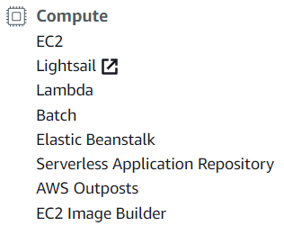

* **EC2**: how you build an instance, how you launch a virtual machine within AWS manually
* **Elastic Beanstalk**: AWS build the instance for me

* **S3** is the simple storage service
* **EFS** (Elastic File System)
* **Glacier** is used for archival purposes (cold data that I don't need very often)
* **Storage Gateway**

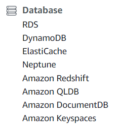

* **RDS** (Relational Database System)
* **DynamoDB** (NoSQL)
* **ElastiCache**: faster to retrieve data

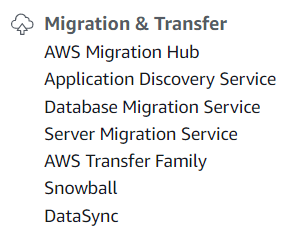

Migration category is all about how do I get my stuff into AWS

* **Migration Hub** takes existing VMware or Hyper-V virtual machines and get them into AWS as an instance. 
* **Snowball** throws a bunch of data at Amazon

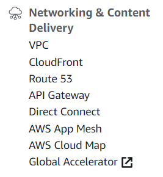

* **VPC**
* **CloudFront** lets you cache data locally to where someone might be accessing the website.
* **Route 53** (my DNS)
* API Gateway (more covered in the AWS Developers Certification)
* **Direct Connect** gets a VPN between your data center and the Amazon cloud

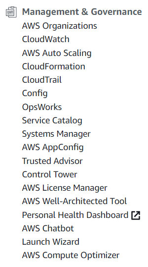

* **CloudWatch** monitors your cloud to make sure everything is healthy and working
* **AWS Auto Scaling** allows you to scale out or scale in depending on your needs in a given time.
* **CloudFormation** 
* **CloudTrail**
* **Trsuted Advisor**

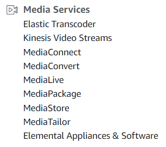

* **Kinesis** for streaming media
* **Elastic Transcoder** for transcoding media, to convert it from one codec to another, even the ability to use something like AWS recognition so we can go in and do text recognition within videos and recognition of other things within videos

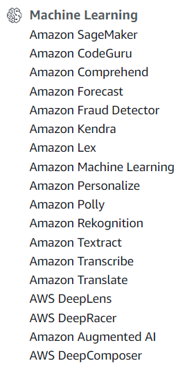

machine learning to undesrtand patterns

* **Rekognition**: analysis app for visual analysis

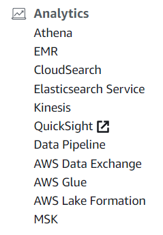

* **Kinesis**: analytics for business decisions and support

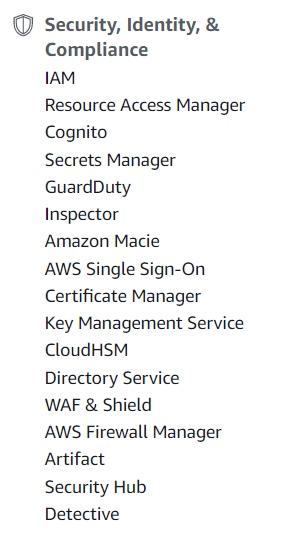

* **IAM**  (Identity and Access Management)
* **Cognito**
* **Inspector**
* **CloudHSM**
* **Directory Service**
* **WAF & Shield**

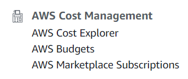

!!! important "the cheapest way to do something"

 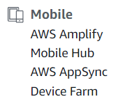

 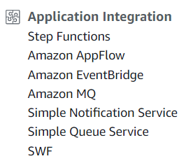

 * **Simple Notification Service** 
 * **Simple Queue Service** 