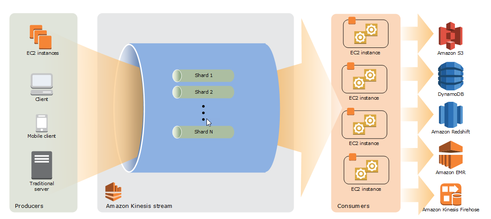
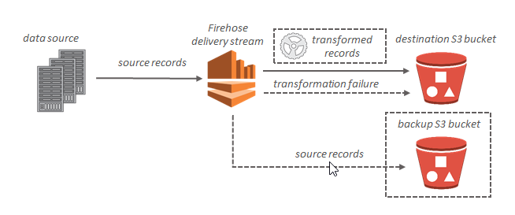
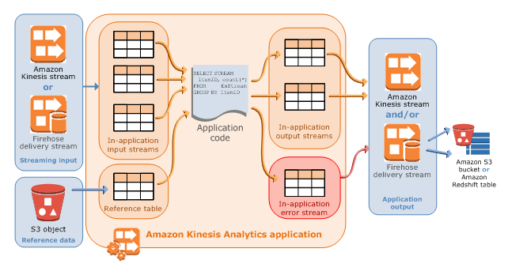

# 10. Media

## Elastic Transcoder 

Amazon Elastic Transcoder covert media files from their original source format in to different formats that will play on any device.

## Kinesis

Kinesis is a platform to send your streaming data to.

* Kinesis Video Streams: Capture, process, and store video streams for analytics and machine learning.
* Kinesis Data Stream (KDS): **store** streaming data for processing in shards from 24 hours to 7 days
    
    * Producers, shards and consumers are components of Kinesis Data Streams
* Kinesis Firehose: **load** streaming data into AWS data stores and analytics tools
    
    * there is not data persistent. lambda funcions are optional 
    * Key components are: delivery streams, records of data and destinations.
* Kinesis Analytics: Process and analyze streaming data using SQL or Java.
    