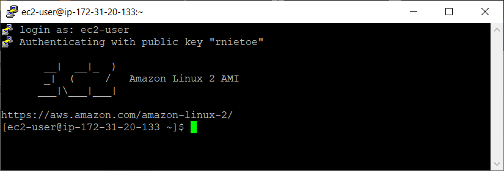

# 4. Compute 

## EC2

**`AWS EC2`** (**E**lastic **C**ompute **C**loud) is a virtual server in the cloud. It is a web service that provides resizeable compute capacity in the cloud

* **EC2 fleet** - multiple EC2 instances. They are manage by **`AWS System Manager`**  
* **Spot fleet** - multiple Spot (and on demand) instances 

!!!danger "AWS originally used a modified version of the **Xen** Hypervisor to host EC2. In 2017, AWS began rolling out their own Hypervisor called **Nitro**"

### Placement groups

* **Clustered**: Group homogenous EC2 instances within a single AZ for network performance
* **Spread**: Individial EC2 instances are placed on distinct rack within one region for hardware errors
* **Partitiononed**: Multiple EC2 instances in the same rack

### Pricing models:

* **On Demand**: low cost, paying by hour or second. You have full control over its lifecycle—you decide when to launch, stop, hibernate, start, reboot, or terminate it. Sample: when **task run uninterrupted** from start to finish
* **Reserved**: the most economical option for **long-term workloads** with predictable usage patterns. Contract terms are 1 to 3 years. It includes different discounts
	* **Standard** Reserved instances (75% off on demand instances)
	* **Convertible** Reserved instances (54%)
	* **Schedule** Reserved instances, based on times
* **Spot**: taket advantage of unused EC2 capacity. It can accept interruptions. Used for various stateless, fault-tolerant, or flexible applications such as big data, containerized workloads, CI/CD, web servers, HPC (high-performance computing), and other test & development workloads. Extra charge when you terminate the instance
    * Spot Instances are available at up to a 90% discount compared to On-Demand prices.
* **Dedicated**: physical EC2 server. It reduces cost using your SW licenses. Also when multitenant not supported by law

    

    !!!danger "Standard Reserved Instances cannot be moved between regions. You can choose if a Reserved Instance applies to either a specific AZ, or an Entire Region, but you cannot change the region"

 EC2 Pricing depends on:

* Clock hours of server time
* instance type
* pricing model (on demand, reserved, spot, dedicated host)
* number of instances
* load balancing
* detailed monitoring
* auto scaling
* Elastic IP Addresses
* Operative Systems and sw packages

### AMI

* (**A**mazon **M**achine **I**mange) are instance image snapshots of different Operative System
* AMI are based on region, OS, architecture (32 or 64 bits), launch permissions and storage for the root volume (EBS or **Instance store** - ephemeral storage)
* EC2 instance with **Instance Store** can't be stopped
* **Instance Store** does not appear in the AWS EC2 Volume list
* To use hibernation, the root volume must be an encrypted EBS volume. RAM be less than 150gb

!!!danger "Use snapshots and AMI to change EC2 volumes (AZ and encryption)."

* Snapshots are incremental
* You must first deregister the AMI before you can delete the snapshot
* You can use AWS APIs, CLI or the AWS Console to copy snapshots, share snapshots, and create volumes from snapshots.
* EBS snapshots use incremental backups and are stored in S3.
* Volumes exist on EBS. Snapshots and instance store exist on S3. 

```shell
aws ec2 create-snapshot
```
### How to create EC2:

1. From AWS EC2, `Launch instance`
2. Select AMI, for example: Amazon Linux 2 AMI
3. Choose an Instance Type (t2 micro - free tier)
4. Configure Instance Details (number of instances) 

    !!!tips "Enable CloudWatch detailed monitoring is not free"

5. Add Storage. Root and EBS volume types allow encryption and delete on termination (turn off by default on EBS) 

    !!!note "EC2 instance and volume are in the same AZ"

6. Add tags like Name, Department or Employee_Id
7. Configure **Security Groups** - virtual firewalls to enable traffic (types ssh & http - ports 22 & 80)
    * All inbound traffic is blocked by default and all outbound traffic is allowed (SG are STATEFUL)
    * Linux=SSH port 22. Microsoft Windows= RDP (Remote Desktop Protocol) port 3389. http/https ports 80/443
    * SG changes are take effect immediately
    * one or more SG can be assigned to EC2 instance. EC2 and SG relationshipt is many to many
    * use **Network ACL** to block specific IP address instead of SG

8. Launch using a key pair (public and private key)

!!!danger "Always design for failure. Have one EC2 instance in each AZ"
!!!tips "EC2 instance are provisioned in AZ"

### How to connect to EC2 

Using AWS Console, select the EC2 instance and clic on the `Connect` button

Using putty:

1. Download [putty](https://www.chiark.greenend.org.uk/~sgtatham/putty/latest.html) and load private key file created at `EC2/Key Pairs` (rnietoe.ppk) using putty gen.

	**Key pair** can created or imported in AWS. You can create you key pair with the following command, keep the private key and import the public key in AWS:

	```shell
	ssh-keygen -C rnietoe@gmail.com -f ~/.ssh/rnietoe
	```

2. Configure SSH Auth with private key
3. Copy IP address to the session host name field
4. Open connection, login as `ec2-user` and type `sudo su command`

    

Using gitbash and install a web server:

```shell
cd "C:\Users\rniet\OneDrive\AWS"
CHMOD 400 rnietoe.pem # change permissions to lock my key down
ssh ec2-user@3.80.39.184 -i rnietoe.pem
sudo su
uname -a  # software details
cat ~/.ssh/authorized_keys	# the public key
```

```shell
while true; do echo; done # to monitor the CPU usage
```

Using CLI

1. Download the windows installer from [AWS Command Line Interface](https://aws.amazon.com/cli/?nc1=h_ls) and installe it
2. Now we have the **aws** command in our prompt
3. Configure IAM User with Programmatic access 
4. Download the access key and the secret access key:

	```shell
	aws configure
	aws configure --profile profile_name # when we want to work with cli profiles
	# once type the access key, the secret access key, the default region and the output format (json/text)
	aws ec2 describe-regions
	# use :q to exit from command output
	aws <command> --profile <profile_name> # when we want to execute commands with a specific profile
	set AWS_PROFILE=<profile_name> # set/unset default profile
	echo $AWS_PROFILE
	aws sts get-caller-identity # print out account and user info    
    cat ~/.aws/config	# file containing profile configuration
    cat ~/.aws/credentials	# file containing profile credentials	
    rm -rf ~/.aws
	```

    We must use **roles** for security reasons instead of saving credentials (anyone could access to the .aws directory). Roles are global. They are not specified any region. Create a role to allows EC2 to use S3 as an admin:

    1. Go to `IAM/Roles` and crete a new role
    2. Select `EC2` as the type of trusted entity
    3. Attach `AmazonS3FullAccess` permissions policies
    4. Go to `EC2`, select the instance and actions/instance settings/attach/replace iam role
    5. Then we can delete .aws directory with credential and still running `aws s3 ls`

    ```shell
    aws s3 ls
    ```

### How to create a static website on S3

```shell
aws configure # enter user´s accesskeys and us-east-1 as default region
aws s3 mb s3://rnietoe2 # make bucket command
aws s3 ls # list all s3 instances

echo "hello world" > hello_world.txt
aws s3 cp hello_world.txt s3://rnietoe2 #upload: ./hello_world.txt to s3://rnietoe2/hello_world.txt

cd ~ # go to home directory
cd .aws # go the hidden directory
nano credentials # display access keys
```

### How to build a web server

```shell
sudo su
yum update -y # check for updates
yum install httpd -y # install apache 
cd /var/www/html # create index.html in this path
nano index.html
<html><body><h1>This is server 1</h1></body></html>
service httpd start # sudo systemctl start httpd # start apache service
chkconfig on # start apache on restarts
```

### How to use a load balancer

Create Load balancer with a single instance:

1. From `EC2/Load Balancers`, create a load balancer

	* Select `Application Load Balancer` as load balancer type for http/https traffic. 
	* `Network Load Balancer` type will be required for ultra-hight performance and static IPs. 
	* `Classic Load Balancer` would be the cheapest type for test and dev. It is intended for applications that were built within the EC2-Classic network.

3. Configure Load Balancer with name and select every AZ
4. Select our Security Group (virtual firewall)
5. Configure Routing with a Target Troup name and the following health check settings:
	* healthy threshold: 3 times
	* unhealthy threshold: 3 times
	* timeout: 3 seconds
	* interval: 5 seconds
	* success code: 200
6. Register target adding our EC2 instance (to registered)
7. Review and create
8. Browse to the ELB (**E**lastic **L**oad **B**alance) DNS name and see the result, instead of browsing to the EC2 IP address

    Launch a new EC2 instance with a different subnet (in order to have our two EC2 instances in two different AZ)

9. Configure instance details with advance details:

	```shell
	#!/bin/bash		below code is running with the root user
	yum update -y
	yum install httpd -y
	service httpd start
	chkconfig httpd on	# start apache on restarts
	cd /var/www/html
	echo "<html><body><h1>This is server 2</h1></body></html>" > index.html
    aws s3 mb s3://YOURBUCKETNAMEHERE
    aws s3 cp index.html s3://YOURBUCKETNAMEHERE # backup in S3
	```

    More details to create Bootstrap actions to install additional software are [here](https://docs.aws.amazon.com/emr/latest/ManagementGuide/emr-plan-bootstrap.html)

10. Add tags
11. Select our security group (virtual firewall)
12. Review and launch using our private key
13. Browse to the public IP to see the result

    Update `Load balancing/Target Groups` adding our second EC2 instance

14. Select the target group and click the button `Register targets`
15. Select our second EC2 instance and click the buttons `Include as pending below` and `Register pending targets` to add registerd on port 80  
16. Wait till the target groups instance status is healthy
17. Browse to the ELB DNS name and see the result

18. Remove the second EC2 instance with the action `Terminate Instance`
19. Browse to the ELB DNS name and see the result.

## Elastic Beanstalk

**`AWS Elastic Beanstalk`** is an easy-to-use service for deploying and scaling web applications and services developed with Java, .NET, PHP, Node.js, Python, Ruby, Go, and Docker on familiar servers such as Apache, Nginx, Passenger, and IIS.

1. `Create Application` from `Elastic Beanstalk`
2. Select PHP as platform and the sample application code
3. Crete environment includes:
	* S3 bucket
	* LB / Target group
	* Security group (virtual firewall)
	* Launch Configuration / Auto Scaling
	* Ec2 instance
	* CloudWatch alarm
	* ...

### Retrieving instance metadata

Connect to the EC2 instance and [get instance metadata](https://docs.aws.amazon.com/AWSEC2/latest/UserGuide/instancedata-data-retrieval.html) to get information about an instance:

```shell
curl http://169.254.169.254/latest/user-data
curl http://169.254.169.254/latest/user-data > bootstrap.txt
cat bootstrap.txt

curl http://169.254.169.254/latest/meta-data
curl http://169.254.169.254/latest/meta-data/local-ipv4
curl http://169.254.169.254/latest/meta-data/public-ipv4
```

## Lambda

**`AWS Lambda`** is the Function-as-a-Service (FaaS) to run your code without provisioning or managing servers.

* Lambda can be used for Infrastructure as Code
* You can use JSON or YAML for Lambda templates.
* The resources section is the only required field in Lambda templates.

Pricing: 

* request pricing
	* 1 million request per month free
	* 0,20$ next million requests
* duration pricing (how long lambda functions are executing for)
	*  4000.000 gb-seconds per month free, up to 3,2 million seconds of compute time
	* 0,00001667 for every GB second used thereafter
* additional charges
	* when using other AWS services

## Batch

**`AWS Batch`** enables you to easily and efficiently run batch computing jobs of any scale on AWS using EC2 and EC2 Spot.
