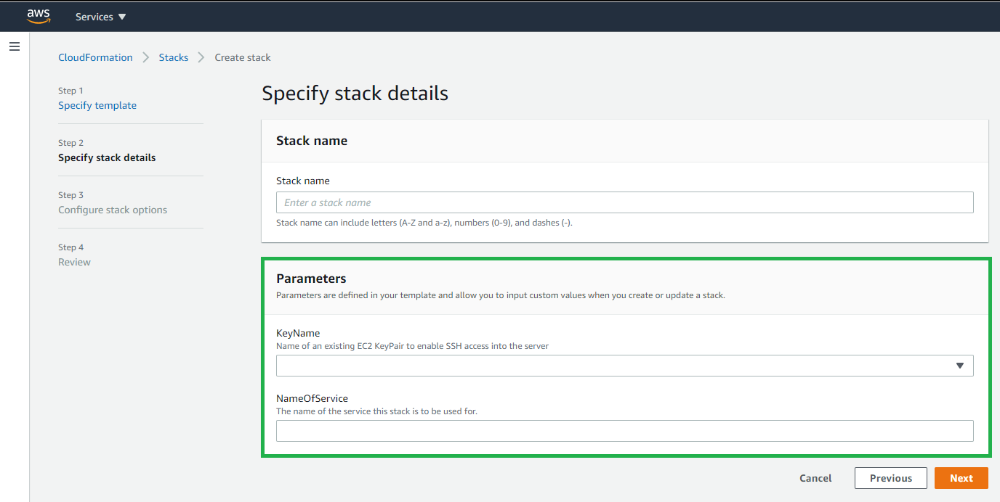

# AWS Architect
Book your exam [here](https://www.aws.training/certification)

## Preparation Guide

### ACloud.Guru Final Practice Exam  
[https://aws.amazon.com/certification/certification-prep/](https://aws.amazon.com/certification/certification-prep/)

• Step 1: Take an AWS Training Class  
• Step 2: Review the Exam Guide and Sample Questions  
• Step 3: Practice with Self-Placed Labs and an Exam Prep Quest  
• Step 4: Study AWS Whitepapers  
• Step 5: Review AWS FAQs  
• Step 6: Take an Exam Prep Workshop  
• Step 7: Take a Practice Exam  
• Step 8: Schedule Your Exam and Get Certified  

[https://www.qwiklabs.com/](https://www.qwiklabs.com/)

### AWS Documentation:  
[https://docs.aws.amazon.com/index.html?nc2=h_ql_doc_do](https://docs.aws.amazon.com/index.html?nc2=h_ql_doc_do)  
[https://aws.amazon.com/faqs/](https://aws.amazon.com/faqs/)  
[https://aws.amazon.com/whitepapers/?whitepapers-main.sort-by=item.additionalFields.sortDate&whitepapers-main.sort-order=desc](https://aws.amazon.com/whitepapers/?whitepapers-main.sort-by=item.additionalFields.sortDate&whitepapers-main.sort-order=desc)    
[https://www.youtube.com/c/amazonwebservices/videos](https://www.youtube.com/c/amazonwebservices/videos)  
[https://aws.amazon.com/architecture/](https://aws.amazon.com/architecture/)  
[https://aws.amazon.com/new/](https://aws.amazon.com/new/)  
[https://www.meetup.com/es/topics/amazon-web-services/](https://www.meetup.com/es/topics/amazon-web-services/)  

### AWS Exam  
[https://aws.amazon.com/certification/faqs/](https://aws.amazon.com/certification/faqs/)  
[https://aws.amazon.com/certification/certified-solutions-architect-associate/](https://aws.amazon.com/certification/certified-solutions-architect-associate/)

AWS Cloud Practitioner Essentials (Second Edition) (Spanish)
[https://www.aws.training/Details/Curriculum?id=46152](https://www.aws.training/Details/Curriculum?id=46152)

### Working with an AWS Account
[https://rnietoe.signin.aws.amazon.com/console](https://rnietoe.signin.aws.amazon.com/console)

* rnietoe@gmail.com - AWS account (root account)
* rnietoe/training
* rnietoe/paying
* Abodroc@83
* Google Authenticator for Android - MFA (**M**ulti-**F**actor **A**uthentication)

How to connect to EC2 using putty:

1. Download [putty](https://www.chiark.greenend.org.uk/~sgtatham/putty/latest.html) and load private key file created at `EC2/Key Pairs` (rnietoe.ppk) using putty gen.

	**Key pair** can created or imported in AWS. You can create you key pair with the following command, keep the private key and import the public key in AWS:

	```shell
	ssh-keygen -C rnietoe@gmail.com -f ~/.ssh/rnietoe
	```

2. Configure SSH Auth with private key
3. Copy IP address to the session host name field
4. Open connection, login as `ec2-user` and type `sudo su command`


How to connect to EC2 using gitbash and install a web server:

```shell
cd "C:\Users\rniet\OneDrive\AWS"
ssh ec2-user@3.80.39.184 -i rnietoe.pem
uname -a  # software details
cat ~/.ssh/authorized_keys	# the public key
```

How to connect using CLI

1. Download the windows installer from [AWS Command Line Interface](https://aws.amazon.com/cli/?nc1=h_ls) and installe it
2. Now we have the **aws** command in our prompt
3. Configure IAM User with Programmatic access 
4. Download the access key and the secret access key:

	```shell
	aws configure
	aws configure --profile profile_name # when we want to work with cli profiles
	# once type the access key, the secret access key, the default region and the output format (json/text)
	aws ec2 describe-regions
	# use :q to exit from command output
	aws <command> --profile <profile_name> # when we want to execute commands with a specific profile
	set AWS_PROFILE=<profile_name> # set/unset default profile
	echo $AWS_PROFILE
	aws sts get-caller-identity # print out account and user info
	```

~/.aws/config	# file containing profile configuration
~/.aws/credentials	# file containing profile credentials	

## AWS Certified Cloud Practitioner 2020

### Introduction to AWS

* **IaaS**: Infrastructure as a service, such as **`EC2`**
* **PaaS**: Platform as a Service, such as **`Elastic Beanstalk`** or **`Lightsail`** 
* **SaaS**: Software as a Service, such as Gmail
* **FaaS**: Function as a Service
* **DaaS**: Desktop as a Service such as Windows or Linux, provide by **`WorkSpaces`**.

 Three different ways to access AWS:

 1. Programmatic, using the CLI (**C**ommand **L**ine **I**nterface)
 2. Using the Console
 3. Using SDK 

The three types of cloud deployments are:

* Public
* Hybrid
* Private (also called 'on-prem')

Traditional Computing VS Cloud Computing

* IT Assets as provisioned resources
	* Bootstrapping scripts, Golden images, Containers, Hybrid
	* CloudFormation
	* Automation: serverless management and deployment
		* AWS Elastic Beanstalk
		* EC2 auto recovery and Auto Scaling
	* Alarms and Events - CloudWatch - Lambda scheduled events, WAF security automations
* Global, available and scalable capacity
	* Scale up / Vertical Scaling (increase RAM, CPU)
	* Scale Out - Horizontal Scaling (add multiple virtual machines behind a ELB)
		* Stateless applications (Lambda - Alexa)
		* Stateless componets (login credentials in a cookie)
		* Statefull components (store information in a db)
		* Distribute load to multiple nodes
		* Distributed Processing 
		* Implemente distributed processing
* Higher level managed services
* Built-in security
* Architecting for cost
* Operations on AWS
	
	Build your systems to be scalable, use disposable resources, reduce infrastructure to code, and assume EVERYTHING will fail sooner or later.

Global services (for every region):

* IAM
* Route53
* CloudFront
* SNS (Simple Notify Service)
* SES

Regional Services with global view

* S3

AWS Service that can be used on premise:

* Snowball - to upload TB to amazon in a week instead of three months
* Snowball Edge- include CPUs
* Storage gateway
* CodeDeploy - include applications
* Opsworks - include applications
* IoT greengrass

### Overview

* **Availability Zone** (AZ) are data center
* **Region** is a distinct location within a geographical area with 2 or more AZ, designed to provide high availability to a specific geography. Choosen by law, latency and AWS Services

!!!note "US East (N. Virginia) us-east-1 was the first region and all new services are deployed here first" 

* **Edge Locations** are Amazon's CDN (**C**ontent **D**elivery **N**etwork) end points. Objects are cached for 48 hours by default (TTL - Time To Live). This not just read only. Types:
    * Web Distribution (websites)
    * RTMD (media streaming) - Discontinued support by CloudFront on December 31, 2020"

!!!important "Number of Edge Locations > Number of Availability Zones > Number of Regions"

#### CloudFront: 

**`AWS CloudFront`** distribution is a collection of a CDN's Edge Locations. This allows you to distribute content using a worldwide network of edge locations that provide low latency and high data transfer speeds

1. Create a CloudFront distribution
2. Browse to the CloudFront distribution domain name ([https://dzi85fss8k88j.cloudfront.net/malaga.jpg](https://dzi85fss8k88j.cloudfront.net/malaga.jpg))
3. To delete a CloudFront distribution, you have to disable it first. This process takes 15 minutes

	A CloudFront Origin can be an S3 bucket, an EC2 instance, an Elastic Load Balancer or Route53.

!!!info "We can be charged when deleting cached data from an edge location"

#### Resource Groups and Tag Editor

* **Tags** allow to find AWS resources in a selected region, but it can not directly managing those resources. This can make it easier to search for and filter resources by purpose, owner, environment, or other criteria.

* **Resources groups** allow to execute operations from **`AWS Systems Manager`** to different resources (such as a EC2 fleet) based on resources groups

### Security

#### IAM 

**`AWS IAM`** (**I**dentity and **A**ccess **M**anagement) enables you to manage access to AWS services and resources securely. 

* You can create and manage AWS users and groups globally and not for a specific a region
* You can use permissions to allow and deny their access to AWS resources.
* Groups are a collection of users with specific permissions/policies
* **Identities** include users, groups, and roles. These are the IAM resource objects that are used to identify and group. You can attach a policy to an IAM identity. 
* A **Principal** is a person or application that uses the AWS account root user, an IAM user, or an IAM role to sign in and make requests to AWS.

When you create IAM policies, follow the standard security advice of granting **the least privilege**, or granting only the permissions required to perform a task. Determine what users (and roles) need to do, and then craft policies that allow them to perform only those tasks.

With the **IAM Policy Simulator**, you can test and troubleshoot identity-based policies, IAM permissions boundaries, Organizations service control policies, and resource-based policies.

#### Security in the cloud 

**`AWS Artifact`**: [Compliance](https://aws.amazon.com/compliance/?nc1=h_ls) and security **reports** in the AWS Cloud

* A **PCI DSS Level 1** certification attests to the security of the AWS platform regarding **credit card transactions**.
* A **HIPAA** certification attests to the fact that the AWS Platform has met the standard required for the secure storage of **medical records** in the US

"AWS is responsible for the security **OF** the cloud. The customer is responsible for security **IN** the cloud ". Customer is responsible of patching EC2 instances. If you can do in the aws console, you are the responsible

Encryption is a shared responsability

[Shared responsability model](https://aws.amazon.com/compliance/shared-responsibility-model/) talks about who is responsible for waht in cloud


The customer would be responsible for patching the Operating System for IaaS solutions

* **`WAF`** (**W**eb **A**pplication **F**irewall) to stop hackers. It operates down to Layer 7.
* **`Shield`** protect a lot of traffic (DDOS attacks). Only AWS Shield Advanced offers automated application layer monitoring. This costs $3000/month
* **`Inspector`** to anayze and report security issues on EC2, but it can not examine individual policies
* **`Trusted Advisor`** for recomendations and advices (not only EC2 instances). It helps you optimize cost, fault-tolerance, and more.
* **`CloudTrail`** track user **activity** and API usage
* **`CloudWatch`** monitoring **performance**
* **`Config`** monitor **configuration** settings
* **`Athena`** serverless service for **querying** data in S3
* **`Macie`** uses Machine learning to protect **sensitive data** stored in S3
* **`Kinesis`** work with Real-Time Streaming Data

* `Personal Health Dashboard` helps you to inspect account alerts and find remediation guidance for your account
* `Service Health Dashboard` displays the general status of AWS services

It's safer to use IAM roles than it is to use Access Keys.

### Compute

#### EC2

**`AWS EC2`** (**E**lastic **C**ompute **C**loud) is a virtual server in the cloud. It is a web service that provides resizeable compute capacity in the cloud

**EC2 fleet** - multiple EC2 instances. They are manage by **`AWS System Manager`**

Pricing models:

* **Dedicated**: physical EC2 server. It reduces cost using your SW licenses. Also when multitenant not supported by law
* **Reserved**: the most economical option for **long-term workloads** with predictable usage patterns. Contract terms are 1 to 3 years. It includes different discounts
	* Standard Reserved instances (75%)
	* Convertible Reserved instances (54%)
	* Schedule Reserved instances, based on times
* **On Demand**: low cost, paying by hour or second. You have full control over its lifecycle—you decide when to launch, stop, hibernate, start, reboot, or terminate it. Sample: when **task run uninterrupted** from start to finish
* **Spot**: based on start and end times. it can accept interruptions. Used for various stateless, fault-tolerant, or flexible applications such as big data, containerized workloads, CI/CD, web servers, high-performance computing (HPC), and other test & development workloads. Extra charge when you terminate the instance

Spot Instances are available at up to a 90% discount compared to On-Demand prices.


**EBS** is the virtual hard disk attached to the EC2:

* SSD 
	* GP2 - General Purpose
	* IO1 - Input Output per second - high perfrmance
* Magnetic (HDD)
	* ST1 - Low cost for frequently access
	* SC1 - Lowest cost for less frequently access
	* Magnetic - Previous generation

##### How to create a EC2:

1. `Launch instance`
2. Select Operative System (amazon linux 2 AMI)
3. Choose an Instance Type (free tier)
4. Configure Instance Details (number of instances) 
5. Add Storage
6. Add tags like Name, Department or Employee_Id
7. Configure **Security Groups** - virtual firewalls (types ssh & http - ports 22 & 80)

	!!!info "Linux=SSH port 22. Microsoft Windows= RDP (Remote Desktop Protocol) port 3389. http/https ports 80/443"

8. Launch using a key pair (public and private key)

!!!danger "Always design for failure. Have one EC2 instance in each AZ"

##### How to create a static website on S3

```shell
aws configure # enter user´s accesskeys and us-east-1 as default region
aws s3 mb s3://rnietoe2 # make bucket command
aws s3 ls # list all s3 instances

echo "hello world" > hello_world.txt
aws s3 cp hello_world.txt s3://rnietoe2 #upload: ./hello_world.txt to s3://rnietoe2/hello_world.txt

cd ~ # go to home directory
cd .aws # go the hidden directory
nano credentials # display access keys
```

We must use **roles** for security reasons instead of saving credentials (anyone could access to the .aws directory). Roles are global. They are not specified any region. Create a role to allows EC2 to use S3 as an admin:

1. Go to `IAM/Roles` and crete a new role
2. Select `EC2` as the type of trusted entity
3. Attach `AmazonS3FullAccess` permissions policies
4. Go to `EC2`, select the instance and actions/instance settings/attach/replace iam role
5. Then we can delete .aws directory with credential and still running `aws s3 ls`

```shell
cd ~
rm -rf .aws
aws s3 ls
```

##### How to build a web server

```shell
sudo su
yum update -y # check for updates
yum install httpd -y # install apache 
cd /var/www/html # create index.html in this path
nano index.html
<html><body><h1>This is server 1</h1></body></html>
sudo systemctl start httpd # start apache service
```

##### How to use a load balancer

Create Load balancer with a single instance:

1. From `EC2/Load Balancers`, create a load balancer

	* Select `Application Load Balancer` as load balancer type for http/https traffic. 
	* `Network Load Balancer` type will be required for ultra-hight performance and static IPs. 
	* `Classic Load Balancer` would be the cheapest type for test and dev. It is intended for applications that were built within the EC2-Classic network.

3. Configure Load Balancer with name and select every AZ
4. Select our Security Group (virtual firewall)
5. Configure Routing with a Target Troup name and the following health check settings:
	* healthy threshold: 3 times
	* unhealthy threshold: 3 times
	* timeout: 3 seconds
	* interval: 5 seconds
	* success code: 200
6. Register target adding our EC2 instance (to registered)
7. Review and create
8. Browse to the ELB (**E**lastic **L**oad **B**alance) DNS name and see the result, instead of browsing to the EC2 IP address

Launch a new EC2 instance with a different subnet (in order to have our two EC2 instances in two different AZ)

9. Configure instance details with advance details:

	```shell
	#!/bin/bash		below code is running with the root user
	yum update -y
	yum install httpd -y
	service httpd start
	chkconfig httpd on	# start apache on restarts
	cd /var/www/html
	echo "<html><body><h1>This is server 2</h1></body></html>" > index.html
	```

10. Add tags
11. Select our security group (virtual firewall)
12. Review and launch using our private key
13. Browse to the public IP to see the result

Update `Load balancing/Target Groups` adding our second EC2 instance

14. Select the target group and click the button `Register targets`
15. Select our second EC2 instance and click the buttons `Include as pending below` and `Register pending targets` to add registerd on port 80  
16. Wait till the target groups instance status is healthy
17. Browse to the ELB DNS name and see the result

18. Remove the second EC2 instance with the action `Terminate Instance`
19. Browse to the ELB DNS name and see the result.

#### Elastic Beanstalk

**`AWS Elastic Beanstalk`** is an easy-to-use service for deploying and scaling web applications and services developed with Java, .NET, PHP, Node.js, Python, Ruby, Go, and Docker on familiar servers such as Apache, Nginx, Passenger, and IIS.

1. `Create Application` from `Elastic Beanstalk`
2. Select PHP as platform and the sample application code
3. Crete environment includes:
	* S3 bucket
	* LB / Target group
	* Security group (virtual firewall)
	* Launch Configuration / Auto Scaling
	* Ec2 instance
	* CloudWatch alarm
	* ...

#### Lambda

**`AWS Lambda`** is the Function-as-a-Service (FaaS) to run your code without provisioning or managing servers.

* Lambda can be used for Infrastructure as Code
* You can use JSON or YAML for Lambda templates.
* The resources section is the only required field in Lambda templates.

### Databases

#### RDS

**`AWS RDS`** (**R**elational **D**atabase **S**ervice): 

* MS SQL Server
* Oracle
* MySQL
* Amazon Aurora. This is up to 5X faster than a traditional MySQL database.
* MariaDB
* PostgreSQL

Some features: 

* Multi-AZ for disaster recovery, like a LB
* Multi-Region deployment will best ensure global availability.
* Read replicas for performance

##### How to create an RDS instance

1. From `RDS`, click `Create Database` button
2. Select MySQL engine type, free tier template (without Multi-AZ) and fill the database name (db instance identifier)
3. Use rnietoe and Abodroc83 for credencials
4. Set initial db name as rnietoe in the additional configuration. If you do not specify a database name, Amazon RDS does not create a database.
5. Clik on defult VPC security group, `inbound rules`, edit to add a rule with:
	* MySQL/Aurora type
	* protocol TCP 
	* port 3306
	* WebDMZ security group

	Then create a new EC2 instance with our WebDMZ security group, our key pair rnietoe and the following advanced details:

	```
	#!/bin/bash
	yum install httpd php php-mysql -y
	amazon-linux-extras install -y php7.2
	cd /var/www/html
	wget https://wordpress.org/wordpress-5.4.1.tar.gz
	tar -xzf wordpress-5.4.1.tar.gz
	cp -r wordpress/* /var/www/html/
	rm -rf wordpress
	rm -rf wordpress-5.4.1.tar.gz
	chmod -R 755 wp-content
	chown -R apache:apache wp-content
	service httpd start
	chkconfig httpd on
	```

6. Browse to the EC2 public IP and see the wordpress home page. Fill db anme, user name, pwd and RDS endpoint (rnietoe.cmr9irlg1qe3.us-east-1.rds.amazonaws.com)
7. Create the wp-config.php file manually:

	```shell
	ssh ec2-user@52.87.161.80 -i rnietoe.pem
	cd /var/www/html
	nano wp-config.php
	# here paste wp-config.php from the wordpress home page. Ctrl+X to save it
	```
8. From the wordpress home page, `Run the installation`, fill the same credentials and `Install WordPress`
9. Login to wordpress
10. Configure a ELB target group to set WordPress settings URL with a DNS address instead of a public IP

Finally we create a EC2 instance image, like a **snapshot**. this is called `AMI` (**A**mazon **M**achine **I**mange)

##### How to create a fault-tolerance wordpress app

1. Create `Launch Configuration` named MyLaunchConfigurationGroup
2. select AMI MyworkPressTemplate
3. select instance type t2.micro
4. advance settings:

	```
	#!/bin/bash
	yum update -y
	```

5. select our Security group (virtual firewall) and key pair

6. Create `Auto Scaling Group` named MyAutoScalingGroup
7. Select MyLaunchConfigurationGroup
8. Select all subnets (AZ)
9. Enable ELB and select my target group
10. Scale between 2 and 3 instances (group size)
11. Set a scaling policy. for example, when cpu is 90%
12. notifications and tags not required here
13. Select the ASG (**A**uto **S**caling **G**roup) created and see the `Activity` tab. Two instances are created. 
14. Browse to the ELB DNS adress and create new post in wordpress . Delete instances, wait ASG create new instances and check the post is still there


#### DynamoDB

DynamoDB (Non Relational Databases) is a key-value and document database that delivers single-digit millisecond performance at any scale.

* colletion = table
* document = row
* key value pairs = fields

DynamoDB provide automatic replication across AZs.

#### Red Shift

* **Amazon's Data WareHousing** used for Online Anaylitcs Processing
* Business Intelligence

#### EMR 

a web service that makes it easy to process large amounts of data efficiently.

#### ElastiCache

caches the most common queries:

* Memcached
* Redis

#### Graph Databases

Amazon Neptune

### Storage

#### S3

**`AWS S3`** is **Object-based** for the storage of 'flat' files such as text files, videos, pictures and any other flat file from 0 to 5 tb. The object has a key (filename), value (data), versionID, Metadata, encryption, and security by ACL (Access Control Lists) and Bucket Policies 

!!!important "Objects stored in S3 are stored in multiple servers in multiple facilities across AWS"

**Buckets** are folders/containers for everything that you store in Amazon S3. S3 bucket names are **global**, and must be unique. Universal namespaces are like https://s3-region_name.amazonaws.com/bucket_name. The response code is 200 when file upload succeeds

We can use the bucket to host a static website using S3, with index.html and error.html. Dynamic website can not be hosted on S3.

Create new files are read inmediately. However, updates and deletes takes a little bit of time to propagate.

Pricing models:

* S3 Standard: Frequently accessed data
* S3 - IA (**I**nfrequently **A**ccessed)
* S3 One Zone - IA (multiple AZ not required)
* S3 - Intelligent Tiering, using machine learning to move files to the most cost-effective access tier
* S3 Glacier (low cost storage. retrieval times from 2 minutes to hours)
* S3 Glacier Deep Archive (lowest-cost. retrieval time of 12 hours is acceptable)

The **`AWS DMS`** (**D**atabase **M**igrations **S**ervice) is the best choice for conventional database migrations.

You can add rules in an **S3 Lifecycle** configuration to tell Amazon S3 to transition objects to another Amazon S3 storage class:

* When you know that objects are infrequently accessed, you might transition them to the S3 Standard-IA storage class.
* You might want to archive objects that you don't need to access in real time to the S3 Glacier storage class
 
**S3 Transfer Acceleration** takes advantage of Amazon CloudFront (edge location - cache) using Amazon internal network (no internet). It enables fast, easy and secure transfers of files to and from your bucket.

**Cross Bucket Replication**: replicate a bucket from a region to another

**Multipart uploads** use multithreading to upload large files to S3 buckets **in parallel** (the parts of the file are uploaded in parallel).

To upload a file larger than 160 GB, use the AWS CLI, AWS SDK, or Amazon S3 REST API.

Uploaded files are not public by default.

* Bucket policies applies to the whole bucket (like one hosting a static S3 website - public) 
* Object policies applies to an individual file. You use ACL
* IAM policies applies to users and groups. 

A Policy is the document used to grant permissions to users, groups, and roles, but it can not be attached directly to an application. Policies are written using JSON.

**Public** bucket policy sample:
```json
{
	"Version": "2020-09-08",
	"Statement": [
		{
			"Sid": "PublicReadGetObject",
			"Effect": "Allow",
			"Principal": "*",
			"Action": [
				"s3:GetObject"
			],
			"Resource": [
				"arn:aws:s3:::BUCKET_NAME/*" 
			]
		}
	]
}
```

#### Glacier

#### EFS

Amazon Elastic File System (EFS) is a mountable file storage service for EC2, but has no connection to S3 which is an object storage service.

#### EBS

Amazon Elastic Block Store (EBS) is a block level storage service for use with Amazon EC2 and again has no connection to S3.

### Network

#### VPC

**`AWS VPC`** (**V**irtual **P**rivate **C**loud) is a **virtual network** that lets you provision a logically isolated section of the AWS Cloud where you can launch AWS resources. You have complete control over your virtual networking environment, including the selection of your own IP address range, creation of subnets, and configuration of route tables and network gateways. You can use both IPv4 and IPv6 in your VPC for secure and easy access to resources and applications.

**VPC peering** creates a connection between two VPCs. 

A **VPG** (**V**irtual **P**rivate **G**ateway) is a logical, fully redundant distributed edge routing function that sits at the edge of your VPC. As it is capable of terminating VPN connections from your on-prem or customer environments, the VPG is the VPN concentrator on the Amazon side of the Site-to-Site VPN connection.

An **internet gateway** is a horizontally scaled, redundant, and highly available VPC component that allows communication between your VPC and the internet. An internet gateway serves two purposes: to provide a target in your VPC route tables for internet-routable traffic, and to perform network address translation (NAT) for instances that have been assigned public IPv4 addresses

An **elastic network interface** is a logical networking component in a VPC that represents a virtual network card. It can include multiple attributes, such as security groups, IPv6 and IPv4 addresses, MAC addresses, and more.

#### Route 53

**`AWS Route 53`** service name comes from port 53, where DNS work on 

we can register a DNS using `Route53` - `Register domain`. You can purchase and manage domain names such as example.com, and Route 53 will automatically configure DNS settings for your domains

!!!tip "Ensure there is a free bucket with the same domain name"

* **Failover Routing policy** routes data to a second resource if the first is unhealthy. Route 53 can be used for Disaster Recovery by simply shifting traffic to the new region.
* **Latency-based Routing policy** routes data to resources that have better performance

**Route 53 Traffic Flow** makes it easy for you to manage traffic globally through a variety of routing types, including Latency Based Routing, Geo DNS, Geoproximity, and Weighted Round Robin—all of which can be combined with DNS Failover to enable a variety of low-latency, fault-tolerant architectures. Using Route 53 Traffic Flow’s simple visual editor, you can easily manage how your end-users are routed to your application’s endpoints—whether in a single AWS region or distributed around the globe. 

### Management and Governance

#### CloudFormation

**`AWS CloudFormation`** is IaaS tool to **create**, **update** and **delete** resources with **templates** (json or yaml). While Elastic Beanstalk we can create and manage resources based on code...

1. Create **stack** using the sample template Wordpress blog, where stack is a set of related resources.
2. enter rnietoe for every name and Abodroc83 for every password. 
3. Select instance type t2.micro and our key value pair rnietoe
4. `Create stack`. This will create and configure an EC2 instance based on the wordpress template
5. from `Output` tab, click on the value link.
6. from `Template` tab, clik on `View in Designer`

CloudFormation service is free, but the resources that it provisions have a cost

CloudFormation has a wide set of supported resources, but does not support the creation of all AWS resources.

[AWS Quick Start](https://aws.amazon.com/quickstart/?nc1=h_ls&quickstart-all.sort-by=item.additionalFields.sortDate&quickstart-all.sort-order=desc) is a way of deploying environments quickly using CloudFormation templates built by experts AWS Solucions Architects.

[Template anatomy](https://docs.aws.amazon.com/AWSCloudFormation/latest/UserGuide/template-anatomy.html):

```yaml
AWSTemplateFormatVersion: "optional version date. sample: 2010-09-09"
Description: optional string
Metadata:
  # optional template metadata
Parameters:
  # optional set of parameters
Mappings:
  # optional set of mappings
Conditions:
  # set of conditions
Transform:
  # set of transforms
Resources:
  # required set of resources
Outputs:
  # optional set of outputs
```

When updating a stack, a change set (such as tags) is created with the summary of proposed changes. This change set is executed to update the stack. Only the change set is executed instead of all resources defined in the template.

At the other hand, when adding a new resource (such as SecurityGroup) for our previous deployed resource (EC2), a new EC2 instance in created with the SecurityGroup, and the old EC2 instance is deleted automatically

##### Resources

[Resources](https://docs.aws.amazon.com/AWSCloudFormation/latest/UserGuide/resources-section-structure.html)

**UserData** property:

* perform actions on system startup
* only runs on the first boot cycle
* execution time impact on the startup time
* Base64 encoded

on Windows:

* Run as local admin
* Batch commands and/or powersheel support
* Executed by EC2Config or EC2Launch

```shell
#script
echo Current date and time >> %SystemRoot%\Tem\test.log
echo %DATE% %TIME% >> %SystemRoot%\Tem\test.log
#powershell
$file = $env:SystemRoot + "\Temp\" + (Get=Date).ToString("MM-dd-yy-hh-mm")
New-Item $file -ItemType file
```

on Linux:

* Run as root (no need for sudo)
* Not run interactively (no user feedback)
* Logs output to /var/log/cloud-init-output.log

```bash
#!/bin/bash # interpreter
yum update -y
yum install -y httpd
service httpd start
```

Sample template:

```yml
Resources:
  EC2Instance:
    Type: AWS::EC2::Instance
    Properties:
      UserData:
        !Base64: |
          #!/bin/bash -xe
          yum update -y
          yum install httpd -y
          service httpd start
```

##### Mappings

[Mappings](https://docs.aws.amazon.com/AWSCloudFormation/latest/UserGuide/mappings-section-structure.html)

```yaml
Mappings:
  RegionMap:                # MapName
    us-east-1:              # TopLevelKey 1
      AMI: ami-1853ac65     # SecondLevelKey 1
    us-west-1:              # TopLevelKey 2
      AMI: ami-bf5540df     # SecondLevelKey 2
Resources:
  MyEc2Instance:
    Type: AWS::EC2::Instance
    Properties:
      InstanceType: t2.micro
      ImageId:
        !FindInMap:
        - RegionMap         # MapName
        - !Ref AWS::Region  # TopLevelKey
        - AMI               # SecondLevelKey
```

##### Input Parameters

[Parameters](https://docs.aws.amazon.com/AWSCloudFormation/latest/UserGuide/parameters-section-structure.html) enable you to input custom values to your template each time you create or update a stack.



Supported parameter types:

* String
* Number
* List<Number>
* CommaDelimitedList
* AWS-specific types(AWS::ec2::Image::Id)

```yaml
Parameters:
  InstanceTypeParameter:                        # Parameter ID
    Type: String                                # Parameter Type
    Default: t2.micro                           # Parameter Property 1
    AllowedValues:                              # Parameter Property 2
      - t2.micro
      - m1.small
      - m1.large
    Description:                                # ParameterProperty 3
      EC2 Instance Type
Resources:
  Ec2Instance:
    Type: AWS::EC2::Instance
    Properties:
      InstanceType: !Ref: InstanceTypeParameter # Parameter
```

##### Metadata

[Metadata](https://docs.aws.amazon.com/AWSCloudFormation/latest/UserGuide/metadata-section-structure.html)

##### Conditions

[Conditions](https://docs.aws.amazon.com/AWSCloudFormation/latest/UserGuide/conditions-section-structure.html)

##### Transform

[Transform](https://docs.aws.amazon.com/AWSCloudFormation/latest/UserGuide/transform-section-structure.html)

##### Outputs

[Outputs](https://docs.aws.amazon.com/AWSCloudFormation/latest/UserGuide/outputs-section-structure.html) information about resources, within a cloudformation stack. For example:

* the public IP or DNS of a EC2 instance
* the S3 bucket name for a stack

```yml
Outputs:
  ServerDns:            # OutputID
    Value: !GetAtt      # Value to return
      - Ec2Instance
      - PublicDnsName
    Export:
      Name:             # Value to export
```


##### Intrinsic functions

[Intrinsic functions](https://docs.aws.amazon.com/AWSCloudFormation/latest/UserGuide/intrinsic-function-reference.html)

* **Join**: appends a set of values into a single value
```json
{ "Fn::Join" : [ ":", [ "a", "b", "c" ] ] }
```
```yml
!Join [ ":", [ a, b, c ] ]
```

* **Ref**: : returns the value of the specified resource.
```json
{ "Ref" : "resourceId" }
```
```yml
!Ref resourceId
```

* **FindInMap**: returns the value corresponding to keys in a two-level map that is declared in the Mappings section.
```json
{ "Fn::FindInMap" : [ "MapName", "TopLevelKey", "SecondLevelKey"] }
```
```yml
!FindInMap [ MapName, TopLevelKey, SecondLevelKey ]
```

* **GetAtt**: returns the value of an attribute from a resource in the template
```json
{ "Fn::GetAtt" : [ "logicalNameOfResource", "attributeName" ] }
```
```yml
!GetAtt logicalNameOfResource.attributeName
```

* **Sub**: substitutes variables in an input string with values that you specify when you create or update a stack, such as ${AWS::StackName} or ${AWS::Region}
```json
{ "Fn::Sub" : String }
```
```yml
!Sub String
```

* **GetAZs**:  returns an array that lists AZs for a specified region in alaphabetical order. Specifying an empty string is equivalent to specifying AWS::Region.
```json
{ "Fn::GetAZs" : "region" }```
```yml
!GetAZs region
```

##### Pseudo parameters

[Pseudo parameters](https://docs.aws.amazon.com/AWSCloudFormation/latest/UserGuide/pseudo-parameter-reference.html)

* **AWS::AccountId**: Returns the AWS account ID of the account in which the stack is being created
* **AWS::NotificationARNs**: Returns the list of notification ARNs (**A**mazon **R**esource **N**ames) for the current stack.
* **AWS::StackId**: Returns the ID of the stack
* **AWS::StackName**: Returns the Name of the stack
* **AWS::Region**: Returns the AWS Region in which the resource is being created

##### CloudFormation helper scripts

Pyhon based helper scripts preinstalled on Amazon Linux (to avoid scripting):

* **cfn-init:**: read Metadata to execute AWS::CloudFormation::Init
* **cfn-signal**: signal with a CreationPolicy or WaitCondition when the resource or application is ready.
* **cfn-get-metadata**: retrieve metadata based on a specific key.
* **cfn-hup**: check for updates to metadata and execute custom hooks when changes are detected.

single config key sample:

```yml
AWS::CloudFormation::Init:
  config: 
    packages: download and install pre-packaged applications and components
    groups: create Linux/Unix groups and assign group IDs
    users: create Linux/UNIX users on the EC2 instance
    sources: download an archive file and unpack it in the target directory on EC2
    files: create files on the EC2 instance
    services: define enabled and siabled services when the instance is launch
    commands: execute commands on the EC2 instance
```

**configSets** sample to install a web server:

```yml
installweb:
  packages:
    yum:
      httpd: []
  services:
    sysvinit:
      httpd:
        enabled: true
        ensureRunning: true

installphp:
  packages:
    yum:
      php: []

Resources:
  EC2Instance:
    Metadata: 
      AWS::CloudFormation::Init:
        configSets: 
          webphp:
          - "installphp"
          - "installweb"
```

How to setting up a full stack:

1. From `CloudFormation`, create stack uploading the following template file:

```yml
Parameters:
  myKeyPair: 
    Description: Amazon EC2 Key Pair
    Type: AWS::EC2::KeyPair::KeyName
  VpcId:
    Description: Enter the VpcId
    Type: AWS::EC2::VPC::Id
  SubnetIds:
    Description: Enter the Subnets
    Type: List<AWS::EC2::Subnet::Id>
Mappings:
  RegionMap:
    us-east-1:
      AMI: ami-1853ac65
    us-west-1:
      AMI: ami-bf5540df
    eu-west-1:
      AMI: ami-3bfab942
    ap-southeast-1:
      AMI: ami-e2adf99e
    ap-southeast-2:
      AMI: ami-43874721
Resources:
  LoadBalancer: # Application Load Balancer
    Type: AWS::ElasticLoadBalancingV2::LoadBalancer
    Properties:
      SecurityGroups:
        - !Ref ALBSecurityGroup
      Subnets: !Ref SubnetIds
  LoadBalancerListener: # Port 80 Listener for ALB
    Type: AWS::ElasticLoadBalancingV2::Listener
    Properties:
      LoadBalancerArn: !Ref LoadBalancer
      Port: 80
      Protocol: HTTP
      DefaultActions:
        - Type: forward
          TargetGroupArn:
            Ref: TargetGroup
  TargetGroup:
    Type: AWS::ElasticLoadBalancingV2::TargetGroup
    Properties:
      Port: 80
      Protocol: HTTP
      VpcId: !Ref VpcId
  AutoScalingGroup:
    Type: AWS::AutoScaling::AutoScalingGroup
    Properties:
      AvailabilityZones: !GetAZs
      LaunchConfigurationName: !Ref LaunchConfiguration
      MinSize: 1
      MaxSize: 3
      TargetGroupARNs: 
        - !Ref TargetGroup
  LaunchConfiguration:
    Type: AWS::AutoScaling::LaunchConfiguration
    Metadata: 
      Comment: Install php and httpd
      AWS::CloudFormation::Init:
        config: 
          packages: 
            yum:
              httpd: []
              php: []
          files: 
            /var/www/html/index.php:
              content: !Sub |
                <?php print "Hello world Abs was here!"; ?>
          services: 
            sysvinit:
              httpd:
                enabled: true
                ensureRunning: true
    Properties:
      KeyName: !Ref myKeyPair
      InstanceType: t2.micro
      SecurityGroups:
        - !Ref EC2SecurityGroup
      ImageId:
        Fn::FindInMap:
        - RegionMap
        - !Ref AWS::Region
        - AMI
      UserData:
        'Fn::Base64': 
          !Sub |
            #!/bin/bash -xe                        
            # Ensure AWS CFN Bootstrap is the latest
            yum install -y aws-cfn-bootstrap
            # Install the files and packages from the metadata
            /opt/aws/bin/cfn-init -v --stack ${AWS::StackName} --resource LaunchConfiguration --region ${AWS::Region}
  ALBSecurityGroup:
    Type: AWS::EC2::SecurityGroup
    Properties:
      GroupDescription: ALB Security Group
      VpcId: !Ref VpcId
      SecurityGroupIngress:
        - IpProtocol: tcp
          FromPort: 80
          ToPort: 80
          CidrIp: 0.0.0.0/0
  EC2SecurityGroup: 
    Type: AWS::EC2::SecurityGroup
    Properties:
      GroupDescription: EC2 Instance
  EC2InboundRule: # EC2 can only accept traffic from ALB
    Type: AWS::EC2::SecurityGroupIngress
    Properties:
      IpProtocol: tcp
      FromPort: 80
      ToPort: 80
      SourceSecurityGroupId:
        !GetAtt
        - ALBSecurityGroup
        - GroupId
      GroupId:
        !GetAtt
        - EC2SecurityGroup
        - GroupId
Outputs:
  PublicDns:
    Description: The Public DNS
    Value: !Sub 'http://${LoadBalancer.DNSName}'
```

2. Set stack name and parameters and finally create the stack
3. Stak is created with defined resources


4. Check the stack outputs and browse to the EC2 instance uri:


##### ChangeSets

Allow to preview how changes will impact to the resources. There are 4 changeSets operations:

* **Create**: create a change set. This operation does not modify the stack
* **View**: view proposed changes after creating
* **Execute**: execute the change set to update the stack
* **Delete**: delete change set. This operation does not modify the stack

how to `create` a change set for current stack to update security groups:

1. We are going to remove port 22 from security group in this sample
2. From CloudFormation, select the stack and from stack actions, Create change sets for current stack
3. Upload the template with changes and create
4. See the JSON Changes result:

```json
[
  {
    "resourceChange": {
      "logicalResourceId": "MySecurityGroup",
      "action": "Modify", // Add | Modify | Remove
      "physicalResourceId": "MyFirstStack-MySecurityGroup-1AT0XTT24PZNP",
      "resourceType": "AWS::EC2::SecurityGroup",
      "replacement": "False",
      "moduleInfo": null,
      "details": [
        {
          "target": {
            "name": "SecurityGroupIngress",
            "requiresRecreation": "Never",
            "attribute": "Properties"
          },
          "causingEntity": null,
          "evaluation": "Static",
          "changeSource": "DirectModification"
        }
      ],
      "changeSetId": null,
      "scope": [
        "Properties"
      ]
    },
    "type": "Resource"
  }
]
```

4. Finally we can `delete` or `execute` the change set

The actions depends on the resource. we should predict if replacement will be necesary based on these documents:

* [AWS resource and property types reference](https://docs.aws.amazon.com/AWSCloudFormation/latest/UserGuide/aws-template-resource-type-ref.html)
* [Update behaviors of stack resources](https://docs.aws.amazon.com/AWSCloudFormation/latest/UserGuide/using-cfn-updating-stacks-update-behaviors.html)

#### CloudWatch

Monitor resources and applications **performances**:

* compute
	* ec2 instances - every 5 minutes by default
	* autoscaling groups
	* ELB
	* Route53 health checks
* storage and content delivery
	* EBS - virtual hard disk
	* Storage gateways
	* CloudFront
* network

#### CloudTrail

Continuously log your AWS account **activity** monitoring API calls per account and region

logs can be stored in a single S3 bucket (belonging to the paying account):

1. turn on CloudTrail in paying account
2. create a bucket policy that allows cross-account access
3. turn on cloud trail in other accounts and use the bucket in the paying account 

#### Systems Manager

View and manage AWS resources in the cloud (EC2 fleets) or on premise (virtual machines)

#### AWS Organisations

AWS Organizations enables you to centrally manage billing, control access, compliance, and security, and share resources across multiple accounts in the AWS Cloud.

You can consolidate all your AWS accounts into an organization, and arrange all AWS accounts into distinct organizational units.

* Provides single payer and centralized cost tracking
* Lets you create and invite accounts
* Allows you to apply policy-based controls
* Helps you simplify organization-wide management of AWS services
* Or you can create an organization with only consolidated billing features.

After you create an organization, you cannot join this account to another organization until you delete its current organization.

1. From AWS Organisations, `create organisation`

Enable AWS Single Sign On to centrally manage access to multiple AWS accounts and business applications.
Create an **organization trail** in AWS CloudTrail to log all events for all AWS accounts in your organization.

2. From `Organize Accounts` Tab, we create a new organisational units
3. From `Policies` tab, enable service control policies and create a policy to block EC2 usage. this is a sample
	* Select Amazon EC2 statement and deny effect
4. Apply the new policy to organisational units or to AWS Accounts

Maximum of 20 Link accounts. Contact AWS for more

!!!warning "Assuming all instances are in the same AWS Organization, the reserved instance pricing for the unused on demand instances will be applied."

[Landing Zone](https://aws.amazon.com/solutions/implementations/aws-landing-zone/) helps to quickly setup a secure, multi-account AWS environment based on AWS best practices 


### Pricing

* Capex: Capital Expenditure: you pay up front. It's a fixed cost
* Opex: Operational Expenditure: you pay for what you use, like electricity, gas or water

**Budgets** predict costs **before** they are incurred. Alarms can be set to monitor spending on your AWS Account.  
**Cost explorer** is use to explore costs **after** they have been incurred

Support Plans

All accounts receive billing support.


Setting up a billing alarm at `ClouldWatch/Alarms/Billing` using SNS (**S**imple **N**otify **S**ervice) topic

`Application Integration/SNS` is a messaging service that enables you to decouple microservices, distributed systems, and serverless applications. Using AWS SNS topics, your publisher systems can fan-out messages to a large number of subscriber endpoints for parallel processing, including Amazon SQS queues, AWS Lambda functions, and HTTP/S webhooks. Additionally, SNS can be used to fan out notifications to end users using mobile push, SMS, and email.

`Application Integration/SQS` (**S**imple **Q**ueue **S**ervice) offers a queue that lets you integrate and decouple distributed software systems and components.

Pricing policies

* pay as you go
* pay less when you reserve
* pay even less per unit by using more
* pay even less as AWS grows
* custom pricing

cost drivers:

* compute
* storage
* data outbound (data leavingn, not data entering)

free services

* VPC
* Elastic Beanstalk
* Cloud Formation
* IAM
* Autoscaling
* Opsworks
* Consolidated billing

Create a paying account for billing purposes only. Do not deploy resources into the paying account.

Consolidated billing allows you to get volume discounts on all your accounts

#### EC2 Pricing

* Clock hours of server time
* instance type
* pricing model (on demand, reserved, spot, dedicated host)
* number of instances
* load balancing
* detailed monitoring
* auto scaling
* Elastic IP Addresses
* Operative Systems and sw packages

#### Lambda Pricing 

* request pricing
	* 1 million request per month free
	* 0,20$ next million requests
* duration pricing (how long lambda functions are executing for)
	*  4000.000 gb-seconds per month free, up to 3,2 million seconds of compute time
	* 0,00001667 for every GB second used thereafter
* additional charges
	* when using other AWS services

#### EBS Pricing

* Volumes
* Snapshots
* Data transfer

#### S3 Pricing

* Storage class
* storage
* requests
* Data transfer

#### Glacier pricing

* storage
* Data Retrieval times

#### Snowball pricing

* 50tb are 200$
* 80tb are 250$
* First 10 days are free. 15$ per day later
* Data transfer to S3 is free. Data transfer out is charged

#### RDS Pricing

* Clock hours of server time
* database Characteristics
* database purchase type
* number of database instances
* provisioned storage
* aditional storage
* requests
* deployment type
* data transfer

#### cloudfront pricing

* traffic distribution
* requests
* data transfer out

#### AWS Cost Calculators

* [AWS Simple Monthly Calculator](https://calculator.s3.amazonaws.com/index.html) (**DEPRECATED**)
* AWS Total Cost of Ownership Calculator (**DEPRECATED**): comparing AWS VS on premise
* [AWS Pricing Calculator](https://calculator.aws/#/)

#####################################################################


Introduction to Amazon RDS

S3 Masterclass

#101 - Securing S3
Supplementary
Mastering the AWS Well-Architected Framework

AWS Certified Solutions Architect Associate SAA-C02

Application Load Balancer - Deprecated Aug 2020
Supplementary
Introduction to Machine Learning

#107 - Does Twitter Hate Cats?
Supplementary
#101 - What is the DeepRacer?
Supplementary
Introduction to AWS AppSync
2:15:00
Docker Fundamentals - Deprecated Aug 2020

Professional
457 Total Lessons, 50.76 Hours of Video
AWS Security Best Practices - Deprecated Aug 2020

The Sky Is Falling, Run! | Mark Nunnikhoven
Supplementary
#109 - Your Very Own API
25:48
#108 - Let the Free Times Roll
19:48
The Complete Serverless Course - Deprecated Aug 2020
14:30:00
AS400/Mainframe to Serverless | David Wilson
Supplementary
Building Resilient Serverless Systems with "Non-Serverless" Components | Jeremy Daly
Supplementary
AWS Business Essentials
2:00:00
Demonstrating ROI: Convincing the VCs/Bosses to Invest in Serverless | MJ Ramachandran
Supplementary
AWS Certified Developer - Associate 2020

`Developer Tools - X-Ray`
AWS X-Ray helps developers analyze and debug production, distributed applications, such as those built using a microservices architecture. With X-Ray, you can understand how your application and its underlying services are performing to identify and troubleshoot the root cause of performance issues and errors. X-Ray provides an end-to-end view of requests as they travel through your application, and shows a map of your application’s underlying components.

Git Merge
Supplementary
Git Merge Conflicts
Supplementary
Git Remotes
Supplementary
Hands on with AWS Redshift: Table Design - Deprecated Aug 2020
2:30:00
AWS Certified SysOps Administrator - Associate 2020
12:30:00
Essentials for Windows Administrators on AWS - Deprecated Aug 2020
Supplementary
Automating AWS with Python - Deprecated Aug 2020
Supplementary
Guru
496 Total Lessons, 76 Hours of Video
Advanced AWS CloudFormation - Deprecated Aug 2020
12:00:00
#111 - Soda-theft Detection Device
Supplementary
AWS DynamoDB - From Beginner to Pro - Deprecated Aug 2020
19:00:00
Kubernetes Deep Dive
4:00:00
#112 - How to Turn on a Lamp from Anywhere in the World
Supplementary
AWS CodeDeploy - Deprecated Aug 2020
4:00:00
Avoiding Work: Architecting for serverless efficiency | Ryan Scott Brown
Supplementary
AWS Certified Advanced Networking - Specialty 2020
25:00:00
AWS Certified Solutions Architect - Professional 2020
12:00:00