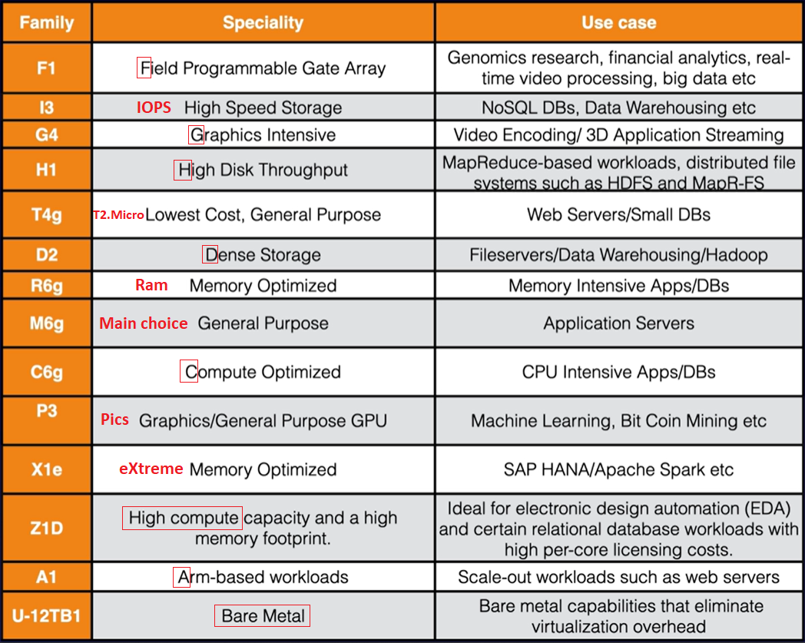
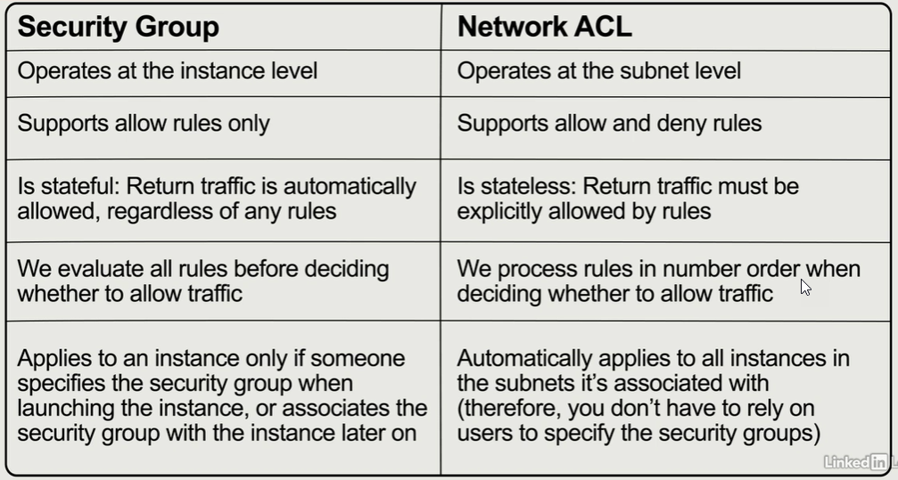
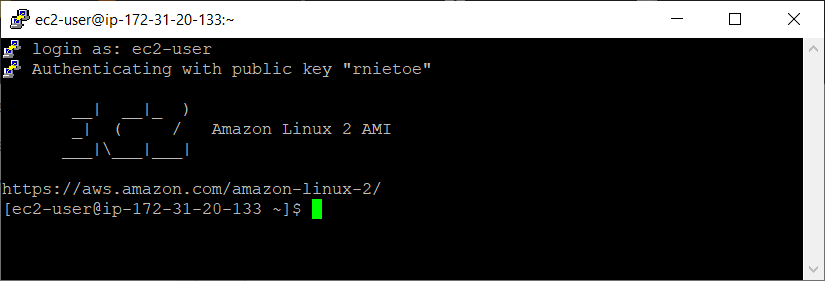
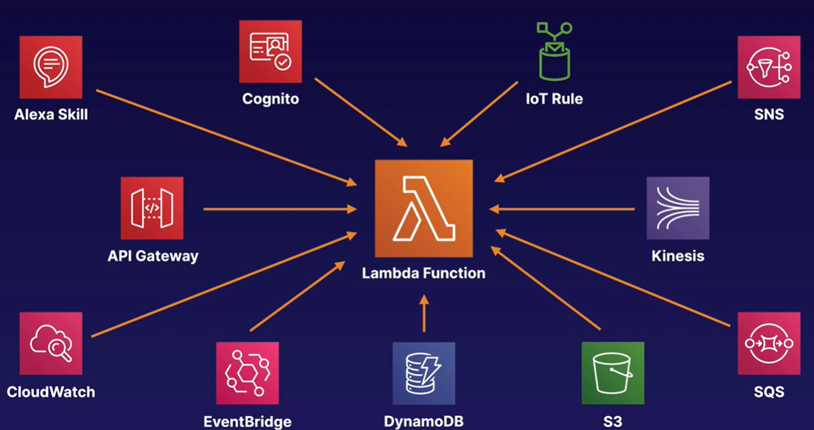

# 4. Compute 

## EC2

!!!danger "EC2 instances are provisioned in AZs"

**`AWS EC2`** (Elastic Compute Cloud) is a VM in the cloud. It is a web service that provides resizeable compute capacity in the cloud.


AWS originally used a modified version of the **Xen** Hypervisor to host EC2. In 2017, AWS began rolling out their own Hypervisor called **Nitro**.

[Resource Optimization](https://aws.amazon.com/blogs/aws-cost-management/launch-resource-optimization-recommendations/) gives recommendations to help saving money

[Host recovery](https://docs.aws.amazon.com/AWSEC2/latest/UserGuide/dedicated-hosts-recovery.html) restarts EC2 instances when a problem is detected or when a new host is available

### Placement groups

* **Clustered**: Group homogenous EC2 instances within a **single AZ** for **network performance**
* **Spread**: Individial EC2 instances are placed on distinct rack within one region for **high availability**
	* you can only have a maximum of **7** running instances per AZ
* **Partitioned**: Multiple EC2 instances in the same rack
* **EC2 fleet** - multiple EC2 instances managed by **`AWS System Manager`**  
* **Spot fleet** - multiple Spot (and on demand) instances 

The name of your placement group must be unique within your AWS Account

There is no charge for creating a placement group

### Instance types

* General Purpose por basic apps: **T2** (burst performance), **M5**, **M4** and **M3**. They provie balance of memory and CPU
* Compute Optimized for CPU intensive apps: **C5**, **C5n** **C4** and **C3**
* Memory Optimized for eXtreme memory requirements: **X1e**, **X1**, **R4** and **R3**
* Storage Optimized for high Input/Output access: **H1**, **I3**, **I3en** and **D2**
* Advance Computing for hardware compute requirements: **P3**, **P2**, **G3** and **F1**

    

Change the instance type required stopping the instance previously.

### Pricing models:

* **On Demand**: low cost, paying by hour or second. You have full control over its lifecycle—you decide when to launch, stop, hibernate, start, reboot, or terminate it. Sample: when **task run uninterrupted** from start to finish
* **Reserved**: the most economical option for **long-term workloads** with predictable usage patterns. Contract terms are 1 to 3 years. It includes different discounts
	* **Standard** Reserved instances (75% off on demand instances). 
	
	!!!danger "Standard Reserved Instances cannot be moved between regions: You can choose if a Reserved Instance applies to either a specific AZ, or an entire Region, but you cannot change the region."

	* **Convertible** Reserved instances (54%)
	* **Schedule** Reserved instances, based on times
* **Spot**: taket advantage of **unused** EC2 capacity. It can accept interruptions. Used for various stateless, fault-tolerant, or flexible applications such as big data, containerized workloads, CI/CD, web servers, HPC (high-performance computing), and other test & development workloads. Extra charge when you terminate the instance
    * Spot Instances are available at up to a 90% discount compared to On-Demand prices.
	* It is possible that your Spot Instance is terminated before the warning can be made available.
	* In rare situations, **Spot blocks** may be interrupted due to Amazon EC2 capacity needs. In these cases, AWS provides a two-minute warning before the instance is terminated, and customers are not charged for the terminated instances even if they have used them.
	* **Capacity Rebalancing** helps you maintain workload availability by proactively augmenting your fleet with a new Spot Instance before a running Spot Instance receives the two-minute Spot Instance interruption notice. When Capacity Rebalancing is enabled, Auto Scaling or Spot Fleet attempts to proactively replace Spot Instances that have received a rebalance recommendation, providing the opportunity to rebalance your workload to new Spot Instances that are not at elevated risk of interruption. Capacity Rebalancing complements the **capacity optimized allocation strategy** (which is designed to help find the most optimal spare capacity) and the **mixed instances policy** (which is designed to enhance availability by deploying instances across multiple instance types running in multiple AZs).
* **Dedicated**: physical EC2 server. 
	* It reduces cost using your SW licenses (importing your licensed VM). 
	* Also when multitenant not supported by law (compliance)

Tenancy:

* **Shared**: (default) multiple customers share the hardware instance. Cost reduced
* **Dedicated** instance: (not free) launch the instance in a dedicated host for one customer, but it may be moved to other of my hosts on restart
* **Dedicated host**: launch the instance in a dedicated host for one customer

 EC2 Pricing depends on:

* Clock hours of server time
* instance type
* pricing model (on demand, reserved, spot, dedicated host)
* number of instances
* load balancing
* detailed monitoring
* auto scaling
* Elastic IP Addresses
* Operative Systems and sw packages
* Windows instances are billed by the full hour, and partial hours are billed as full hours

### AMI

* AMI (Amazon Machine Image) are instance image snapshots of different Operative System
	* **public** for everyone
	* **explicit** for specified accounts
	* **implicit** for the owner only (default)
* AMI are based on region, OS, architecture (32 or 64 bits), launch permissions and storage for the root volume (EBS or **Instance store** - ephemeral storage.
	* An instance store provides temporary block-level storage for your instance. This storage is located on disks that are physically attached to the host computer. Instance store is ideal for temporary storage of information that changes frequently, such as buffers, caches, scratch data, and other temporary content, or for data that is replicated across a fleet of instances, such as a load-balanced pool of web servers.
	* **Instance store** is physically attached to the EC2 instance and provides the lowest latency and highest IOPS
	* EC2 instance with **Instance Store** can't be stopped
	* Reboot does not cause the data to be deleted on an **instance store** volume
	* **Instance Store** does not appear in the AWS EC2 Volume list
* To use **hibernation**, the root volume must be an encrypted EBS volume and RAM must be less than 150gb

AWS does not copy launch permissions, tags, or SG rules from the source AMI to the new AMI. 

* You must first deregister the AMI before you can delete the snapshot
* **Snapshots** are incremental
* You can use AWS APIs, CLI or the AWS Console to copy snapshots, share snapshots, and create volumes from snapshots.
* Volumes exist on EBS. Snapshots and instance store exist on S3. 

	```shell
	aws ec2 create-snapshot
	```

!!!danger "Use snapshots and AMI to change EC2 volumes (AZ and encryption)."

### How to create EC2:

1. From AWS EC2, `Launch instance`
2. Select AMI, for example: Amazon Linux 2 AMI
3. Choose an Instance Type (t2 micro - free tier)
4. Configure Instance Details (number of instances) 

    !!!danger "Enable CloudWatch detailed monitoring is not free"

5. Add Storage. Root and EBS volume types allow encryption and delete on termination (turn off by default on EBS) 

    !!!note "EC2 instance and volume are in the same AZ"

6. Add tags like Name, Department or Employee_Id
7. Configure **Security Groups**: virtual **firewalls** to enable traffic - disabled by default
    * SG support "allow" rules only. Use **Network ACL** to block specific IPs instead of SG
    * All inbound traffic (**ingress**) is blocked by default and all outbound traffic (**egrees**) is allowed 
	* SG are **stateful** (no inbound traffic is allowed without request while all outbound traffic is allowed)
	* network ACLs are stateless (outbound traffic must be specified)
    * Security groups operate at the instance level, not to subnet as NACL
    * Linux=SSH port 22. Microsoft Windows=RDP (Remote Desktop Protocol) port 3389. http/https ports 80/443
	* default SG for linux instances brings already inbound with SSH. Default SG for windows instances bring RDP
    * SG changes are take effect immediately
    * one or more SG can be assigned to EC2 instance. EC2 and SG relation is many to many
	* a maximum of 5 SGs per instance

	

8. Launch using a key pair (public and private key)

!!!danger "Always design for failure. Have one EC2 instance in each AZ, using clustering and backups"

!!!danger "implement elasticity with auto scaling, ELB, decoupling applications and running tasks in parallel"

### How to connect to EC2 

Using AWS Console, select the EC2 instance and clic on the `Connect` button. Password required

Using chrome extension [Secure Shell](https://chrome.google.com/webstore/detail/secure-shell/iodihamcpbpeioajjeobimgagajmlibd?hl=en)

	```shell
	ren MyKeyPair.pem MyKeyPair # rename without extension
	ssh-key-gen -y -f MyKeyPair.pem > MyKeyPair.pub	# generate our public key
	```

Using putty:

1. Download [putty](https://www.chiark.greenend.org.uk/~sgtatham/putty/latest.html) and load PK file created at `EC2/Key Pairs` (rnietoe.ppk) using putty gen.

	**Key pair** can created or imported in AWS. You can create you key pair with the following command, keep the PK and import the public key in AWS:

	```shell
	ssh-keygen -C rnietoe@gmail.com -f ~/.ssh/rnietoe
	```

2. Configure SSH Auth with PK
3. Copy IP address to the session host name field
4. Open connection, login as `ec2-user` (default user) and type `sudo su command`

    

Using gitbash and install a web server:

```shell
cd "C:\Users\rniet\OneDrive\AWS"
CHMOD 400 rnietoe.pem # change permissions to unlock my key down
ssh ec2-user@3.80.39.184 -i rnietoe.pem
sudo su
uname -a  # software details
cat ~/.ssh/authorized_keys	# the public key
```

```shell
while true; do echo; done # to monitor the CPU usage
```

Using CLI

1. Download the windows installer from [AWS Command Line Interface](https://aws.amazon.com/cli/?nc1=h_ls) and installe it
2. Now we have the **aws** command in our prompt
3. Configure IAM User with Programmatic access 
4. Download the access key and the secret access key:

	```shell
	aws configure
	aws configure --profile profile_name # when we want to work with cli profiles
	# once typep the access key, the secret access key, the default region and the output format (json/text)
	aws ec2 describe-regions
	# use :q to exit from command output
	aws <command> --profile <profile_name> # when we want to execute commands with a specific profile
	set AWS_PROFILE=<profile_name> # set/unset default profile
	echo $AWS_PROFILE
	aws sts get-caller-identity # print out account and user info    
    cat ~/.aws/config	# file containing profile configuration
    cat ~/.aws/credentials	# file containing profile credentials	
    rm -rf ~/.aws
	```

    We must use **roles** for security reasons instead of saving credentials (anyone could access to the .aws directory). Roles are global, they are not specified any region. Create a role to allows EC2 to use S3 as an admin:

    1. Go to `IAM/Roles` and create a new role
    2. Select `EC2` as the type of trusted entity
    3. Attach `AmazonS3FullAccess` permissions policies
    4. Go to `EC2`, select the instance and actions/instance settings/attach/replace iam role
    5. Then we can delete .aws directory with credential and still running `aws s3 ls`

### How to create a static website on S3

```shell
aws configure # enter user´s accesskeys and us-east-1 as default region
aws s3 mb s3://rnietoe2 # make bucket command
aws s3 ls # list all s3 instances

echo "hello world" > hello_world.txt
aws s3 cp hello_world.txt s3://rnietoe2 # upload: ./hello_world.txt to s3://rnietoe2/hello_world.txt

cd ~ # go to home directory
cd .aws # go the hidden directory
nano credentials # display access keys
```

More details to create Bootstrap actions to install additional software are [here](https://docs.aws.amazon.com/emr/latest/ManagementGuide/emr-plan-bootstrap.html)

bootstrapping: providing code to be run on an instance at launch

### How to build a web server

```shell
sudo su
yum update -y # check for updates
yum install httpd -y # install apache 
cd /var/www/html # create index.html in this path
nano index.html
<html><body><h1>This is server 1</h1></body></html>
service httpd start # sudo systemctl start httpd # start apache service
chkconfig on # start apache on restarts
```

## Elastic Beanstalk


**`AWS Elastic Beanstalk`** deploy and manage applications in the AWS cloud without worrying about the infrastructure that runs those applications. Some platforms are:

* docker
* multi-container docker
* tomcat (php and apache)
* .net (windows and iis)
* python
* ...

you cannot change the environment tier after creating an environment

1. `Create Application` from `Elastic Beanstalk`
2. Select PHP as platform and the sample application code
3. Created environment includes:
	* S3 bucket
	* LB / Target group
	* Security group (virtual firewall)
	* EIP
	* EC2 instance
	* Launch Configuration / Auto Scaling
	* CloudWatch alarm
	* ...

```shell
mkdir helloworld
cd hellowworld
eb init -p PHP
echo "Hello World" > index.html
eb create dev-env
eb open
eb deploy # to deploy updates to the applications
```

### Retrieving instance metadata

Connect to the EC2 instance and [get instance metadata](https://docs.aws.amazon.com/AWSEC2/latest/UserGuide/instancedata-data-retrieval.html) to get information about an instance using ip address **169.254.169.254**:

```shell
curl http://169.254.169.254/latest/user-data
curl http://169.254.169.254/latest/user-data > bootstrap.txt
cat bootstrap.txt

curl http://169.254.169.254/latest/meta-data
curl http://169.254.169.254/latest/meta-data/local-ipv4
curl http://169.254.169.254/latest/meta-data/public-ipv4
```

## Lambda

**`AWS Lambda`** is the FaaS (Function-as-a-Service) to run your code **globally** without provisioning or managing servers (Serverless).

* Lambda can be used for Infrastructure as Code.
* Lambda, EC2 and ECS supports **hyper-threading** on one or more virtual CPUs.
* You can use JSON or YAML for Lambda templates.
* The resources section is the only required field in Lambda templates.
* **Scales out automatically**. (for example, 5 lambda replications running at the same time). Each time your function is triggered, a new and separate instance of that function is started. There are limits, but these can be adjusted on request.
* when creating a lambda function, a role is required to provide credentials with rights to other services. This is exactly the same as needing a Role on an EC2 instance to access S3 or DDB. Create a new role selecting the  `Simple microservice permissions` policy template.
* different services can trigger your function,  such as  Api Gateway
	
	* a lambda function can trigger other lambda functions
	* ALB, Cognito, Lex, Alexa, API Gateway, CloudFront, and Kinesis Data Firehose are all valid direct (synchronous) triggers for Lambda functions.
	* **S3** is one of the valid **asynchronous** triggers.

Pricing: 

* number of request
	* 1 million request per month free
	* 0,20$ next million requests
* duration (how long lambda functions are executing for)
	*  4000.000 gb-seconds per month free, up to 3,2 million seconds of compute time
	* 0,00001667 for every GB second used thereafter
* The amount of memory assigned.
* additional charges
	* when using other AWS services

languages supported:

* node.js
* java
* c#
* Go
* Python

lambda python sample:

```python
def lambda_handler(event, context):
	print("In lambda handler")

	resp = {
		"statusCode": 200,
		"headers": {
			"Access-Control-Allow-Origin": "*",
		},
		"body": "Hello world"
	}

	return resp
```

triggered in a html:

```html
<html>
	<script>
		function myFunction() {
			var xhttp = new XMLHttpRequest();
			xhttp.onreadystatechange = function() {
				if (this.readyState == 4 && this.status == 200) {
					document.getElementById("my-demo").innerHTML = this.responseText;
				}
			};
			xhttp.open("GET", "YOUR-API-GATEWAY-LINK-HERE", true);
			xhttp.send();
		}
	</script>
	<body>
		<div align="center">
			<br><br><br><br>
			<h1>Hello <span id="my-demo">Cloud Gurus!</span></h1>
			<button onclick="myFunction()">Click me</button><br>
			
		</div>
	</body>
</html>
```

[Lambda Troubleshooting](https://help.acloud.guru/hc/en-us/articles/115003704634)

## Batch

**`AWS Batch`** enables you to easily and efficiently run batch computing **jobs** of any scale on AWS using on-demand and Spot EC2.

like hangfire??
