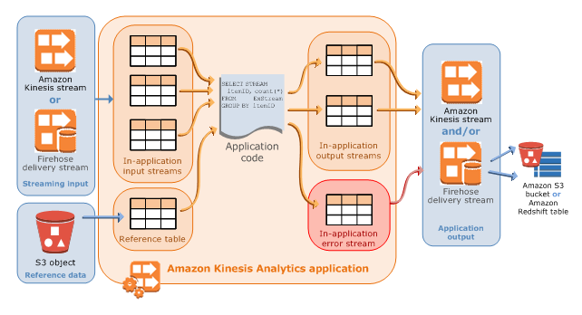

# 10. Media

Most of the following media services use **S3 buckets** as repository:

## Elastic Transcoder 

Amazon Elastic Transcoder **convert** media files from their original source **format** in to different formats that will play on any device.

## Translate

On-demand language **translation**

## Elemental MediaStore

**Store** and deliver **video** assets for live **streaming** media workflows

## Transcribe 

speech to **text transcription** from audio and video (subtitles) based on machine learning

## Amazon Polly

Machine learning service to convert text to audio mp3 (Alexa)

## Rekognition

Deep learning-based **visual analysis** service to search, verify, and organize millions of images and videos

## Kinesis

Kinesis is a platform to send your **real-time streaming data** to.

* Kinesis Data Stream (KDS): **store**/collect streaming data for **processing** and storing in shards from 24 hours to 7 days
    
    * Producers, **shards** and consumers are components of Kinesis Data Streams
    * Shard will ensure ordering
* Kinesis Firehose: **load** streaming data into AWS data stores for **analytics** tools (S3, Redshift, Elasticsearch and Splunk)
    
    * there is not data persistent. lambda funcions are optional 
    * Key components are: delivery streams, records of data and destinations.
* Kinesis Analytics: **analyze** and process streaming data in real-time using **SQL** or Java.
    
* Kinesis Video Streams: Capture, process, and store **video streams** for analytics and machine learning.