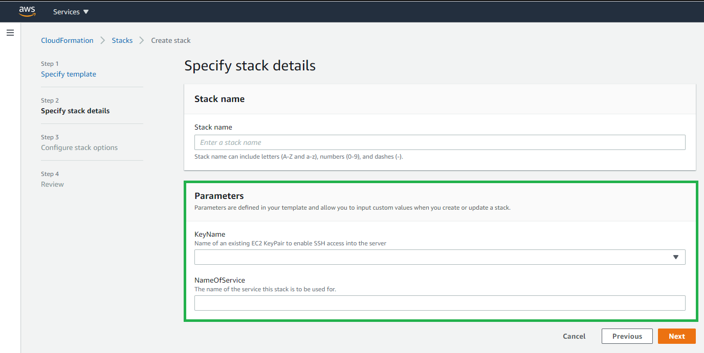
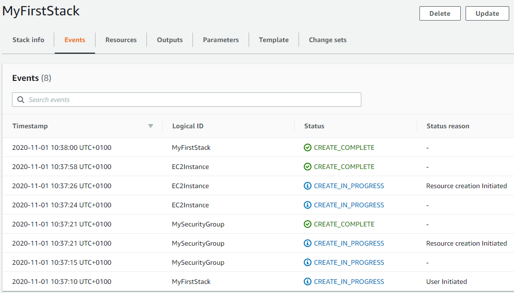
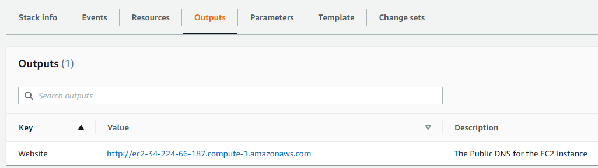

# CloudFormation

**`AWS CloudFormation`** is IaaS tool to **create**, **update** and **delete** resources with **templates** (json or yaml). While Elastic Beanstalk we can create and manage resources based on code...

1. Create **stack** using the sample template Wordpress blog, where stack is a set of related resources.
3. Select instance type t2.micro and our key value pair rnietoe
4. `Create stack`. This will create and configure an EC2 instance based on the wordpress template
5. from `Output` tab, click on the value link.
6. from `Template` tab, clik on `View in Designer`

[AWS Quick Start](https://aws.amazon.com/quickstart/?nc1=h_ls&quickstart-all.sort-by=item.additionalFields.sortDate&quickstart-all.sort-order=desc) is a way of deploying environments quickly using CloudFormation templates built by experts AWS Solucions Architects.

* CloudFormation service is free, but the resources that it provisions have a cost
* CloudFormation has a wide set of supported resources, but does not support the creation of all AWS resources.

[Template anatomy](https://docs.aws.amazon.com/AWSCloudFormation/latest/UserGuide/template-anatomy.html):

```yaml
AWSTemplateFormatVersion: "optional version date. sample: 2010-09-09"
Description: optional string
Metadata:
  # optional template metadata
Parameters:
  # optional set of parameters
Mappings:
  # optional set of mappings
Conditions:
  # set of conditions
Transform:
  # set of transforms
Resources:
  # required set of resources
Outputs:
  # optional set of outputs
```

When updating a stack, a change set (such as tags) is created with the summary of proposed changes. This change set is executed to update the stack. Only the change set is executed instead of all resources defined in the template.

At the other hand, when adding a new resource (such as SecurityGroup) for our previous deployed resource (EC2), a new EC2 instance in created with the SecurityGroup, and the old EC2 instance is deleted automatically

## Resources

[CloudFormation Resources](https://docs.aws.amazon.com/AWSCloudFormation/latest/UserGuide/resources-section-structure.html)

**UserData** property:

* perform actions on system startup
* only runs on the first boot cycle
* execution time impact on the startup time
* Base64 encoded

on Windows:

* Run as local admin
* Batch commands and/or powersheel support
* Executed by EC2Config or EC2Launch

```shell
#script
echo Current date and time >> %SystemRoot%\Tem\test.log
echo %DATE% %TIME% >> %SystemRoot%\Tem\test.log
#powershell
$file = $env:SystemRoot + "\Temp\" + (Get=Date).ToString("MM-dd-yy-hh-mm")
New-Item $file -ItemType file
```

on Linux:

* Run as root (no need for sudo)
* Not run interactively (no user feedback)
* Logs output to /var/log/cloud-init-output.log

```bash
#!/bin/bash # interpreter
yum update -y
yum install -y httpd
service httpd start
```

Sample template:

```yml
Resources:
  EC2Instance:
    Type: AWS::EC2::Instance
    Properties:
      UserData:
        !Base64: |
          #!/bin/bash -xe
          yum update -y
          yum install httpd -y
          service httpd start
```

## Mappings

[CloudFormation Mappings](https://docs.aws.amazon.com/AWSCloudFormation/latest/UserGuide/mappings-section-structure.html)

```yaml
Mappings:
  RegionMap:                # MapName
    us-east-1:              # TopLevelKey 1
      AMI: ami-1853ac65     # SecondLevelKey 1
    us-west-1:              # TopLevelKey 2
      AMI: ami-bf5540df     # SecondLevelKey 2
Resources:
  MyEc2Instance:
    Type: AWS::EC2::Instance
    Properties:
      InstanceType: t2.micro
      ImageId:
        !FindInMap:
        - RegionMap         # MapName
        - !Ref AWS::Region  # TopLevelKey
        - AMI               # SecondLevelKey
```

## Input Parameters

[CloudFormation Parameters](https://docs.aws.amazon.com/AWSCloudFormation/latest/UserGuide/parameters-section-structure.html) enable you to input custom values to your template each time you create or update a stack.



Supported parameter types:

* String
* Number
* List<Number>
* CommaDelimitedList
* AWS-specific types(AWS::ec2::Image::Id)

```yaml
Parameters:
  InstanceTypeParameter:                        # Parameter ID
    Type: String                                # Parameter Type
    Default: t2.micro                           # Parameter Property 1
    AllowedValues:                              # Parameter Property 2
      - t2.micro
      - m1.small
      - m1.large
    Description:                                # ParameterProperty 3
      EC2 Instance Type
Resources:
  Ec2Instance:
    Type: AWS::EC2::Instance
    Properties:
      InstanceType: !Ref: InstanceTypeParameter # Parameter
```

## Metadata

[CloudFormation Metadata](https://docs.aws.amazon.com/AWSCloudFormation/latest/UserGuide/metadata-section-structure.html)

## Conditions

[CloudFormation Conditions](https://docs.aws.amazon.com/AWSCloudFormation/latest/UserGuide/conditions-section-structure.html)

## Transform

[CloudFormation Transform](https://docs.aws.amazon.com/AWSCloudFormation/latest/UserGuide/transform-section-structure.html)

## Outputs

[CloudFormation Outputs](https://docs.aws.amazon.com/AWSCloudFormation/latest/UserGuide/outputs-section-structure.html) information about resources, within a cloudformation stack. For example:

* the public IP or DNS of a EC2 instance
* the S3 bucket name for a stack

```yml
Outputs:
  ServerDns:            # OutputID
    Value: !GetAtt      # Value to return
      - Ec2Instance
      - PublicDnsName
    Export:
      Name:             # Value to export
```

## Intrinsic functions

[CloudFormation Intrinsic functions](https://docs.aws.amazon.com/AWSCloudFormation/latest/UserGuide/intrinsic-function-reference.html)

* **Join**: appends a set of values into a single value
```json
{ "Fn::Join" : [ ":", [ "a", "b", "c" ] ] }
```
```yml
!Join [ ":", [ a, b, c ] ]
```

* **Ref**: : returns the value of the specified resource.
```json
{ "Ref" : "resourceId" }
```
```yml
!Ref resourceId
```

* **FindInMap**: returns the value corresponding to keys in a two-level map that is declared in the Mappings section.
```json
{ "Fn::FindInMap" : [ "MapName", "TopLevelKey", "SecondLevelKey"] }
```
```yml
!FindInMap [ MapName, TopLevelKey, SecondLevelKey ]
```

* **GetAtt**: returns the value of an attribute from a resource in the template
```json
{ "Fn::GetAtt" : [ "logicalNameOfResource", "attributeName" ] }
```
```yml
!GetAtt logicalNameOfResource.attributeName
```

* **Sub**: substitutes variables in an input string with values that you specify when you create or update a stack, such as ${AWS::StackName} or ${AWS::Region}
```json
{ "Fn::Sub" : String }
```
```yml
!Sub String
```

* **GetAZs**:  returns an array that lists AZs for a specified region in alaphabetical order. Specifying an empty string is equivalent to specifying AWS::Region.
```json
{ "Fn::GetAZs" : "region" }```
```yml
!GetAZs region
```

## Pseudo parameters

[CloudFormation Pseudo parameters](https://docs.aws.amazon.com/AWSCloudFormation/latest/UserGuide/pseudo-parameter-reference.html)

* **AWS::AccountId**: Returns the AWS account ID of the account in which the stack is being created
* **AWS::NotificationARNs**: Returns the list of notification ARNs (**A**mazon **R**esource **N**ames) for the current stack.
* **AWS::StackId**: Returns the ID of the stack
* **AWS::StackName**: Returns the Name of the stack
* **AWS::Region**: Returns the AWS Region in which the resource is being created

## Helper scripts

Pyhon based helper scripts preinstalled on Amazon Linux (to avoid scripting):

* **cfn-init:**: read Metadata to execute AWS::CloudFormation::Init
* **cfn-signal**: signal with a CreationPolicy or WaitCondition when the resource or application is ready.
* **cfn-get-metadata**: retrieve metadata based on a specific key.
* **cfn-hup**: check for updates to metadata and execute custom hooks when changes are detected.

single config key sample:

```yml
AWS::CloudFormation::Init:
  config: 
    packages: download and install pre-packaged applications and components
    groups: create Linux/Unix groups and assign group IDs
    users: create Linux/UNIX users on the EC2 instance
    sources: download an archive file and unpack it in the target directory on EC2
    files: create files on the EC2 instance
    services: define enabled and siabled services when the instance is launch
    commands: execute commands on the EC2 instance
```

* **configSets** sample to install a web server:

```yml
installweb:
  packages:
    yum:
      httpd: []
  services:
    sysvinit:
      httpd:
        enabled: true
        ensureRunning: true

installphp:
  packages:
    yum:
      php: []

Resources:
  EC2Instance:
    Metadata: 
      AWS::CloudFormation::Init:
        configSets: 
          webphp:
          - "installphp"
          - "installweb"
```

How to setting up a full stack:

1. From `CloudFormation`, create stack uploading the following template file:

    ```yml
    Parameters:
    myKeyPair: 
        Description: Amazon EC2 Key Pair
        Type: AWS::EC2::KeyPair::KeyName
    VpcId:
        Description: Enter the VpcId
        Type: AWS::EC2::VPC::Id
    SubnetIds:
        Description: Enter the Subnets
        Type: List<AWS::EC2::Subnet::Id>
    Mappings:
    RegionMap:
        us-east-1:
        AMI: ami-1853ac65
        us-west-1:
        AMI: ami-bf5540df
        eu-west-1:
        AMI: ami-3bfab942
        ap-southeast-1:
        AMI: ami-e2adf99e
        ap-southeast-2:
        AMI: ami-43874721
    Resources:
    LoadBalancer: # Application Load Balancer
        Type: AWS::ElasticLoadBalancingV2::LoadBalancer
        Properties:
        SecurityGroups:
            - !Ref ALBSecurityGroup
        Subnets: !Ref SubnetIds
    LoadBalancerListener: # Port 80 Listener for ALB
        Type: AWS::ElasticLoadBalancingV2::Listener
        Properties:
        LoadBalancerArn: !Ref LoadBalancer
        Port: 80
        Protocol: HTTP
        DefaultActions:
            - Type: forward
            TargetGroupArn:
                Ref: TargetGroup
    TargetGroup:
        Type: AWS::ElasticLoadBalancingV2::TargetGroup
        Properties:
        Port: 80
        Protocol: HTTP
        VpcId: !Ref VpcId
    AutoScalingGroup:
        Type: AWS::AutoScaling::AutoScalingGroup
        Properties:
        AvailabilityZones: !GetAZs
        LaunchConfigurationName: !Ref LaunchConfiguration
        MinSize: 1
        MaxSize: 3
        TargetGroupARNs: 
            - !Ref TargetGroup
    LaunchConfiguration:
        Type: AWS::AutoScaling::LaunchConfiguration
        Metadata: 
        Comment: Install php and httpd
        AWS::CloudFormation::Init:
            config: 
            packages: 
                yum:
                httpd: []
                php: []
            files: 
                /var/www/html/index.php:
                content: !Sub |
                    <?php print "Hello world Abs was here!"; ?>
            services: 
                sysvinit:
                httpd:
                    enabled: true
                    ensureRunning: true
        Properties:
        KeyName: !Ref myKeyPair
        InstanceType: t2.micro
        SecurityGroups:
            - !Ref EC2SecurityGroup
        ImageId:
            Fn::FindInMap:
            - RegionMap
            - !Ref AWS::Region
            - AMI
        UserData:
            'Fn::Base64': 
            !Sub |
                #!/bin/bash -xe                        
                # Ensure AWS CFN Bootstrap is the latest
                yum install -y aws-cfn-bootstrap
                # Install the files and packages from the metadata
                /opt/aws/bin/cfn-init -v --stack ${AWS::StackName} --resource LaunchConfiguration --region ${AWS::Region}
    ALBSecurityGroup:
        Type: AWS::EC2::SecurityGroup
        Properties:
        GroupDescription: ALB Security Group
        VpcId: !Ref VpcId
        SecurityGroupIngress:
            - IpProtocol: tcp
            FromPort: 80
            ToPort: 80
            CidrIp: 0.0.0.0/0
    EC2SecurityGroup: 
        Type: AWS::EC2::SecurityGroup
        Properties:
        GroupDescription: EC2 Instance
    EC2InboundRule: # EC2 can only accept traffic from ALB
        Type: AWS::EC2::SecurityGroupIngress
        Properties:
        IpProtocol: tcp
        FromPort: 80
        ToPort: 80
        SourceSecurityGroupId:
            !GetAtt
            - ALBSecurityGroup
            - GroupId
        GroupId:
            !GetAtt
            - EC2SecurityGroup
            - GroupId
    Outputs:
    PublicDns:
        Description: The Public DNS
        Value: !Sub 'http://${LoadBalancer.DNSName}'
    ```

2. Set stack name and parameters and finally create the stack
3. Stak is created with defined resources
    

4. Check the stack outputs and browse to the EC2 instance uri:
    

## ChangeSets

Allow to preview how changes will impact to the resources. There are 4 changeSets operations:

* **Create**: create a change set. This operation does not modify the stack
* **View**: view proposed changes after creating
* **Execute**: execute the change set to update the stack
* **Delete**: delete change set. This operation does not modify the stack

how to `create` a change set for current stack to update security groups:

1. We are going to remove port 22 from security group in this sample
2. From CloudFormation, select the stack and from stack actions, Create change sets for current stack
3. Upload the template with changes and create
4. See the JSON Changes result:

    ```json
    [
    {
        "resourceChange": {
        "logicalResourceId": "MySecurityGroup",
        "action": "Modify", // Add | Modify | Remove
        "physicalResourceId": "MyFirstStack-MySecurityGroup-1AT0XTT24PZNP",
        "resourceType": "AWS::EC2::SecurityGroup",
        "replacement": "False",
        "moduleInfo": null,
        "details": [
            {
            "target": {
                "name": "SecurityGroupIngress",
                "requiresRecreation": "Never",
                "attribute": "Properties"
            },
            "causingEntity": null,
            "evaluation": "Static",
            "changeSource": "DirectModification"
            }
        ],
        "changeSetId": null,
        "scope": [
            "Properties"
        ]
        },
        "type": "Resource"
    }
    ]
    ```

4. Finally we can `delete` or `execute` the change set

The actions depends on the resource. We should predict if replacement will be necesary based on these documents:

* [AWS resource and property types reference](https://docs.aws.amazon.com/AWSCloudFormation/latest/UserGuide/aws-template-resource-type-ref.html)
* [Update behaviors of stack resources](https://docs.aws.amazon.com/AWSCloudFormation/latest/UserGuide/using-cfn-updating-stacks-update-behaviors.html)

There are three CloudFormation-specific IAM conditions that you can add to your IAM policies:

* cloudformation:**TemplateURL**: lets you specify where the CloudFormation template for a stack action, such as create or update, resides and enforce that it be used.
* cloudformation:**ResourceTypes**: you specify which types of resources can be created or updated
* cloudformation:**StackPolicyURL**: used in conjunction with IAM, stack policies provide a second layer of defense against both unintentional and malicious changes to your stack resources.