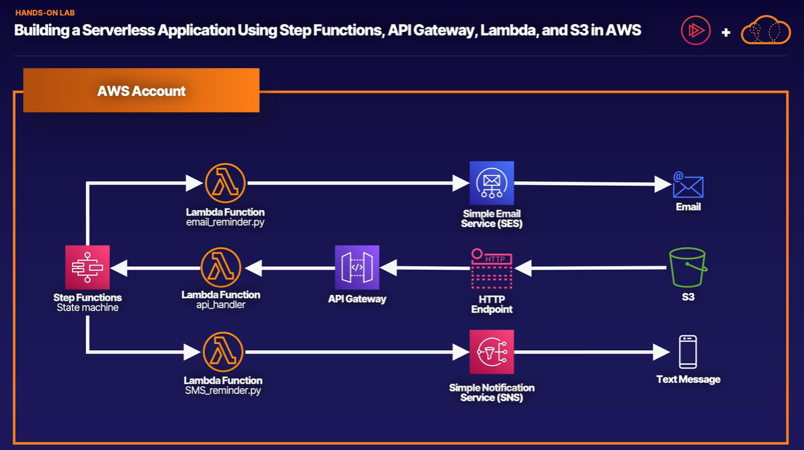

# Building a Serverless Application Using Step Functions, API Gateway, Lambda, and S3 in AWS

https://github.com/ACloudGuru-Resources/lab-building-a-serverless-application-using-step-functions-api-gateway-lambda-and-s3-in-aws




## email_reminder.py
```py
import boto3

VERIFIED_EMAIL = 'rnietoe@gmail.com'

ses = boto3.client('ses')

def lambda_handler(event, context):
    ses.send_email(
        Source=VERIFIED_EMAIL,
        Destination={
            'ToAddresses': [event['email']]  # Also a verified email
        },
        Message={
            'Subject': {'Data': 'A reminder from your reminder service!'},
            'Body': {'Text': {'Data': event['message']}}
        }
    )
    return 'Success!'
```

## sms_reminder.py 
```py
import boto3

sns = boto3.client('sns')

def lambda_handler(event, context):
    sns.publish(PhoneNumber=event['phone'], Message=event['message'])
    return 'Success!'
```

## api_handler.py
```py
import boto3
import json
import os
import decimal

SFN_ARN = 'STEP_FUNCTION_ARN'

sfn = boto3.client('stepfunctions')

def lambda_handler(event, context):
    print('EVENT:')
    print(event)
    data = json.loads(event['body'])
    data['waitSeconds'] = int(data['waitSeconds'])
    
    # Validation Checks
    checks = []
    checks.append('waitSeconds' in data)
    checks.append(type(data['waitSeconds']) == int)
    checks.append('preference' in data)
    checks.append('message' in data)
    if data.get('preference') == 'sms':
        checks.append('phone' in data)
    if data.get('preference') == 'email':
        checks.append('email' in data)

    # Check for any errors in validation checks
    if False in checks:
        response = {
            "statusCode": 400,
            "headers": {"Access-Control-Allow-Origin":"*"},
            "body": json.dumps(
                {
                    "Status": "Success", 
                    "Reason": "Input failed validation"
                },
                cls=DecimalEncoder
            )
        }
    # If none, run the state machine and return a 200 code saying this is fine :)
    else: 
        sfn.start_execution(
            stateMachineArn=SFN_ARN,
            input=json.dumps(data, cls=DecimalEncoder)
        )
        response = {
            "statusCode": 200,
            "headers": {"Access-Control-Allow-Origin":"*"},
            "body": json.dumps(
                {"Status": "Success"},
                cls=DecimalEncoder
            )
        }
    return response

# This is a workaround for: http://bugs.python.org/issue16535
class DecimalEncoder(json.JSONEncoder):
    def default(self, obj):
        if isinstance(obj, decimal.Decimal):
            return int(obj)
        return super(DecimalEncoder, self).default(obj)

```

## step-function-template.json
```json
{
  "Comment": "An example of the Amazon States Language using a choice state.",
  "StartAt": "SendReminder",
  "States": {
    "SendReminder": {
      "Type": "Wait",
      "SecondsPath": "$.waitSeconds",
      "Next": "ChoiceState"
    },
    "ChoiceState": {
      "Type": "Choice",
      "Choices": [
        {
          "Variable": "$.preference",
          "StringEquals": "email",
          "Next": "EmailReminder"
        },
        {
          "Variable": "$.preference",
          "StringEquals": "sms",
          "Next": "TextReminder"
        },
        {
          "Variable": "$.preference",
          "StringEquals": "both",
          "Next": "BothReminders"
        }
      ],
      "Default": "DefaultState"
    },
    "EmailReminder": {
      "Type": "Task",
      "Resource": "EMAIL_REMINDER_ARN",
      "Next": "NextState"
    },
    "TextReminder": {
      "Type": "Task",
      "Resource": "TEXT_REMINDER_ARN",
      "Next": "NextState"
    },
    "BothReminders": {
      "Type": "Parallel",
      "Branches": [
        {
          "StartAt": "EmailReminderPar",
          "States": {
            "EmailReminderPar": {
              "Type": "Task",
              "Resource": "EMAIL_REMINDER_ARN",
              "End": true
            }
          }
        },
        {
          "StartAt": "TextReminderPar",
          "States": {
            "TextReminderPar": {
              "Type": "Task",
              "Resource": "TEXT_REMINDER_ARN",
              "End": true
            }
          }
        }
      ],
      "Next": "NextState"
    },
    "DefaultState": {
      "Type": "Fail",
      "Error": "DefaultStateError",
      "Cause": "No Matches!"
    },
    "NextState": {
      "Type": "Pass",
      "End": true
    }
  }
}
```