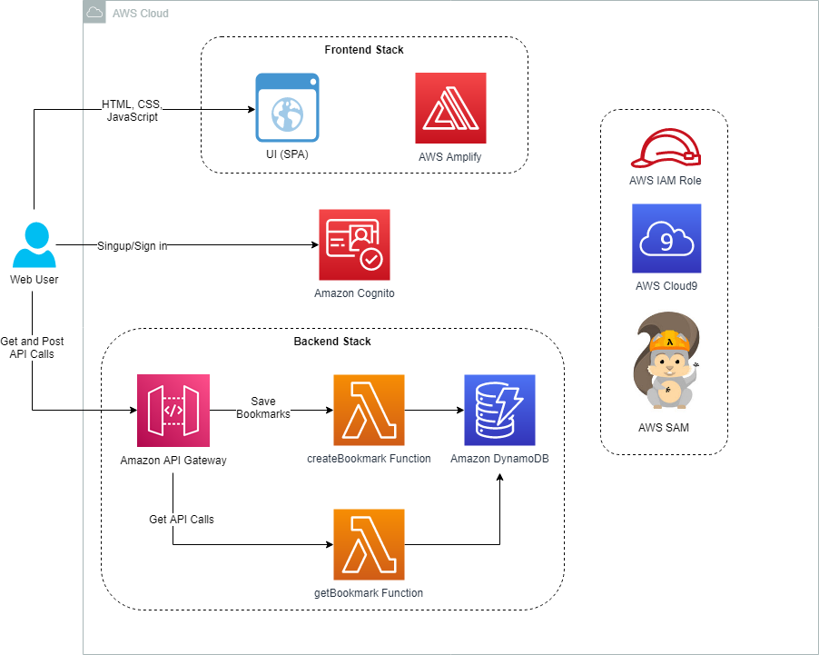

# Lab 1: Deploying a Simple Serverless Application



## Task 1: AWS Cloud9

To set up your environment, open the pre-provisioned environment **AWS Cloud9** is a cloud-based integrated development environment (IDE) that lets you write, run, and debug your code with just a browser. It includes a code editor, debugger, and terminal. AWS Cloud9 makes it easy to write, run, and debug serverless applications. It pre-configures the development environment with all the SDKs, libraries, and plugins needed for serverless development.

```shell
#To download your source code, run the following commands:
cd ~/environment
wget https://us-west-2-tcprod.s3-us-west-2.amazonaws.com/courses/ILT-TF-200-SVDVSS/v1.0.28.prod-be5d5511/lab-1-Bookmarks/scripts/app-code.zip
unzip app-code.zip
cd app-code
#Run the commands below to add more disk space to your AWS Cloud9 environment.
bash resize.sh 50
#In the AWS Cloud9 terminal, run the following AWS CLI and bash commands to update the values in the samconfig.toml file
sudo yum -y install jq
cd ~/environment/app-code/backend
export BUCKET_NAME=$(aws s3api list-buckets --query "Buckets[?contains(Name, 'bookmark')].Name" --output text)
sed -Ei "s|<BUCKET_NAME>|${BUCKET_NAME}|g" samconfig.toml
export AWS_REGION=$(curl -s 169.254.169.254/latest/dynamic/instance-identity/document | jq -r '.region')
sed -Ei "s|<AWS_REGION>|${AWS_REGION}|g" samconfig.toml
export LAMBDA_ROLE_ARN=$(aws iam  list-roles --query "Roles[?contains(RoleName, 'LambdaDeployment')].Arn" --output text)
sed -Ei "s|<LAMBDA_ROLE_ARN>|${LAMBDA_ROLE_ARN}|g" samconfig.toml
cd ..
#This command deploys your application to the AWS Cloud. The command takes the deployment artifacts you build with the sam build command, packages and uploads them to an Amazon S3 bucket created by the AWS SAM CLI, and deploys the application using CloudFormation.
cd backend
sam deploy
#To switch to your frontend directory and install packages and dependencies, run the following commands:
cd ../frontend
npm install
#To run the dev server, run the following command:
npm run dev
#In the AWS Cloud9 terminal, run the following AWS CLI and bash commands to replace the parameters with the actual values in the aws-exports.js file.
cd src
export API_GATEWAY_ID=$(aws apigateway get-rest-apis --query 'items[?name==`Bookmark App`].id' --output text)  
export AWS_REGION=$(curl -s 169.254.169.254/latest/dynamic/instance-identity/document | jq -r '.region')
sed -Ei "s|<AWS_REGION>|${AWS_REGION}|g" aws-exports.js
export API_GATEWAY_URL=https://${API_GATEWAY_ID}.execute-api.${AWS_REGION}.amazonaws.com/dev 
sed -Ei "s|<API_GATEWAY_URL>|${API_GATEWAY_URL}|g" aws-exports.js
export COGNITO_USER_POOL_ID=$(aws cognito-idp list-user-pools --query "UserPools[?contains(Name, 'bookmark-app-userpool')].Id"  --max-results 1 --output text)
sed -Ei "s|<COGNITO_USER_POOL_ID>|${COGNITO_USER_POOL_ID}|g" aws-exports.js
export APP_CLIENT_ID=$(aws cognito-idp list-user-pool-clients --user-pool-id ${COGNITO_USER_POOL_ID}  --query "UserPoolClients[?contains(ClientName, 'AppClientForBookmarkUserPool')].ClientId"  --output text)
sed -Ei "s|<APP_CLIENT_ID>|${APP_CLIENT_ID}|g" aws-exports.js
cd ..
#To build the application for production, run the following command:
npm run build
#From the AWS Cloud9 terminal, run the following command:
cd dist
ls
#To zip the contents of the build folder, run the following command:
zip -r app.zip *
#To upload the file to the pre-provisioned Amazon S3 bucket, run the following commands:
export BUCKET_NAME=$(aws s3api list-buckets --query "Buckets[?contains(Name, 'bookmark')].Name" --output text)
aws s3 cp app.zip s3://${BUCKET_NAME}
```
