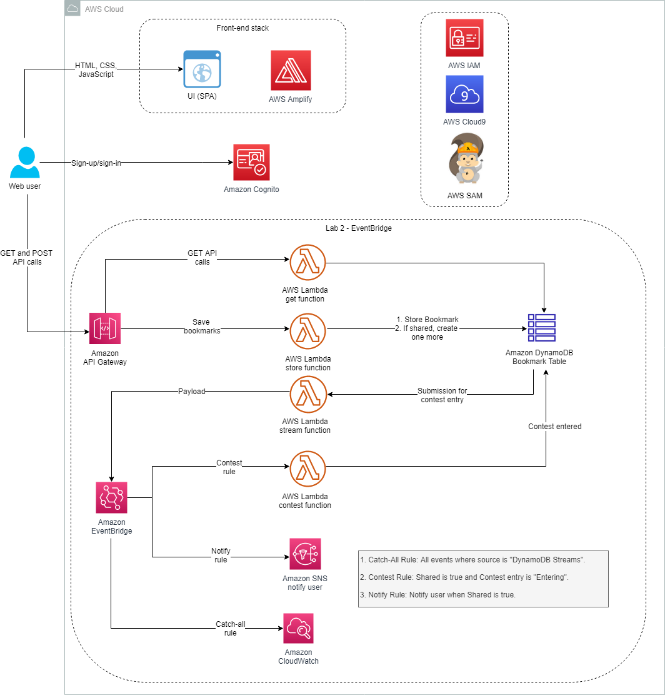

# Lab 2: Message Fan-Out with Amazon EventBridge



* Enable Amazon DynamoDB Streams as an event source for an AWS Lambda function that is invoked when new items are added to a DynamoDB table
* Configure an EventBridge event bus with a Lambda function as its event source and Lambda, Amazon Simple Notification Service (Amazon SNS), and Amazon CloudWatch as targets
* Configure EventBridge rules that route events to your targets based on the criteria that you specify
* Configure an SNS topic that notifies an email subscriber

## Task 2: Amazon DynamoDB Streams
Enabling DynamoDB Streams and setting up a Lambda trigger. DynamoDB Streams helps ensure that each stream record appears exactly once in the stream. Also, for each item that is modified in a DynamoDB table, the stream records appear in the same sequence as the actual modifications to the item.
**Amazon DynamoDB Streams** is an ordered flow of information about changes to items in a DynamoDB table. When you enable a stream on a table, DynamoDB captures information about every modification to data items in the table.

# Task 3: SNS
Subscribing to bookmark contest notifications. 
**Amazon Simple Notification Service (Amazon SNS)** is a fully managed messaging service for both system-to-system and app-to-person communication. It enables you to communicate between systems through publish/subscribe (pub/sub) patterns that enable messaging between decoupled microservice applications or to communicate directly to users via SMS, mobile push, and email. The system-to-system pub/sub functionality provides topics for high-throughput, push-based, many-to-many messaging. Using SNS topics, your publisher systems can fan out messages to a large number of subscriber systems or customer endpoints, including Amazon Simple Queue Service (Amazon SQS) queues, Lambda functions, and HTTP and HTTPS, for parallel processing. The app-to-person messaging functionality enables you to send messages to users at scale using either a pub/sub pattern or direct-publish messages using a single API.

## Task 4: Amazon EventBridge
Setting up an event bus and configuring rules. 
**Amazon EventBridge** makes it easy to build event-driven applications because it takes care of event ingestion, delivery, security, authorization, and error handling for you. To achieve the promises of serverless technologies with event-driven architecture, such as being able to individually scale, operate, and evolve each service, the communication between the services must happen in a loosely coupled and reliable environment. Event-driven architecture is a fundamental approach for integrating independent systems or building up a set of loosely coupled systems that can operate, scale, and evolve independently and flexibly. In this lab, you use EventBridge to address the contest use case.

```shell
# These commands download and run the startup script, which contains the application code:
wget https://us-west-2-tcprod.s3-us-west-2.amazonaws.com/courses/ILT-TF-200-SVDVSS/v1.0.28.prod-be5d5511/lab-2-EventBridge/scripts/app-code.zip
unzip app-code.zip
cd app-code
chmod +x resize.sh
chmod +x startupscript.sh
./startupscript.sh
# This script modifies the samconfig.toml file within the backend portion of the application code. The script replaces values such as AWS Region, stack name, and role Amazon Resource Name (ARN). Next, the script updates the aws-exports.js file with the Amazon Cognito metadata that was launched in the lab’s AWS CloudFormation template. The script then runs the build, deploys the bookmark application, and uploads the app.zip file to the samserverless bucket.
```

```js
const EventBridge = require('aws-sdk/clients/eventbridge');
const ev = new EventBridge();

exports.handler = async (event) => {
    console.log(JSON.stringify(event, null, 2));
    try
    {
        for(let i=0; i< event.Records.length; i++) {
            const record = event.Records[i];
            console.log(record.eventID);
            console.log(record.eventName);
            if(record.eventName === 'INSERT' || record.eventName === 'MODIFY') {
                console.log('DynamoDB Record: %j', record.dynamodb);
                console.log('share flag:', record.dynamodb.NewImage.shared.BOOL);
                console.log('contest value: ', record.dynamodb.NewImage.contest.S);
                
                var pk = record.dynamodb.NewImage.id.S;
                var sharedFlag = record.dynamodb.NewImage.shared.BOOL;
                var contestValue = record.dynamodb.NewImage.contest.S;
                
                const bookmarkDetails = {
                    id: pk,
                    shared: sharedFlag,
                    contest: contestValue,
                    payload: record.dynamodb.NewImage
                };
                
                const params = {
                Entries: [
                  {
                    Source: 'DynamoDB Streams',
                    DetailType: 'Shared Bookmarks',
                    EventBusName: 'bookmarks-bus',
                    Detail: JSON.stringify(bookmarkDetails)
                  }        
                ]
              };
              const response =  await ev.putEvents(params).promise();
              console.log("response:", response);
              //We can optimize the code by calling the putEvents outside of the loop with promise all option. where all the records
              //will put in the bus in parallel. 
            }
        }
    } catch (error) {
          throw new Error(JSON.stringify(error));
    }
    
}
```

EventBridge rules use event patterns to match AWS events on an event bus. When a pattern matches, the rule routes that event to a target:

* catch-all-rule sends the event payload to Amazon CloudWatch Logs after being invoked by the StreamTrigger Lambda function and passing through the event bus.
    ```json
    {
    "source": [
        "DynamoDB Streams"
    ],
    "detail-type": [
        "Shared Bookmarks"
    ]
    }
    ```

* notify-rule sends a notification via Amazon SNS to the email address that you used earlier to register with the bookmarks site.
    ```json
    {
    "source": [
        "DynamoDB Streams"
    ],
    "detail-type": [
        "Shared Bookmarks"
    ],
    "detail": {
        "shared": [
        true
        ],
        "contest": [
        {
            "anything-but": [
            "Entering"
            ]
        }
        ]
    }
    }
    ```

* contest-rule invokes the contest Lambda function, which adds the relevant item into the sam-bookmark-app-bookmarksTable
    ```json
    {
    "source": [
        "DynamoDB Streams"
    ],
    "detail-type": [
        "Shared Bookmarks"
    ],
    "detail": {
        "shared": [
        true
        ],
        "contest": [
        "Entering"
        ]
    }
    }
    ```
