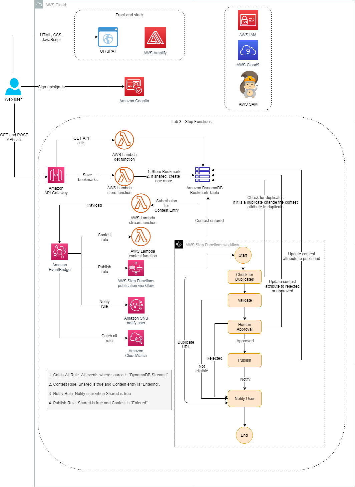

# Lab 3: Workflow Orchestration Using AWS Step Functions



* Configure EventBridge to target a Step Functions workflow
* Use a Step Functions Standard Workflow to orchestrate tasks
* Use Lambda for tasks within a Step Functions state machine

**AWS Step Functions** is a serverless function orchestrator that makes it easy to sequence Lambda functions and multiple AWS services into business-critical applications. Through its visual interface, you can create and run a series of checkpointed and event-driven workflows that maintain the application state. The output of one step acts as input to the next. Each step in your application runs in order, as defined by your business logic.
Orchestrating a series of individual serverless applications, managing retries, and debugging failures can be challenging. As your distributed applications become more complex, the complexity of managing them also grows. Step Functions automatically manages error handling, retry logic, and state. With its built-in operational controls, Step Functions manages sequencing, error handling, retry logic, and state, removing a significant operational burden from your team.

**Amazon Simple Notification Service (Amazon SNS)** is a fully managed messaging service for both system-to-system and app-to-person (A2P) communication. The service enables you to communicate between systems through publish/subscribe (pub/sub) patterns that enable messaging between decoupled microservice applications or to communicate directly to users via SMS, mobile push, and email. The system-to-system pub/sub functionality provides topics for high-throughput, push-based, many-to-many messaging. Using Amazon SNS topics, your publisher systems can fan out messages to a large number of subscriber systems or customer endpoints including Amazon Simple Queue Service (Amazon SQS) queues, Lambda functions, and HTTP/S, for parallel processing. The A2P messaging functionality enables you to send messages to users at scale using either a pub/sub pattern or direct-publish messages using a single API.

 ```shell
#download the application code and run the startup script
wget https://us-west-2-tcprod.s3-us-west-2.amazonaws.com/courses/ILT-TF-200-SVDVSS/v1.0.28.prod-be5d5511/lab-3-Step-Functions/scripts/app-code.zip
unzip app-code.zip
cd app-code
chmod +x resize.sh
chmod +x startupscript.sh
./startupscript.sh
 ```

 ```js
const AWS = require('aws-sdk');
const docClient = new AWS.DynamoDB.DocumentClient();
const dynamodb = new AWS.DynamoDB();

exports.handler = async message => {
   console.log(message);
   let bookmark = message;
   const bookmarkDetails = JSON.stringify(bookmark);
   console.log("bookmarkDetails are "+bookmarkDetails);
   const bookmarkItem = JSON.parse(bookmarkDetails);
   console.log("bookmarkItem "+bookmarkItem);
   console.log("url is "+bookmarkItem.detail.payload.bookmarkUrl.S);
   var exists = false;
   try{
       if(message != null) 
        {
            var params = {
              TableName: process.env.TABLE_NAME,
              IndexName: process.env.INDEX_NAME,
              KeyConditionExpression: "bookmarkUrl = :keyurl",
              ExpressionAttributeValues: {
               ":keyurl": {"S": bookmarkItem.detail.payload.bookmarkUrl.S}
              }
            };
           console.log("exists "+exists);
           var result = await dynamodb.query(params).promise();
           console.log("result is "+JSON.stringify(result.Items));
           var data = JSON.parse(JSON.stringify(result.Items));

            data.forEach(function(item) {
                console.log("db username", item.username.S+" "+bookmarkItem.detail.payload.username.S);
                if (item.username.S != bookmarkItem.detail.payload.username.S)
                    exists = true;
                });

            console.log(exists);
            if (exists === true)
            {
              console.log("in here");    
              var updateParams = {
              TableName: process.env.TABLE_NAME,
              Key:{
                  "id": bookmarkItem.detail.payload.id.S
              },
              UpdateExpression: "set contest=:c",
              ExpressionAttributeValues:{
                  ":c": "duplicate"
              },
              ReturnValues:"UPDATED_NEW"
            };
            await docClient.update(updateParams, function(err, data) {
              if (err) {
                console.log("Unable to update item. Error JSON:", JSON.stringify(err, null, 2));
              }
              else {
                console.log("UpdateItem succeeded:", JSON.stringify(data, null, 2));
              }
            }).promise();
            return "Duplicate";
            }
        }
    }

   catch(e){
     console.log(e);
   }
    return "NotDuplicate";
};
 ```

statemachine.json
 ```json
{
  "Comment": "Publish Rule workflow",
  "StartAt": "CheckDuplicates",
  "States": {
    "CheckDuplicates": {
      "Type": "Task",
      "Resource": "<duplicateBookmarkCheckArn>",
      "InputPath":"$",
      "ResultPath":"$.extractedMetadata",
      "Catch": [
          {
            "ErrorEquals": [ "States.ALL" ],
            "Next": "NotifyUser"
           }
         ],
      "Next": "DuplicateChoiceState"
    },
    "DuplicateChoiceState": {
        "Type": "Choice",
        "Choices": [
          {
            "Variable": "$.extractedMetadata",
            "StringEquals": "NotDuplicate",
            "Next": "NotDuplicate"
          },
          {
            "Variable": "$.extractedMetadata",
            "StringEquals": "Duplicate",
            "Next": "Duplicate"
          }
        ]
      },
    "NotDuplicate": {
      "Type": "Pass",
      "Next": "ValidateURL"
    },
    "Duplicate": {
      "Type": "Pass",
      "Next": "NotifyUser"
    },
    "ValidateURL":{
      "Type": "Task",
      "Resource": "<validateURLArn>",
      "InputPath":"$",
      "ResultPath":"$.extractedMetadata",
      "Catch": [
          {
            "ErrorEquals": [ "States.ALL" ],
            "Next": "NotifyUser"
           }
         ],
      "Next": "ValidateChoiceState"
      },
     "ValidateChoiceState": {
        "Type": "Choice",
        "Choices": [
          {
            "Variable": "$.extractedMetadata",
            "StringEquals": "Valid",
            "Next": "Valid"
          },
          {
            "Variable": "$.extractedMetadata",
            "StringEquals": "Invalid",
            "Next": "Invalid"
          }
        ]
      },
    "Valid": {
      "Type": "Pass",
      "Next": "UserApprovalEmail"
    },
    "Invalid": {
      "Type": "Pass",
      "Next": "NotifyUser"
    },
    "UserApprovalEmail": {
      "Type": "Task",
      "Resource": "arn:aws:states:::lambda:invoke.waitForTaskToken",
      "InputPath":"$",
      "ResultPath":"$.extractedMetadata",
      "Parameters": {
        "FunctionName": "<userApprovalEmailArn>",
        "Payload": {
          "ExecutionContext.$": "$$",
          "APIGatewayEndpoint": "https://<API_GATEWAY_ID>.execute-api.<AWS_REGION>.amazonaws.com/dev/bookmarks/approval"
        }
      },
      "Next": "ManualApprovalChoiceState"
        },
      "ManualApprovalChoiceState": {
        "Type": "Choice",
        "Choices": [
          {
            "Variable": "$.extractedMetadata.Status",
            "StringEquals": "Approved",
            "Next": "PublishApproval"
          },
          {
            "Variable": "$.extractedMetadata.Status",
            "StringEquals": "Rejected",
            "Next": "NotifyUser"
          }
        ]
      },
   "PublishApproval":{
    "Type": "Task",
    "Resource": "<publishApprovalArn>",
    "InputPath": "$",
    "ResultPath": "$.extractedMetadata",
    "End": true
    },
    "NotifyUser": {
        "Type": "Task",
         "Resource": "arn:aws:states:::sns:publish",
         "InputPath": "$",
         "Parameters": {
           "TopicArn": "<ContestTopicArn>",
           "Message.$": "$",
           "MessageAttributes": {
             "msg": {
               "DataType": "String",
               "StringValue": "additional instructions!"
             }
           }
         },
         "End": true
        }
   }
}
 ```

 ```bash
export duplicateBookmarkCheckArn=$(aws lambda get-function --function-name duplicateBookmarkCheck | jq '.Configuration.FunctionArn' | tr -d '"')
export validateURLArn=$(aws lambda get-function --function-name validateURL | jq '.Configuration.FunctionArn' | tr -d '"')
export userApprovalEmailArn=$(aws lambda get-function --function-name userApprovalEmail | jq '.Configuration.FunctionArn' | tr -d '"')
export publishApprovalArn=$(aws lambda get-function --function-name publishApproval | jq '.Configuration.FunctionArn' | tr -d '"')
export API_GATEWAY_ID=$(aws apigateway get-rest-apis --query 'items[?name==`Bookmark App`].id' --output text) 
export ContestTopicArn=$(aws sns list-topics  | jq '.Topics[1].TopicArn' | tr -d '"')
sed -Ei "s|<duplicateBookmarkCheckArn>|${duplicateBookmarkCheckArn}|g" statemachine.json
sed -Ei "s|<validateURLArn>|${validateURLArn}|g" statemachine.json
sed -Ei "s|<userApprovalEmailArn>|${userApprovalEmailArn}|g" statemachine.json
sed -Ei "s|<publishApprovalArn>|${publishApprovalArn}|g" statemachine.json
sed -Ei "s|<API_GATEWAY_ID>|${API_GATEWAY_ID}|g" statemachine.json
sed -Ei "s|<ContestTopicArn>|${ContestTopicArn}|g" statemachine.json
export AWS_REGION=$(curl -s 169.254.169.254/latest/dynamic/instance-identity/document | jq -r '.region')
sed -Ei "s|<AWS_REGION>|${AWS_REGION}|g" statemachine.json
```

publish-rule
```json
{
  "detail-type": [
    "Shared Bookmarks"
  ],
  "source": [
    "DynamoDB Streams"
  ],
  "detail": {
    "shared": [
      true
    ],
    "contest": [
      "Entered"
    ]
  }
}

```
