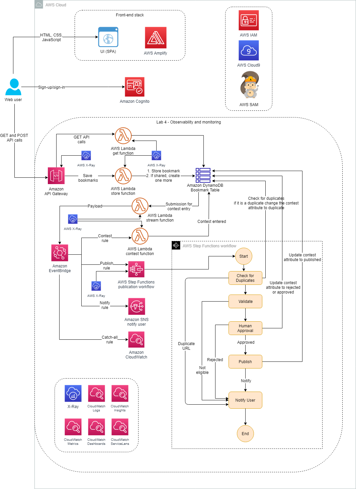

# Lab 4: Observability and Monitoring



* Update your code for better logs, applying logging best practices
* Use Amazon CloudWatch Logs and CloudWatch metrics to monitor application operations
* Use X-Ray and CloudWatch ServiceLens to troubleshoot application issues

Task 2: Enabling **AWS X-Ray** helps developers analyze and debug production, distributed applications, such as those built using a microservices architecture. With X-Ray, you can understand how your application and its underlying services are performing to identify and troubleshoot the root cause of performance issues and errors. X-Ray provides an end-to-end view of requests as they travel through your application and shows a map of your application’s underlying components. You can use X-Ray to analyze both applications in development and in production, from simple three-tier applications to complex microservices applications consisting of thousands of services.

**Amazon CloudWatch Logs Insights** is a fully managed service that is designed to work at cloud scale with no setup or maintenance required. The service analyzes massive logs in seconds and gives you fast, interactive queries and visualizations. CloudWatch Logs Insights can handle any log format and autodiscovers fields from JSON logs.

**Amazon CloudWatch ServiceLens** is a feature that enables you to visualize and analyze the health, performance, and availability of your applications in a single place. CloudWatch ServiceLens ties together CloudWatch metrics and logs, as well as traces from X-Ray, to give you a complete view of your applications and their dependencies. This enables you to quickly pinpoint performance bottlenecks, isolate root causes of application issues, and determine impacted users.

```shell
# download the application code, and run the startup script
wget https://us-west-2-tcprod.s3-us-west-2.amazonaws.com/courses/ILT-TF-200-SVDVSS/v1.0.28.prod-be5d5511/lab-4-ObservabilityMonitoring/scripts/app-code.zip
unzip app-code.zip
cd app-code
chmod +x resize.sh
chmod +x startupscript.sh
./startupscript.sh
```

```shell
cd test
export API_GATEWAY_ID=$(aws apigateway get-rest-apis --query 'items[?name==`Bookmark App`].id' --output text) >> ~/environment/app-code/labVariables
export AWS_REGION=$(curl -s 169.254.169.254/latest/dynamic/instance-identity/document | jq -r '.region')
export API_GATEWAY_URL=https://${API_GATEWAY_ID}.execute-api.${AWS_REGION}.amazonaws.com/dev 
sed -Ei "s|<API_GATEWAY_URL>|${API_GATEWAY_URL}|g" simple-post.yaml
cd ..
```

API Gateway Settings require to provide an Identity and Access Management (IAM) role ARN that has write access to CloudWatch logs in your account, and enable cloudwatch logs and metrics in the stage cloudwatch settings

Lambda configuration required to active tracing for AWS X-Ray. Now any request that the API gets from the four deployed API Gateway methods injects the tracing header into the request. This then flows to the Lambda function and allows you to see where a request is being dropped or receiving an error.

```shell
cd test
npm install artillery -g
npm install faker@5.5.3
artillery run simple-post.yaml
```

```js
//Task 4: Coding for better logging
var AWSXRay = require('aws-xray-sdk');
var AWS = AWSXRay.captureAWS(require('aws-sdk'));
//var dynamodb = new AWS.Dynamodb();
var dynamodb = AWSXRay.captureAWSClient(new AWS.DynamoDB());
```

 Every Lambda function invocation remits a log entry as the last line with the keyword REPORT. The REPORT line contains all of the standard fields and is present on every invoke:

```sql
filter @type = "REPORT"
| fields @requestId, @billedDuration
| sort by @billedDuration desc
```

You can see that @maxMemoryUsed is lower than the @memorySize provisioned for the Lambda function. This is a great starting point for learning more about how your function operates so you can better adjust it.

 When you run a query that uses the **stats** function to group the returned results by the values of one or more fields in the log entries, you can view the results as a bar chart, pie chart, line graph, or stacked area graph. These options help you more efficiently visualize trends in your logs:

```sql
stats count(*) by @logStream
    | limit 100
```

More [Sample queries](https://docs.aws.amazon.com/AmazonCloudWatch/latest/logs/CWL_QuerySyntax-examples.html)

## Task 6: Adding subsegment code

[Add annotations and metadata to segments with the X-Ray SDK for Node.js](https://docs.aws.amazon.com/xray/latest/devguide/xray-sdk-nodejs-segment.html)
* **Annotations** are key-value pairs with string, number, or Boolean values. Annotations are indexed for use with filter expressions. Use annotations to record data that you want to use to group traces in the console or to call the GetTraceSummaries API
* **Metadata** are key-value pairs that can have values of any type, including objects and lists, but are not indexed for use with filter expressions. Use metadata to record additional data that you want stored in the trace but don’t need to use with search.

```js
var AWSXRay = require('aws-xray-sdk');
var AWS = AWSXRay.captureAWS(require('aws-sdk'));
var dynamodb = AWSXRay.captureAWSClient(new AWS.DynamoDB());

exports.handler = async message => {
  console.log(message);
  
  //Fail the messages randomly to see those errors in X-Ray tracing. It's for testing only.
  if(Math.random() < 0.3)
    throw new Error('An unknown error occurred');

  //Can you throw a different response code other than 200?
  
  //Timeout failures about 10%
  if(Math.random() < 0.2) {
     await new Promise(resolve => setTimeout(resolve, 10000));
  };  

  if (message.body) {
    let bookmark = JSON.parse(message.body);
    let params = {
      TableName: process.env.TABLE_NAME,
      Item: {
        id: { S: bookmark.id },
        bookmarkUrl: { S: bookmark.bookmarkUrl },
        name: { S: bookmark.name },
        description: { S: bookmark.description },
        username: { S: bookmark.username },
        shared: { BOOL: bookmark.shared }
      }
    };  
    
    //Call to sub segment annotation code goes here
    var segment = AWSXRay.getSegment();
    await addSegment(segment,message);

    console.log(`Adding bookmark to table ${process.env.TABLE_NAME}`);
    await dynamodb.putItem(params).promise();
    console.log(`New bookmark added to the inventory`);
  }

  return {
    statusCode: 200,
    headers: {"Access-Control-Allow-Origin": '*'},
    body: JSON.stringify({})
  };
};

// Placeholder for sub segment annotation code 
const addSegment = (segment,message) => {
    
    let bookmark = JSON.parse(message.body);
    const f = async (subsegment) => {
      
      subsegment.addAnnotation('uid',bookmark.id);
      subsegment.addAnnotation('name',bookmark.name);
      subsegment.addMetadata('bookmarkUrl', bookmark.bookmarkUrl);
      subsegment.addMetadata('username', bookmark.username);
      
      subsegment.close();
    };
    AWSXRay.captureAsyncFunc("adding annotations and metadata", f, segment);
};
```

## Task 7: Monitoring and visualization
Monitoring is an important part of maintaining the reliability, availability, and performance of your AWS solutions. In this task, you see what the X-Ray service map can offer and then switch into CloudWatch ServiceLens.

X-Ray **Service map** page allows you to identify services where errors are occurring, connections with high latency, or traces for requests that were unsuccessful:

* Green is for successful calls (200).
* Red is for server faults (500-series errors).
* Yellow is for client errors (400-series errors).
* Purple is for throttling errors (429 Too Many Requests).
