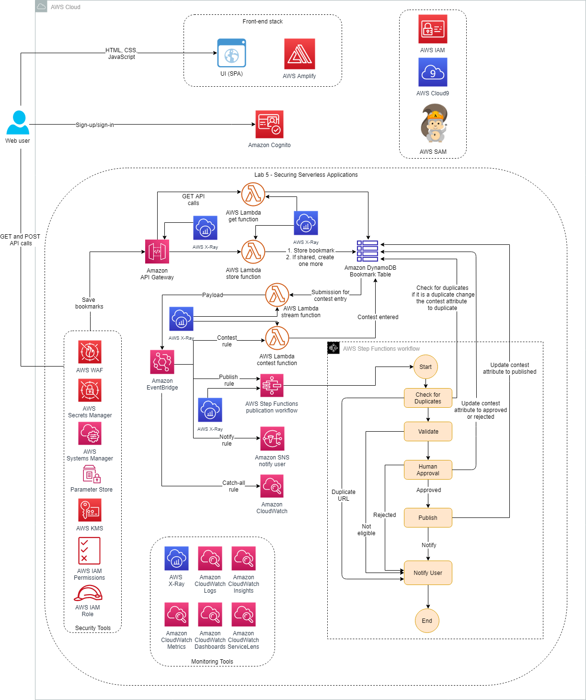

# Lab 5: Securing Serverless Applications



* Secure your application with AWS WAF web ACLs
* Secure access to your API with an API Gateway resource policy
* Secure your Lambda functions and other backend services with AWS KMS, Systems Manager Parameter Store, and Secrets Manager

**AWS WAF** is a web application firewall that helps protect your web applications or APIs against common web exploits that may affect availability, compromise security, or consume excessive resources. AWS WAF gives you control over how traffic reaches your applications by enabling you to create security rules that block common attack patterns, such as SQL injection or cross-site scripting, and rules that filter out specific traffic patterns you define. You can get started quickly using AWS Managed Rules for AWS WAF, a pre-configured set of rules managed by AWS or AWS Marketplace sellers. AWS Managed Rules for AWS WAF address issues like the OWASP Top 10 security risks. These rules are regularly updated as new issues emerge. AWS WAF includes a full-featured API that you can use to automate the creation, deployment, and maintenance of security rules.

```shell
wget https://us-west-2-tcprod.s3-us-west-2.amazonaws.com/courses/ILT-TF-200-SVDVSS/v1.0.28.prod-be5d5511/lab-5-Security/scripts/app-code.zip
unzip app-code.zip
cd app-code
chmod +x resize.sh
chmod +x startupscript.sh
./startupscript.sh
```

## Task 1.1: Securing with AWS WAF web ACLs

1. Create a web ACL
2. Attach the web ACL to API Gateway

* A web access control list (web ACL) has a capacity of 1,500. You can add hundreds of rules and rule groups to a web ACL. The total number that you can add is based on the complexity and capacity of each rule.
* A rate-based rule tracks the rate of requests for each originating IP address and triggers the rule action on IPs with rates that exceed a limit. You set the limit as the number of requests per a 5-minute time span. You can use this type of rule to put a temporary block on requests from an IP address that’s sending excessive requests. By default, AWS WAF aggregates requests based on the IP address from the web request origin, but you can configure the rule to use an IP address from an HTTP header, such as X-Forwarded-For, instead.
* When the rule action triggers, AWS WAF applies the action to additional requests from the IP address until the request rate falls below the limit. It can take a minute or two for the action change to go into effect.

```shell
cd test
echo export API_GATEWAY_ID=$(aws apigateway get-rest-apis --query 'items[?name==`Bookmark App`].id' --output text) >> ~/environment/app-code/labVariables
echo export AWS_REGION=$(curl -s 169.254.169.254/latest/dynamic/instance-identity/document | jq -r '.region') >> ~/environment/app-code/labVariables
source ~/environment/app-code/labVariables
echo export API_GATEWAY_URL=https://${API_GATEWAY_ID}.execute-api.${AWS_REGION}.amazonaws.com/dev >> ~/environment/app-code/labVariables
source ~/environment/app-code/labVariables
sed -Ei "s|<API_GATEWAY_URL>|${API_GATEWAY_URL}|g" simple-post.yaml
cd ..

cd test
npm install artillery@1.7.9 -g
npm install faker@5.5.3
artillery run simple-post.yaml

source ~/environment/app-code/labVariables
echo export ID=$(aws dynamodb scan --table-name sam-bookmark-app-bookmarksTable --query Items[0].id --output text) >> ~/environment/app-code/labVariables
source ~/environment/app-code/labVariables
curl ${API_GATEWAY_URL}/bookmarks/${ID}

source ~/environment/app-code/labVariables
artillery quick -n 20 --count 100 ${API_GATEWAY_URL}/bookmarks
```

API Gateway rejects any further calls after the first 100 requests made in 1 minute. When AWS WAF sees continuous requests from the same source IP address, it blocks all future calls based on the rule. After a few minutes, AWS WAF releases the restrictions and automatically lets the calls in.

Task 2: Securing the application with API Gateway resource policies

API Gateway resource policies are JSON policy documents that you attach to an API to control whether a specified principal (typically an AWS Identity and Access Management [IAM] user or role) can invoke the API. You can use API Gateway resource policies to allow your API to be securely invoked by the following:

apigw / resource policy:
```json
{
  "Version": "2012-10-17",
  "Statement": [{
      "Effect": "Allow",
      "Principal": "*",
      "Action": "execute-api:Invoke",
      "Resource": "execute-api:/*/*/*"
    },
    {
      "Effect": "Deny",
      "Principal": "*",
      "Action": "execute-api:Invoke",
      "Resource": "execute-api:/*/*/*",
      "Condition": {
        "NotIpAddress": {
          "aws:SourceIp": ["165.225.93.23"]
        }
      }
    }
  ]
}
```

response:
```json
{
    "Message":"User: anonymous is not authorized to perform: execute-api:Invoke on resource: arn:aws:execute-api:us-east-1:********3458:zr8nirlpz3/dev/GET/bookmarks/e0a043d2-f6f9-48c0-82b6-8928bd09093b with an explicit deny"
}
```

This message is displayed because you created a resource policy to deny all the requests from other than your system’s IP address.

## Task 3: Securing an AWS Lambda function

* **AWS KMS**: makes it easy for you to create and manage cryptographic keys and control their use across a wide range of AWS services and in your applications. AWS KMS is a secure and resilient service that uses hardware security modules that have been validated under FIPS 140-2, or are in the process of being validated, to protect your keys. AWS KMS is integrated with AWS CloudTrail to provide you with logs of all key use in order to help meet your regulatory and compliance needs.
* **Parameter Store** provides secure, hierarchical storage for configuration data management and secrets management. You can store data such as passwords, database strings, Amazon Machine Image (AMI) IDs, and license codes as parameter values. You can store values as plain text or encrypted data. You can reference Systems Manager parameters in your scripts, commands, Systems Manager documents, and configuration and automation workflows by using the unique name that you specified when you created the parameter.
* **Secrets Manager** helps you protect secrets needed to access your applications, services, and IT resources. The service enables you to easily rotate, manage, and retrieve database credentials, API keys, and other secrets throughout their lifecycle. Users and applications retrieve secrets with a call to Secrets Manager APIs, eliminating the need to hard code sensitive information in plain text. Secrets Manager offers secret rotation with built-in integration for Amazon Relational Database Service (Amazon RDS), Amazon Redshift, and Amazon DocumentDB. Also, the service is extensible to other types of secrets, including API keys and OAuth tokens. In addition, Secrets Manager enables you to control access to secrets using fine-grained permissions and to audit secret rotation centrally for resources in the AWS Cloud, third-party services, and on premises.


```shell
#You are encrypting the string Key Management Service Secrets using the AWS KMS key ID.
export KeyId=$(aws kms list-aliases --query 'Aliases[?starts_with(AliasName, `alias/LambdaSecrets`)].TargetKeyId' --output text)
aws kms encrypt --plaintext "Key Management Service Secrets" --query CiphertextBlob --output text --key-id ${KeyId}
#The resulting encoded output is base64 encoded and is provided as an environment variable to your Lambda function. The Lambda function decrypts the data to get the plaintext in order to actually use it.
```

lambda source code
```js
const aws = require('aws-sdk');

const kmsSecret = process.env.KMS_SECRET;
const ssmSecret = process.env.SSM_SECRET;

let decodedSecret;
let DecodedKMSSecret;

const kms = new aws.KMS();
const ssm = new aws.SSM();
const sm = new aws.SecretsManager();
const userId =  process.env.SM_USER_ID;

exports.handler = async message => {
    console.log(message);
    let secretType = message.pathParameters.id
    console.log("Secret Type:", secretType);
    
    if(secretType == 'kms')
        decodedSecret = await decodeKMSSecret();
    else if (secretType == 'ssm')
        decodedSecret = await decodeSSMSecret();
    else if (secretType == 'sm') {
        var password = await decodeSMSecret(userId);
        decodedSecret = "Password is: " + password;
    }
    else
        decodedSecret = "Provide a valid secret type (kms, ssm, or sm (secrets manager))";
    
    console.log(decodedSecret);
    const response = {
        statusCode: 200,
        headers: {},
        body: JSON.stringify('Plain text secret(s): ' + decodedSecret)
    };
    return response;
};

async function decodeKMSSecret() {
    if (DecodedKMSSecret) {
        return DecodedKMSSecret;
    }
    const params = {
      CiphertextBlob: Buffer.from(kmsSecret, 'base64')
    };
    const data = await kms.decrypt(params).promise();
    DecodedKMSSecret = data.Plaintext.toString('utf-8');
    return DecodedKMSSecret;
}

async function decodeSSMSecret() {
    const params = {
        Name: ssmSecret,
        WithDecryption: true
    };
    const result = await ssm.getParameter(params).promise();
    return result.Parameter.Value
}

async function decodeSMSecret(smkey) {
    console.log("SM Key:", smkey);
    const params = {
        SecretId: smkey
    };
    const result = await sm.getSecretValue(params).promise();
    return result.SecretString;
}
```

The Parameter Store is part of Systems Manager. It is used to store not only encrypted secrets but almost any data. IAM permissions can control who is able to access and change the data in a very fine-grained way. For each record in the Parameter Store, a history is stored, which makes it possible to know exactly when a change has occurred.

```shell
aws ssm put-parameter --name /db/secret --value 'Hello, Parameter Store!' --type SecureString
```

Task 3.3: Storing a secret using Secrets Manager

```shell
aws secretsmanager create-secret --name dbUserId --secret-string  "secretsmanagerpassword"
```
