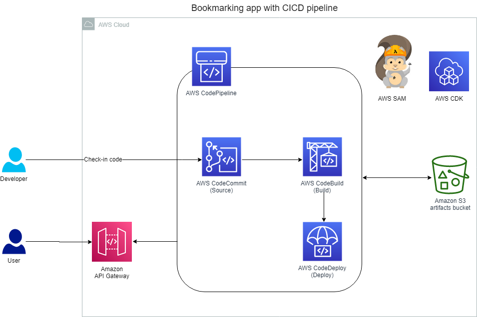

## Lab 6: Serverless CI/CD on AWS



**AWS CodeCommit** is a fully managed source control service that hosts secure Git-based repositories. The service makes it easy for teams to collaborate on code in a secure and highly scalable ecosystem. CodeCommit eliminates the need to operate your own source control system or worry about scaling its infrastructure. You can use CodeCommit to securely store anything from source code to binaries, and the service works seamlessly with your existing Git tools.

**AWS CodePipeline** is a fully managed continuous delivery service that helps you automate your release pipelines for fast and reliable application and infrastructure updates. CodePipeline automates the build, test, and deploy phases of your release process every time there is a code change based on the release model that you define. This enables you to rapidly and reliably deliver features and updates. You can easily integrate CodePipeline with third-party services such as GitHub or with your own custom plugin. With CodePipeline, you pay for only what you use. There are no upfront fees or long-term commitments.

**AWS CodeBuild** is a fully managed continuous integration service that compiles source code, runs tests, and produces software packages that are ready to deploy. With CodeBuild, you don’t need to provision, manage, or scale your own build servers. CodeBuild scales continuously and processes multiple builds concurrently, so your builds are not left waiting in a queue. You can get started quickly by using prepackaged build environments, or you can create custom build environments that use your own build tools. With CodeBuild, you are charged by the minute for the compute resources that you use.

**AWS CodeDeploy** is a fully managed deployment service that automates software deployments to a variety of compute services such as Amazon Elastic Compute Cloud (Amazon EC2), AWS Fargate, AWS Lambda, and your on-premises servers. CodeDeploy makes it easier for you to rapidly release new features, helps you avoid downtime during application deployment, and handles the complexity of updating your applications. You can use CodeDeploy to automate software deployments, which eliminates the need for error-prone manual operations. The service scales to match your deployment needs.

```shell
wget https://us-west-2-tcprod.s3-us-west-2.amazonaws.com/courses/ILT-TF-200-SVDVSS/v1.0.28.prod-be5d5511/lab-6-CICD/scripts/app-code.zip
unzip app-code.zip
cd app-code
chmod +x resize.sh
bash resize.sh 20

cd backend
export LAMBDA_ROLE_ARN=$(aws iam  list-roles --query "Roles[?contains(RoleName, 'LambdaDeployment')].Arn" --output text)
sed -Ei "s|<LAMBDA_ROLE_ARN>|${LAMBDA_ROLE_ARN}|g" template.yaml
export STEP_FUNCTIONS_ROLE_ARN=$(aws iam  list-roles --query "Roles[?contains(RoleName, 'StateMachine')].Arn" --output text)
sed -Ei "s|<STEP_FUNCTIONS_ROLE_ARN>|${STEP_FUNCTIONS_ROLE_ARN}|g" template.yaml
cd ..

#In the AWS Cloud9 terminal, run the following command to create a new CodeCommit repository:
aws codecommit create-repository --repository-name app-code
# These commands specify the use of the Git credential helper with the AWS credential profile and enable the Git credential helper to send the path to repositories. The credential helper uses the default AWS credential profile or the Amazon EC2 instance role.
git config --global credential.helper '!aws codecommit credential-helper $@'
git config --global credential.UseHttpPath true

#In the AWS Cloud9 terminal, run the following commands to do an initial commit of the code:
cd ~/environment/app-code
git init
git checkout -b main
git add .
git commit -m "Initial commit"

# This code adds your CodeCommit repository URL as a remote on your local git project.
sudo yum -y install jq
echo export AWS_REGION=$(curl -s 169.254.169.254/latest/dynamic/instance-identity/document | jq -r '.region') >> ~/environment/app-code/labVariables
source ~/environment/app-code/labVariables
git remote add origin https://git-codecommit.${AWS_REGION}.amazonaws.com/v1/repos/app-code

#To push the code to CodeCommit, run the following command:
git push -u origin main
```

Task 3: Building the CI/CD pipeline

You use the **AWS CDK** as the pipeline vending mechanism in this lab. The AWS CDK is a software development framework for defining cloud infrastructure in code and provisioning it through AWS CloudFormation.

You can describe your infrastructure by writing code in TypeScript, C#, Python, or Java. Your code is then synthesized into CloudFormation templates and, by using the AWS CDK CLI, can then be deployed into your AWS environment.

Serverless developers use the AWS SAM framework to define their applications, the AWS SAM CLI to build and deploy them, and the AWS CDK to provision any infrastructure-related resources, such as the CI/CD pipeline. All of these tools share one underlying service: CloudFormation.

```shell
#uninstall any older versions of the AWS CDK and install the latest version
npm uninstall -g aws-cdk
npm install -g aws-cdk@latest --force

#create a folder outside of the app-code directory where the pipeline code will reside:
cd ~/environment
mkdir pipeline
cd pipeline

#initialize a new AWS CDK project within the pipeline folder
npx aws-cdk@1.x init app --language typescript

#install the AWS CDK modules that are used to build the pipeline
git checkout -b main
npm install --save @aws-cdk/aws-codedeploy @aws-cdk/aws-codebuild
npm install --save @aws-cdk/aws-codecommit @aws-cdk/aws-codepipeline-actions
npm install --save @aws-cdk/aws-s3

#build the AWS CDK project
cd ~/environment/pipeline
npm run build

#deploy the pipeline project by using the AWS CDK CLI
cdk deploy
```

*pipeline.ts* file is the entry point to the AWS CDK project.

Task 4: Creating stages

step 33

```ts
// lib/pipeline-stack.ts

import * as cdk from '@aws-cdk/core';
import s3 = require('@aws-cdk/aws-s3');
import codecommit = require('@aws-cdk/aws-codecommit');
import codepipeline = require('@aws-cdk/aws-codepipeline');
import codepipeline_actions = require('@aws-cdk/aws-codepipeline-actions');
import codebuild = require('@aws-cdk/aws-codebuild');

export class PipelineStack extends cdk.Stack {
  constructor(scope: cdk.Construct, id: string, props?: cdk.StackProps) {
    super(scope, id, props);

    // The code that defines your stack goes here
    const artifactsBucket = new s3.Bucket(this, "ArtifactsBucket");

    // Import existing CodeCommit app-code repository
const codeRepo = codecommit.Repository.fromRepositoryName(
  this,
  'AppRepository', // Logical name within CloudFormation
  'app-code' // Repository name
);

// Pipeline creation starts
const pipeline = new codepipeline.Pipeline(this, 'Pipeline', {
  artifactBucket: artifactsBucket
});

// Declare source code as an artifact. This is necessary for any files that you want CodePipeline to pass to downstream stages. In this case, the source code should be passed to the build stage
const sourceOutput = new codepipeline.Artifact();

// Add source stage to pipeline
pipeline.addStage({
  stageName: 'Source',
  actions: [
    new codepipeline_actions.CodeCommitSourceAction({
      actionName: 'CodeCommit_Source',
      repository: codeRepo,
      output: sourceOutput,
      branch: 'main',
    }),
  ],
});

  }
}
```

```shell
#build and deploy the project
npm run build
cdk deploy


```

buildspec file is a series of commands in YAML format that CodeBuild runs to build your application. This file is placed in the root folder of an AWS SAM application, and CodeBuild automatically finds it and runs it during build time. 
```yml
# ~/environment/app-code/buildspec.yml

version: 0.2
phases:
  install:
    runtime-versions:
      nodejs: 12
    commands:
      # Install packages or any pre-reqs in this phase.
      # Upgrading SAM CLI to latest version
      - pip3 install --upgrade aws-sam-cli
      - sam --version

  build:
    commands:
      # Use Build phase to build your artifacts (compile, etc.)
      - cd backend
      - sam build

  post_build:
    commands:
      # Use Post-Build for notifications, git tags, upload artifacts to S3
      - cd ..
      - sam package --template backend/template.yaml --s3-bucket $PACKAGE_BUCKET --output-template-file packaged.yaml

artifacts:
  discard-paths: yes
  files:
    # List of local artifacts that will be passed down the pipeline
    - packaged.yaml
```

https://docs.aws.amazon.com/codebuild/latest/userguide/build-spec-ref.html

```shell
cd ~/environment/app-code
git add .
git commit -m "Added buildspec.yml"
git push

cd ~/environment/pipeline
npm run build
cdk deploy

```

```shell
cd ~/environment/app-code/test
echo export API_GATEWAY_ID=$(aws apigateway get-rest-apis --query 'items[?name==`Bookmark App`].id' --output text) >> ~/environment/app-code/labVariables
source ~/environment/app-code/labVariables
echo export API_GATEWAY_URL=https://${API_GATEWAY_ID}.execute-api.${AWS_REGION}.amazonaws.com/dev >> ~/environment/app-code/labVariables
source ~/environment/app-code/labVariables
sed -Ei "s|<API_GATEWAY_URL>|${API_GATEWAY_URL}|g" simple-post.yaml
cd ..
```

Task 6: Understanding canary deployments and how to implement them

A canary deployment is a technique that reduces the risk of deploying a new version of an application by slowly rolling out the changes to a small subset of users before rolling the new version out to the entire customer base. Using blue/green and canary deployments is well established as a best practice for reducing the risk of software deployments. In traditional applications, you slowly and incrementally update the servers in your fleet while simultaneously verifying application health. However, these concepts don’t map directly to a serverless world. You can’t incrementally deploy your software across a fleet of servers when there are no servers.

Lambda allows you to publish multiple versions of the same function. Each version has its own code and associated dependencies, and its own function settings (such as memory allocation, timeout, and environment variables). You can then refer to a given version by using a Lambda alias. An alias is a name that can be pointed to a given version of a Lambda function.

```yaml
AutoPublishAlias: live
DeploymentPreference:
    Type: Canary10Percent5Minutes
    Alarms:
        - !Ref CanaryErrorsAlarm
```

`Canary10Percent5Minutes` strategy for this lab, which means that traffic is shifted in two increments. In the first increment, only 10 percent of the traffic is shifted to the new Lambda version, and after 5 minutes, the remaining 90 percent is shifted. You can choose other deployment strategies in CodeDeploy, such as the following:

Canary deployments are considerably more successful if the code is monitored during the deployment. You can configure CodeDeploy to automatically roll back the deployment if a specified Amazon CloudWatch metric has breached the alarm threshold. Common metrics to monitor are Lambda invocation errors or invocation duration (latency).

```yml
CanaryErrorsAlarm:
  Type: AWS::CloudWatch::Alarm
  Properties:
    AlarmDescription: Lambda function canary errors
    ComparisonOperator: GreaterThanThreshold
    EvaluationPeriods: 2
    MetricName: Errors
    Namespace: AWS/Lambda
    Period: 60
    Statistic: Sum
    Threshold: 0
    Dimensions:
      - Name: Resource
        Value: "getBookmark:live"
      - Name: FunctionName
        Value: !Ref getBookmark
      - Name: ExecutedVersion
        Value: !GetAtt getBookmark.Version.Version
```