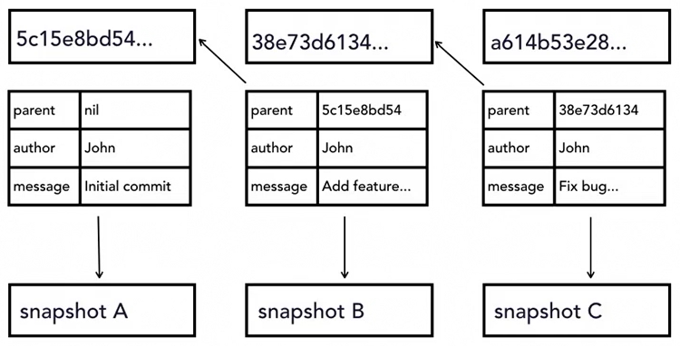
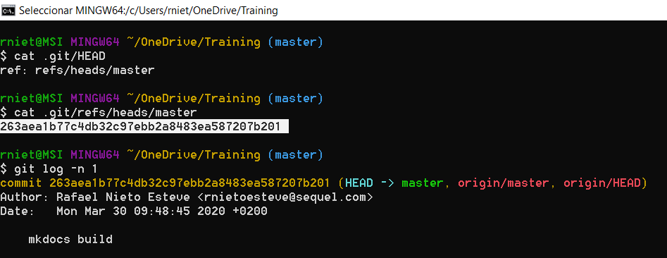

# Git Essential Training: The Basics

## Configuration
Install git from [https://git-scm.com](https://git-scm.com)

* **System**: C:\Program Files\Git\etc\gitconfig:
```git
git config --system --list
```
* **User**: C:\Users\rniet\.gitconfig:
```git
git config --global --list
```
* **Project**: my_project/.git/config: 
```git
git config --list
```

Other configuration settings:

```git
git config --global user.name "Rafael Nieto"
git config --global user.email "rnietoe@gmail.com"
git config --global core.editor "code --wait"` 
git config --list
```

Other basic commands:

* change to my user directory:
```cmd
cd ~
``` 
* list all items (hidden as well):
```cmd
ls -la
```  
* display a text file
```cmd
cat .gitconfig
```   

## Getting started

* Initialize and clone a repository
    ```git
    git init
    git clone https://github.com/rnietoe/Training.git
    git clone https://github.com/rnietoe/Training.git local_repository_name
    ```
* Stage and commit changes
    ```git
    git add .  
    git commit -m "commit message"
    ```
* git log commands  
    ```git
    git log  
    git log -2
    git log --since=2020-04-04
    git log --until=2020-04-04  
    git log --until="3 days ago"  
    git log -L 100,150:filename.txt
    git log --author="Rafael"  
    git log --grep="bug"
    git log --oneline

    git log --stat
    git log --format=medium
    git log --format=short
    git log --format=oneline
    git log --graph --all --oneline --decorated
    ```

    * List logs as patches (diff)
        ```git
        git log --pathces
        git log -p
        ```

## Git Concepts and Architecture

{: style="height:200px;width:250px"} 
{: style="height:200px;width:400px"}



## Make changes to files

### Status
```git
git status
```

* **Untracked**: created but unstagged yet
* **Added**: created and stagged ("cached") 
* **Modified** 
* **Deleted**
* **Renamed**

### Differences

* compare the staging tree and your working directory
```git
git diff
```
* compare the repository and the staging tree:
```git
git diff --stagged
```
* show only the words that are different:
```git
git diff --color-words
```

### Other changes

* remove the file from the working directory and stage the change in a single git command:
```git
git rm filename
```
* rename filename as newname and stage the change in a single git command:
```git
git mv filename newname
```

### Commit all
Stage and commit all changes from working directory directly to the repository (instead to the staging tree)
```git
git commit -all
git commit -am "commit message"
```

!!!warning "it does not include untracked files"

### Multiline commit message
```git
git commit -a
```
Because of we didn't specify the message parameter, the `.git/COMMIT_EDITMSG` file is opened in our editor to enter a multiline commit message. 

!!! note "When git/COMMIT_EDITMSG file is closed, the commit is executed. The commit is aborted if commit message is empty."

### Inspect a commit
```
git show HEAD
git show commitID 
git show commitID --color-words
```
where commitID is the first characters of commit Id (6 to 8 characters are enough)

!!!tip " Use space or `f` to go forward in the paginator, `b` to go backward, `/` to search words and `q` to quit."

### Compare commits
```
git diff commitID1..HEAD 
git diff commitID1..commitID2 
git diff commitID1..commitID2 --color-words
```

## Undo changes
To discard changes in the working directory:
```git
git checkout -- "filename"
git checkout -- .
```
Above command does not check out any branch. Instead, it checks out a single file or every file, from the repository

To discard changes in the staging tree (to the working directory):
```git
git reset HEAD filename
```

### Amend/Edit commits
```git
git commit --amend -m "new commit message"
```

It takes what's in staging and add it to the latest commit

!!! tip "amend command is also usefull to update the message of the latest commit"

### Retrieve old versions
Retrieve files with changes of desired commit ID
```git
git checkout commitId -- .
git checkout commitId -- filename
```

### Revert a commit
```git
git revert commitID
```

### Remove untracked 
Remove untracked files from the working directory
 ```git
 git clean -n # display what would be removed
 git clean -f # remove untracked files

 ```

## Ignore files
`project/.gitignore` using:

* regexp with: * ? [aeiou] [0-9]. Sample of ignore all log files from logs directory: `logs/*.log.[0-9]`
* negative expressions with !: Sample of ignore all php files with *.php, but do not ignore index file with `!index.php`
* trailing slash /: Sample of ignore all files in a directory: `asset/videos/`

`# This is a comment` in the project/.gitignore file

We should ignore:

* compiled source code
* packages and compressed files
* logs and databases
* Operative System generated files
* User-uploaded assets (images, PDFs, videos)

[.gitignore templates](https://github.com/github/gitignore)

### Ignore files globally
Ignore files globally (instead by project):
```git
git config --global core.excludesfile ~/.gitignore_global
```

### Ignore files to be tracked
```git
git rm --cached filename
```

### Track empty directories
Create `.gitkeep` file to track empty directories
```cmd
touch dirname/.gitkeep 
```
