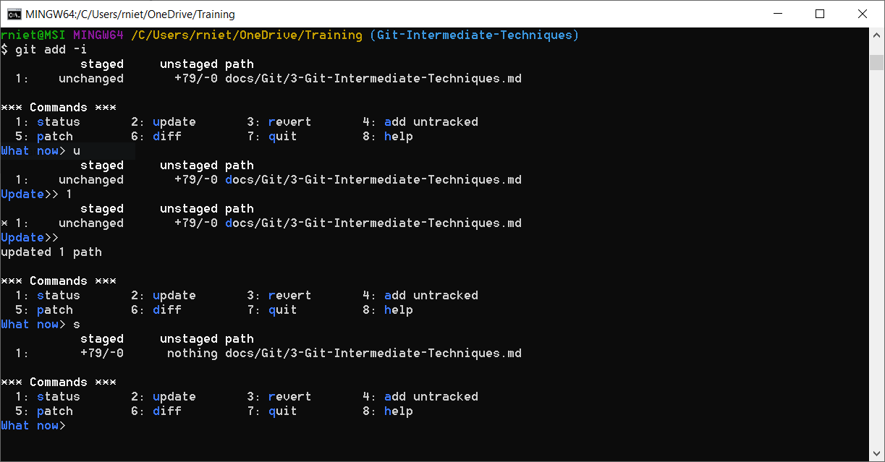

# Git Intermediate Techniques

Delete remote-tracking branches 
```git
git remote prune origin --dry-run
git remote prune origin 

git fetch --prune
git fetch -p 
```

Prune all unreachable objects. Do not need to use
```git
git prune
```

## Tagging

Reference names to a commit (v1.0, v1.1, v2.0):

* Lightweight tag
    ```git
    git tag tag_name commit_id
    ```

* Annotated tag (most common)
    ```git
    git tag -a v1.1 -m "Version 1.0" commitId
    git tag -am "Version 1.0" v1.1 commitId
    ```

List tags
```git
git tag 
git tag --list
git tag -l
git tag -l "v1*"
git tag -l -n
```

Work with tags
```git
git show v1.1
git diff v1.0..v1.1
```

Delete a tag
```git
git tag --delete v1.1
git tag -d v1.1
```

Push tags to remote server
```git
git push origin v1.1
git push origin --tags
```

Delete remote tags
```git
git push origin :v1.1
git push --delete origin v1.1
git push -d origin v1.1
```

check out tags
```git
git checkout -b new_branch v1.1
```

## Cherry-picking

* *copy* a single commit or a range of commits 
* *paste* in the branch (new commits have different SHAs).


```git
git cherry-pick SHA
git cherry-pick SHA --edit "edit commit message"
git cherry-pick SHA -e "edit commit message"
git cherry-pick SHA..SHA
```

when there are conflicts:
```git
git cherry-pick --continue
git cherry-pick --abort
```

## Stage changes interactively
Interactive way to stage changes from the working directory to the staging area:
```git
git add --interactive
git add -i
```



### Hunk

Hunk is an area where two files differ. it can be staged, skipped or split.

In interactive mode, select option 5 (Patch) and use the wizard with options `e` (edit), `s` (split), `y` (yes) and `n` (not) to patch portions of codes.

Patch mode is not only for interactive mode:
```git
git add --patch
git add -p

git stash -p
git reset -p
git checkout -p
git commit -p
```

## Patches

### Diff Patches
```git
git diff from-commit to-commit > output.diff
```

Apply difference to our working directory
```git
git apply output.diff
```

### Formatted Patches
Export each commit in Unix mailbox format, for example:

* export all commits in a range (optional to a file)
    ```git
    git format-patch from-commit..to-commit
    git format-patch from-commit..to-commit --stdout > feature.patch
    ```

* export a single commit
    ```git
    git format-patch -1 commitId
    ```

* export all commits on current branch, which are not in master branch (optional to a directory)
    ```git
    git format-patch master
    git format-patch master -o output_directory
    ```

Apply formatted patches (**a**pply **m**ailbox):
```git
git am path/file.patch
git am path/*.patch
```

## Rebasing