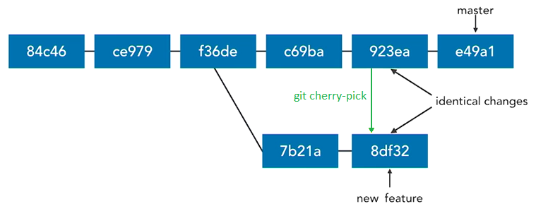

# Git Intermediate Techniques

## Prune
Delete remote-tracking branches 
```git
git remote prune origin --dry-run
git remote prune origin 

git fetch --prune
git fetch -p 
```

Prune all unreachable objects. Do not need to use
```git
git prune
```

## Tags

Reference names to a commit (v1.0, v1.1, v2.0):

* Lightweight tag
    ```git
    git tag tag_name commit_id
    ```

* Annotated tag (most common)
    ```git
    git tag -a v1.1 -m "Version 1.0" commitId
    git tag -am "Version 1.0" v1.1 commitId
    ```

List tags
```git
git tag 
git tag --list
git tag -l
git tag -l "v1*"
git tag -l -n
```

Work with tags
```git
git show v1.1
git diff v1.0..v1.1
```

Delete a tag
```git
git tag --delete v1.1
git tag -d v1.1
```

Push tags to remote server
```git
git push origin v1.1
git push origin --tags
```

Delete remote tags
```git
git push origin :v1.1
git push --delete origin v1.1
git push -d origin v1.1
```

Check out tags
```git
git checkout -b new_branch v1.1
```

## Cherry-pick

1. *copy* a single commit or a range of commits 
2. *paste* in the branch (new commits have different SHAs).



```git
git cherry-pick SHA
git cherry-pick SHA --edit "edit commit message"
git cherry-pick SHA -e "edit commit message"
git cherry-pick SHA..SHA
```

when there are conflicts:
```git
git cherry-pick --continue
git cherry-pick --abort
```

## Stage changes interactively
Interactive way to stage changes from the working directory to the staging area:
```git
git add --interactive
git add -i
```


### Hunk

Hunk is an area where two files differ. It can be staged, skipped or split.

In interactive mode, select option 5 (Patch) and use the wizard with options `e` (edit), `s` (split), `y` (yes) and `n` (not) to patch portions of codes.

Patch mode is not only for interactive mode:
```git
git add --patch
git add -p
```

Patch parameter is also used in other commands:
```git
git stash -p
git reset -p
git checkout -p
git commit -p
```

## Patches

### Diff Patches
```git
git diff from-commit to-commit > output.diff
```

Apply difference to our working directory
```git
git apply output.diff
```

### Formatted Patches
Export each commit in Unix mailbox format, for example:

* export all commits in a range (optional to a file)
    ```git
    git format-patch from-commit..to-commit
    git format-patch from-commit..to-commit --stdout > feature.patch
    ```

* export a single commit
    ```git
    git format-patch -1 commitId
    ```

* export all commits on current branch, which are not in master branch (optional to a directory)
    ```git
    git format-patch master
    git format-patch master -o output_directory
    ```

Apply formatted patches (**a**pply **m**ailbox):
```git
git am path/file.patch
git am path/*.patch
```

## Rebase

!!! tip "Usefull to clean commits and keep the history cleaner."

Copy commits from one branch, one-by-one, and then replaying/incorporating them at the end of another branch (commits are moved).  


```git
git rebase master
git rebase master new_feature
```

Get the commitID where branch diverges (the latest commit in common)
```git
git merge-base master new_feature
```

### Merge VS rebase


* Merge and Rebase have similar ends: they incorporate changes from one branch into another branch
* Use `merge` to bring large branches back into master
* Use `rebase` to add minor commits in master to a branch

!!! warning "Rebasing should be only used on your local, private branches or on branches that you use exclusively; not branches that others are using."

Rebase is destructive when there are conflicts. Conflicts will be resolved with new changes in commits, and then:
```git
git rebase --continue
git rebase --skip
git rebase --abort
```

### Rebase onto other branches
```git
git rebase --onto base upstream branch
```

For example:
```git
git rebase --onto master camping expenses
```


### Undo rebase
Undoing complex rebases may loses SHAs, commit messages, change sets, etc.
```git
git reset --hard ORIG_HEAD
git rebase --onto camping_commitID master expenses
```

### Interactive rebase
```git
git rebase -i master new_feature
git rebase -i HEAD~3
```

with options:

* `pick`: use commit
* `drop`: remove commit
* `reword`: use commit, but edit the commit message
* `edit`: use commit, but stop for amending
* `squash`: use commit, but meld into previous commit
* `fixup`: like `squash`, but discard this commit's log message 
* `exec`: 

### Pull rebase
Fetch from remote, and then rebase instead or merge

```git
git pull --rebase
git pull -r
git pull --rebase=preserve
git pull --rebase=interactive
```

## Track Problems

### Blame
How wrote this code and when? - who I should blame?
```git
git blame filename.txt
git blame -w filename.txt
git blame -L 100,150 filename.txt
git blame -L 100,+50 filename.txt
git blame SHA filename.txt
```

where `-w` ignore whitespace

!!! tip "Add a global alias for blame as praise"
    `git config --global alias.praise blame`

### Annotate
Similar to blame, with different output format
```git
git annotate filename.txt
```

### Bisect
Find the commit that introduced a bug or regression. The last good revision and the first bad revision are marked
```git
git bisect start
git bisect bad <treeish>
git bisect good <treeish>
git bisect reset
```
