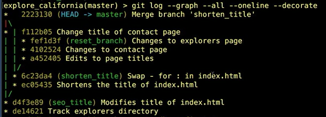
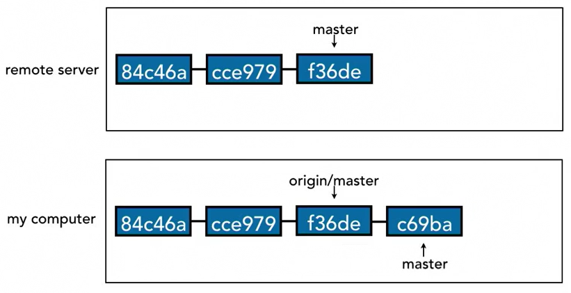
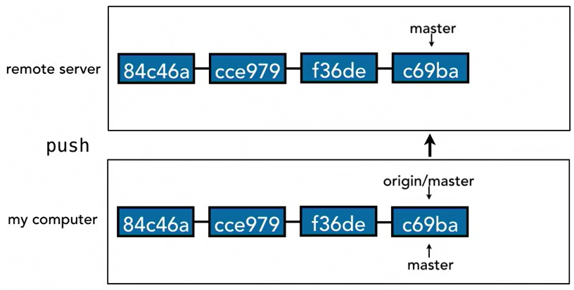
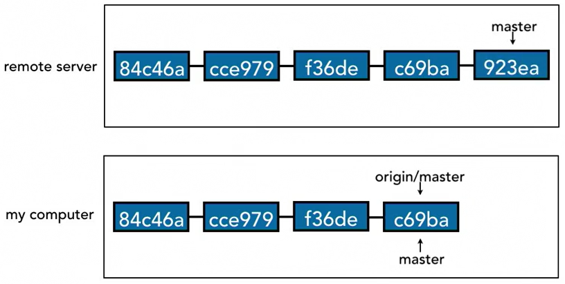
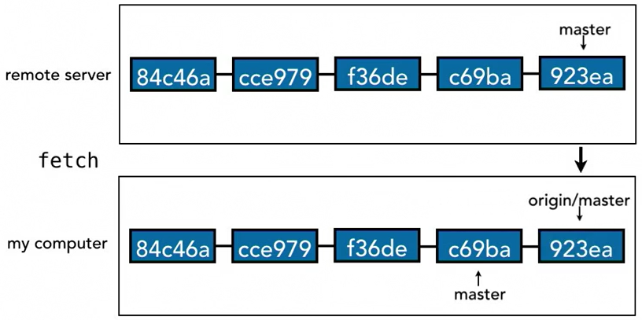
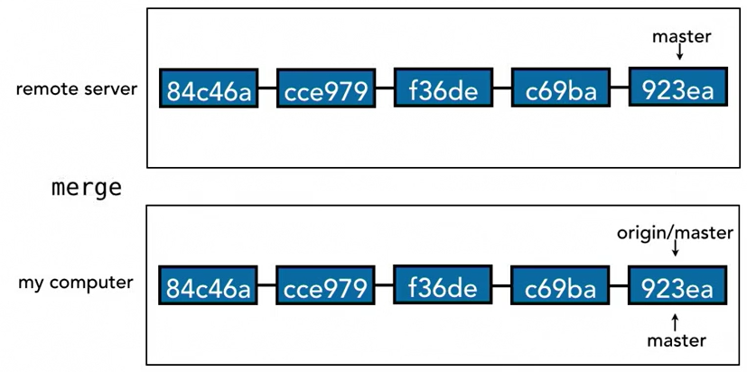
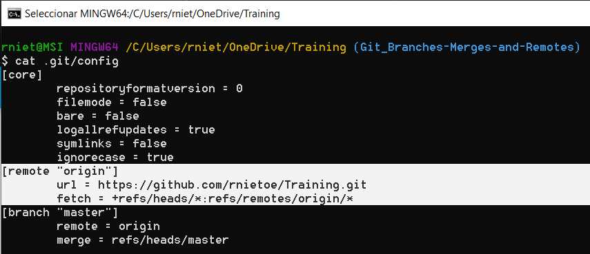
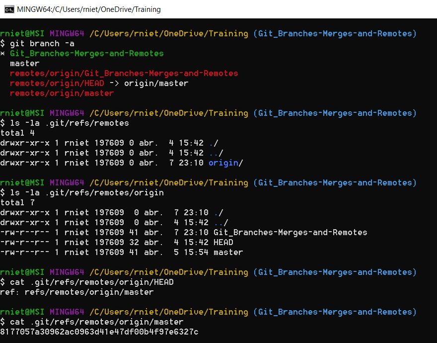

# Git: Branches, Merges, and Remotes

## Tree-ish

### Git references

* SHA1 hash: the commit ID
* HEAD
* Branch
* Tag
* Ancestry
    * Parents: abcd1234^, master^, HEAD^, HEAD~1, HEAD~
    * Grandparent: abcd1234^^, master^^, HEAD^^, HEAD~2
    * Grat-Grandprarents: abcd1234^^^, master^^^, HEAD^^^, HEAD~3

        ```git
        git show HEAD^
        git show HEAD^^
        git show HEAD~3
        ```

### Tree Listing
List of blobs (**b**inary **l**arge **ob**ject = file) and trees (tree =  directory) of a tree

```git
git ls-tree HEAD
git ls-tree HEAD^
git ls-tree HEAD tree/
```

Filter the commit log after a commitID to HEAD

```git
git log abcd1234..
git log abcd1234..HEAD
git log <SHA>..<SHA>
```

Filter the commit log by file or directory

```git
git log filename
git log dirname
```

## Branches
Create a new branch:
```git
git branch branch_name
```

!!! note "Note that new branch and its parent branch are the same at the moment. There are not differences because there were not commits yet."

List all branches. Currently checkout branch is shown in green color: 
```git
git branch
```

Switch branches
```git
git checkout branch_name
```

Switch to a new branch
```git
git checkout -b branch_name
```

Git rejects to switch with uncommited changes. The options are:

1. commit the changes to the current branch
2. remove the changes checking out the file 
3. stash the changes

### Compare branches 
```git
git diff master..new_feature
git diff --color-words <SHA>..<SHA>
```

!!! info "As a general rule, the older branch should go firsts, so changes shown have occurred since that point in time."

Rename branches
```git
git branch -m new_branch_name
```

Delete branches
```git
git branch -d branch_name
```

!!!warning "Cannot delete the checked out branch"  
!!!warning "Cannot delete branches not fully merged. Instead, use capital `-D`, but commits in the branch will be lost."

### Reset Branches

!!! tip "Back up the latest commitID before, in case you want to undo the reset execution"

* **Soft** reset: Latest commits changes are staged and pending to commit. Useful when you want to back things up in the commit timeline.
    ```git
    git reset --soft <SHA>
    ```

* **Mixed** reset (default reset option): Latest commits changes are unstaged, pending to stage and commit.
    ```git
    git reset --mixed <SHA>
    git reset <SHA>
    ```

* **Hard** reset: Latest commits changes are nowhere. Useful to permanently undo commits (SHA=commitID) or if you want to make one branch look like another (sha=branchID)
    ```git
    git reset --hard <SHA>
    ```

    !!! tip "Create a new branch as backup before a hard reset"

### Merge Branches
The merge concept is like a commit to the checked out branch from another branch. Run a merge with a clean working directory:
```git
git merge <branch_name>
```

Find out which other branches already **have merged** all their commits into this branch
```git
git branch --merged
```

Find out which other branches **have NOT merged** their commits into this branch yet
```git
git branch --no-merged
```

!!! tip "Use `git log --graph --all --oneline --decorated` to check how branches were merged"
    

A conflict occurs when two different commits have changes in the same line or set of lines. Solutions:

* Abort merge 
```git
git merge --abort
```
* Resolve the conflict manually 
```git
git show --color-words
git commit
```
* Use the merge tool
```git
git mergetool
```
* Use a graphical user interface tool, like visual studio

To reduce conflicts:

* Keep lines short
* Keep commmits small and focused
* Beware edits to whitespace (spaces, tabs, line return)
* Merge to master often
* Merge from master (tracking)

## Stash Changes
Create and view stash:
```git
git stash save "stash_name"
git stash list
git stash show stash@{0}
git stash show -p stash@{0}
```

Apply stash changes to the workgin directory, **removing** the single stash:
```git
git stash pop
git stash pop stash@{0}
```

Apply stash changes to the workgin directory, **keeping** the single stash:
```git
git stash apply
git stash apply stash@{0}
```

Delete stash (stash that was not deleted using `apply`)
```git
git stash drop stash@{0}
git stash clear
```

???
```git
git stash -u
git stash --include-untracked 
```

## Colaborate remotely

```git
git commit -m "from-my-computer"
```
{: style="height:200px;width:450px"}  

```git
git push
git push origin master
```
{: style="height:200px;width:450px"}  

!!! danger "If you try to do a push and Git rejects it, then you need to fetch, merge, and then push again."

```git
git commit -m "from-remote-server"
```
{: style="height:200px;width:450px"} 

```git
git fetch
```
{: style="height:200px;width:450px"} 

!!! important "`git fetch` does not change the local branch."

* fetch before you start to work everyday
* fetch before you push
* fetch before you go offline
* fetch often
* git fetch + git merge = `git pull`

```git
git merge
```
{: style="height:200px;width:450px"} 

### Remote repositories
Add a remote repository
```git
echo "# repository_name" >> README.md
git init
git add README.md
git commit -m "first commit"
git remote add origin git@github.com:rnietoe/repository_name.git
git push -u origin master
```

List remote repositories
```git
git remote
git remote -v
```

```shell
cat .git/config
```


### Remote branches
Add a remote branch
```git
git push -u origin master
```

List remote and all branches
```git
git branch -r
git branch -a
```



Delete remote branches
```git
git push origin :branch_name
git push origin --delete branch_name
```     

### Tracking/Untraking remote branch
```git
git branch branch_name origin/branch_name
git checkout -b branch_name origin/branch_name
```
???
```git
git branch -u origin/branch_name branch_name
git branch --unset-upstream branch_name
```

### Push workflow
```git
git checkout master
git fetch
git merge origin/master
git merge local_branch
git push
```

## Next steps

### Git Aliases for commonly-used commands
Add alias "st = status" to ~/.gitconfig
```git
git config --global alias.st "status"
```

Other examples: 

* st = status
* co = checkout
* ci = commit
* br = branch
* df = diff
* dfs = diff -stagged
* logg = log --graph --decorate --oneline --all

### Set up SSH keys for remote login
[Authenticating with GitHub from Git](https://help.github.com/en/github/getting-started-with-github/set-up-git#next-steps-authenticating-with-github-from-git)

### Integrated Development Environments (IDEs)
Integrate source code editing with Git features

### Graphical User Interfaces (GUIs)
They have a point-and-click interface for performing Git actions. 