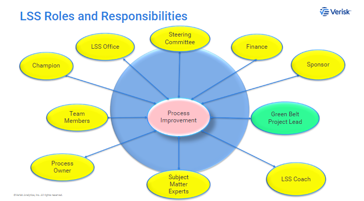
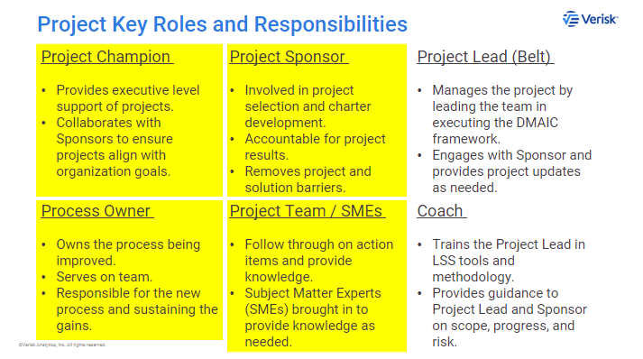
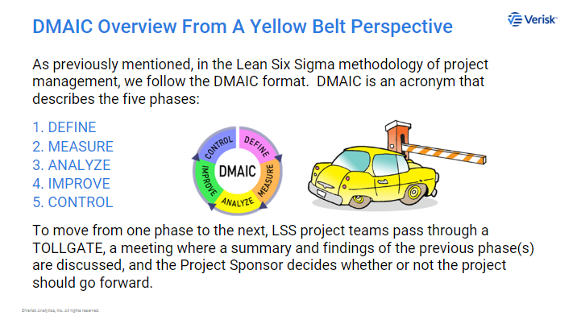
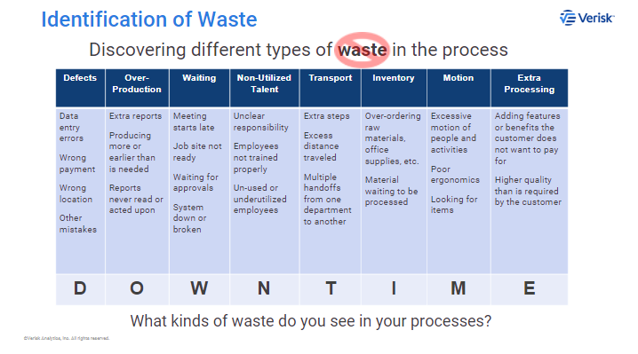

# Verisk Lean Six Sigma Yellow Belt Training

6 months

# Continuous Improvement At Verisk 

Kaizen - Continuous improvement
Muda - waste
Poka Yoke - Error Proofing
 
# What Is Lean Six Sigma?

Lean: delete waste (desperdiciar) to increase productivity
Six Sigma: delete variation and increase quality and prevent defects

Lean Six Sigma: quality, cost and speed, with minimum VARIATION

# What Is A Yellow Belt?

# What Is A Process And How Do You Improve It? 

how do customers view a business. Process perspective

# What Is A Lean Six Sigma Project? 

* people
* resources
* planning and execution
* management an control

DMAIC framework

# How Do You Identify And Scope A Potential Lean Six Sigma Project? 

1. impact on internal/external customers
2. project well defined
3. solution already exist
4. data to track process metrics (number of defects)
5. benefits VS effort: cost of time and resources 
6. project championed by high level individuals
7. authorization and time to work. average of 6 months for the scope
8. KPI key performance indicators

# Roles And Participating On A Lean Six Sigma Project Team 

1. Project Champion: executive support
2. Project Sponsor 
3. Process Owner
4. Project team: knowledge

# DMAIC Overview From A Yellow Belt Perspective

1. **D** DEFINE well defined with clear expectations  
    * Project charter document using SIPOC diagram
2. **M** MEASURE As-Is state VS future state  
    * develop a baseline
3. **A** ANALYZE root causes.  
    * Fishbone exercise.
    * 5 whys
4. **I** IMPROVE develop solution
5. **C** CONTROL. implement solution

# Improving A Process Without A Lean Six Sigma Project

* Quick wins
    * fast
    * cheap
    * easy
    * low risk
    * influence

* Waste Analysis
    * D O W N T I M E   

* 5 WHYs

* Pareto Principle and Analysis (80/20)

* 5 S creates an organized, clean and safe workspace
    1. sort
    2. set in order or simplify
    3. shine (dejarlo brillanto)
    4. standarize
    5. sustain (mantener limpio y ordenado)
    6. Safety

* Document Standard work and procedures

# Expectations of Yellow Belts at Verisk 

