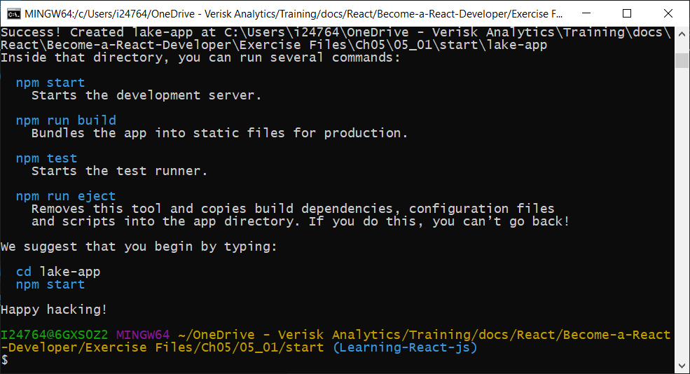
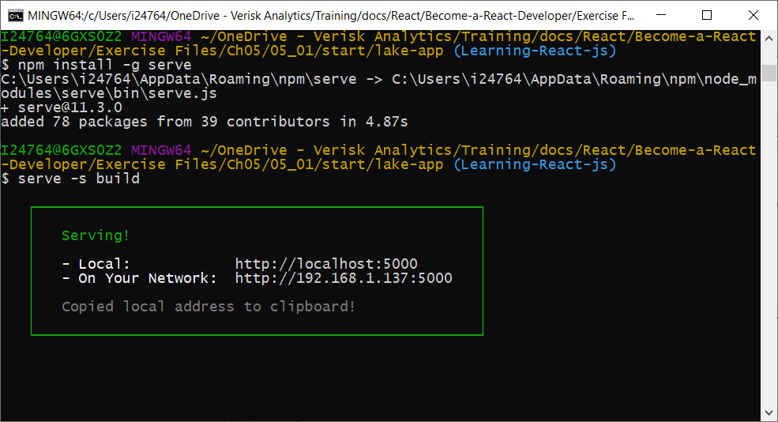

# Learning React.js

## Getting Started
React is a JS library built at Facebook.

Setup React Developer Tools using chrome: [React Developer Tools extension](https://chrome.google.com/webstore/detail/react-developer-tools/fmkadmapgofadopljbjfkapdkoienihi?hl=es). Edit extension setting with "Allow access to file URLs" enabled.

## React Element and JSX
Create a react element using **React.createElement**:

```html
<!DOCTYPE html>
<html>
    <head>
        <title>React Project</title>
        <script src="https://unpkg.com/react@16.7.0/umd/react.development.js"></script>
        <script src="https://unpkg.com/react-dom@16.7.0/umd/react-dom.development.js"></script>
    </head>
    <body>
        <div id="root"></div>
        <script type="text/javascript">
            ReactDOM.render(
                React.createElement(
                    "div",                  //type
                    null,                   //properties
                    React.createElement(    //children
                        "h1",               //type
                        null,               //properties
                        "Oh hello!"         //children
                    )
                ),
                document.getElementById("root")
            );
        </script>
    </body>
</html>    
```

Using JSX (JS as XML). Require **script type="text/babel"** and **className** instead of class:  
```html 
<script src="https://unpkg.com/@babel/standalone/babel.min.js"></script>
<script type="text/babel">  
    let city = "Madrid";            
    ReactDOM.render(
        <h1 className="heading">Hello {city}</h1>,
        document.getElementById("root")
    );
</script>
```

## React Components

!!! important "All react components should be capitalized using Pascal Case"

* Functions as **const**:
    ```js 
    const Hello = (props) => {
        return (
            <div className="heading">
                <h1>Welcome to {props.library}</h1>
                <p>{props.message}</p>
            </div>
        )
    };    
    ReactDOM.render(
        <Hello library="React" message="Enjoy!"/>,
        document.getElementById("root")
    );
    ```

* Properties: see below example using a functon with properties
    ```js          
    const Lake = ({name, country}) => {
        return (
            <div className="heading">
                <h1>{name}</h1>
                <p>{country}</p>
            </div>
        )
    }; 
    const App = () => (
        <div>
            <Lake name="Lake Tahoe" country="USA" />
            <Lake name="Angora Lake" country="Angola"/>
            <Lake name="Shirley Lake" country="Australia"/>
        </div>
    );
    ReactDOM.render(
        <App />,
        document.getElementById("root")
    );
    ```

* Classes: always include the **render** method
    ```js           
    const Lake = ({name}) => <h1>{name}</h1>;
    class App extends React.Component {
        render() {
            return (
                <div>
                    <Lake name="Lake Tahoe" />
                    <Lake name="Angora Lake" />
                    <Lake name="Shirley Lake" />
                </div>
            )
        }
    }    
    ```    

    See below example using a class with properties

    ```js
    class Message extends React.Component {
        render() {
            return (
                <div>
                    <h1 style={{color: this.props.color}}>
                        {this.props.msg}
                    </h1>
                    <p>I will check back in {this.props.minutes} minutes</p>
                </div>
            )
        }
    }
    ReactDOM.render(
        <Message color="blue" msg="how are you?" minutes={5}/>, 
        document.getElementById('root')
    )
    ```

* State: When a component's State data changes, the render function will be called again to re-render the state change.
```js
class App extends React.Component {
    state = {
        logged: false
    }
    render() {
        return (
            <div>
                The user is {this.state.logged ? "logged in" : "logged out"}.
            </div>
        )
    }
}
```

## Render Components
Render from a list:
```js
const lakeList = ["Echo Lake", "Maud Lake", "Cascade Lake" ];
const App = ({lakes}) => (
    <ul>
        {lakes.map((lake, i) => 
            <li key={i}>{lake}</li>    
        )}
    </ul>
)
ReactDOM.render(
    <App lakes={lakeList}/>,
    document.getElementById("root")
);
```

Render from a list of objects:
```js
const lakeList = [
    {id: 1, name: "Echo Lake", trailhead: "Echo Lake"}, 
    {id: 2, name: "Maud Lake", trailhead: "Wright's Lake"}, 
    {id: 3, name: "Cascade Lake", trailhead: "Bayview"}
];
const App = ({lakes}) => (
    <ul>
        {lakes.map(lake => 
            <li key={lake.id}>{lake.name} | Trailhead: {lake.trailhead}</li>    
        )}
    </ul>
)
ReactDOM.render(
    <App lakes={lakeList}/>,
    document.getElementById("root")
);
```

## React Events
```js
state = {
    loggedIn: false
}
logIn = () => this.setState({loggedIn: true})
logOut = () => this.setState({loggedIn: false})
render() {
    return (
        <div>
            <button onClick={this.logIn}>Log In</button>
            <button onClick={this.logOut}>Log Out</button>
            <div>
                The user is {this.state.logged ? "logged in" : "logged out"}.
            </div>
        </div>
    )
}
```

## If Else
```js
const Lake = ({name}) => <h1>{name}</h1>;
const Resort = ({name}) => <h1>{name}</h1>;
const App = ({summer}) => (
    <div>
        // If summer then Lake Else Resort
        {summer ? <Lake name="Lake1"/> : <Resort name="Resort2"/>}
    </div>
)
ReactDOM.render(
    <App summer={false}/>,
    document.getElementById("root")
);
```

## Create React App
[Create React App](https://create-react-app.dev) requires [nodejs](https://nodejs.org/en/)

```shell
npm -v
node -v
npm install -g create-react-app
cd "new_project_folder"
create-react-app "project_name"
```



Next steps:

1. Replace `ReactDOM.render` at /src/index.js with the one we have at index.html
2. Copy `const lakeList` at /src/index.js from index.html
3. Replace `function App` at /src/App.js with the one we have at index.html
4. Install dependencies and start:
```shell
cd lake-app
npm install
npm start
```
5. Browse to http://localhost:3000/ to check the result.

To create a production build:
```shell
npm run build
```

The build folder is ready to be deployed. You may serve it with a static server:
```shell
npm install -g serve
serve -s build
```

