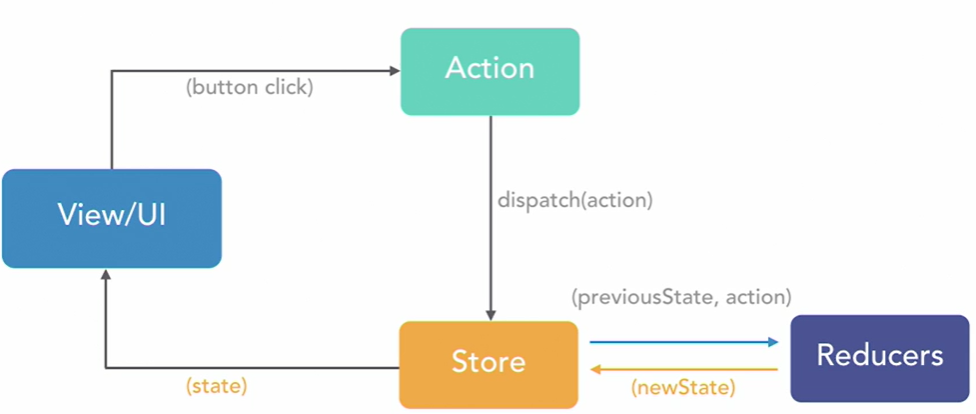

# Building React and ASP.NET Core Applications

## Create new Application
```
dotnet new react
dotnet run
```

Other Web Application Templates:

```
dotnet new
```

* mvc
* webapp
* angular
* react
* reactredux
* webapi
* ...

### index.html
All the React related files can be found inside the `ClientApp` folder. Inside the `public` folder, we can see the `index.html` file. This is the first page that is loaded when the application starts.

```html
<div id="root"></div>
```

!!! note " This will be the only html file in the entire application since React is generally written in JavaScript"

### index.js
Inside the `src` folder,  you can see the `index.js` file. This is the JavaScript file that corresponds to the `index.html`.

```js
const rootElement = document.getElementById('root');

ReactDOM.render(
  <BrowserRouter basename={baseUrl}>
    <App />
  </BrowserRouter>,
  rootElement);
```

### App.js
The `app` component is the main component in React which acts as a container for all the other components.

```js
render () {
  return (
    <Layout>
      <Route exact path='/' component={Home} />
      <Route path='/create' component = {Create} />
      <Route path='/trips' component = {Trips} />
    </Layout>
  );
}
```

## Web API
We can create a folder as "Data" to put in all the data-related files such as models, services, etc.

Then create:

* /Data/Models
* /Data/Services
* /Controllers

## Getting starting with React
In React, the **component** is an individual item that can obtain other items. Extension file is **.jsx**

Getting data into components using:

* **props**: html attribute
* **context**: data through many levels
* **state**: place to store data
* JSX
* lifecycle methods (**componentDidMount**, etc.)

You can only return one single parent module from a react component. This is why we always return a parents div in the render method:

```js
render() {
  return (
    <div></div>
  );
}
```

### List View

* **axios** is required: `npm install axios --save`
* **componentDidMount** lifecycle method is used to get the data from the API endpoint once the UI has been loaded: 

```js
import React, {Component} from 'react';
import axios from 'axios';
export class Trips extends Component
{
  constructor(props){
    super(props);

    this.state = {
      trips: [],
      loading: true
    }
  }

  //Once the component is mounted, it sends a request to get all data
  componentDidMount(){
    this.populateTripsData();
  }

  populateTripsData(){
    axios.get("api/Trips/GetTrips").then(result => {
      const response = result.data;
      this.setState({trips: response, loading: false});
    })
  }

  renderAllTripsTable(trips){
    return (
      <table className="table table-striped">
        <thead>
          <tr>
            <th>Name</th>
            <th>Description</th>
            <th>Date started</th>
            <th>Date completed</th>
            <th>Action</th>
          </tr>
        </thead>
        <tbody>
          {
            trips.map(trip => (
            <tr key={trip.id}>
              <td>{trip.name}</td>
              <td>{trip.description}</td>
              <td>{new Date(trip.dateStarted).toISOString().slice(0,10)}</td>
              <td>{trip.dateCompleted ? new Date(trip.dateCompleted).toISOString().slice(0,10) :  '-' }</td>
              <td> - </td>
            </tr>
            ))
          }                    
        </tbody>
      </table>
    );
  }

  render(){
    let content = this.state.loading ? (
      <p>
        <em>Loading...</em>
      </p>
    ) : (
      this.renderAllTripsTable(this.state.trips)
    )

    return (
      <div>
        <h1>All trips</h1>
        <p>Here you can see all trips</p>
        {content}
      </div>
    );
  }
}
```

### Create View


```js
import React, {Component} from 'react';
import axios from 'axios';

export class Create extends Component{
  constructor(props){
    super(props);

    this.onChange = this.onChange.bind(this);
    this.onSubmit = this.onSubmit.bind(this);

    this.state = {
      name: '',
      description: '',
      dateStarted: null,
      dateCompleted: null
    }
  }

  onChange(value, event) {
    this.setState({
      [event.target.name]: value
    });
  }

  onSubmit(e){
    e.preventDefault();

    let tripObject = {
      Id: Math.floor(Math.random()*1000),
      name: this.state.name,
      description: this.state.description,
      dateStarted: this.state.dateStarted,
      dateCompleted: this.state.dateCompleted
    }

    //post request and redirect to /trips component
    const {history} = this.props;
    axios.post("api/Trips/AddTrip", tripObject).then(result => {
      history.push('/trips');
    })
  }

  render(){
    return (
      <div className="trip-form" >
        <h3>Add new trip</h3>
        <form onSubmit={this.onSubmit}>
          <div className="form-group">
            <label>Trip name:  </label>
            <input 
              type="text" 
              className="form-control" 
              value={this.state.name}
              onChange={this.onChange}
              />
          </div>
          <div className="form-group">
            <label>Trip description: </label>
            <textarea 
              type="text" 
              className="form-control"
              value={this.state.description}
              onChange={this.onChange}
            />
          </div>
          <div className="row">
            <div className="col col-md-6 col-sm-6 col-xs-12">
              <div className="form-group">
                <label>Date of start:  </label>
                <input 
                  type="date" 
                  className="form-control" 
                  value={this.state.dateStarted}
                  onChange={this.onChange}
                />
              </div>
            </div>
            <div className="col col-md-6 col-sm-6 col-xs-12">
              <div className="form-group">
                <label>Date of completion:  </label>
                <input 
                  type="date" 
                  className="form-control" 
                  value={this.state.dateCompleted}
                  onChange={this.onChange}
                />
              </div>
            </div>
          </div>          
          <div className="form-group">
            <input type="submit" value="Add trip" className="btn btn-primary"/>
          </div>
        </form>
      </div>
    )
  }
}
```

### Edit View

Trips.js
```js
onTripUpdate(id){
  const {history} = this.props;
  history.push('/update/'+id);
}
...
<div className="form-group">
  <button onClick={() => this.onTripUpdate(trip.id)} className="btn btn-success">
    Update
  </button>
</div>
```

Apps.js
```js
render () {
    return (
      <Layout>
        ...
        <Route path='/update/:id' component = {Update} />
      </Layout>
    );
  }
```

Update.jsx
```js
import React, {Component} from 'react';
import axios from 'axios';

export class Update extends Component{
  constructor(props){
    super(props);

    this.onChange = this.onChange.bind(this);
    this.onUpdateCancel = this.onUpdateCancel.bind(this);
    this.onSubmit = this.onSubmit.bind(this);

    this.state = {
      name: '',
      description: '',
      dateStarted: null,
      dateCompleted: null
    }
  }

  //Once the component is mounted, it sends a request to get data by id
  componentDidMount(){
    const {id} = this.props.match.params;

    axios.get("api/Trips/SingleTrip/"+id).then(trip => {
      const response = trip.data;

      this.setState({
        name: response.name,
        description: response.description,
        dateStarted: new Date(response.dateStarted).toISOString().slice(0,10),
        dateCompleted: response.dateCompleted ? new Date(response.dateCompleted).toISOString().slice(0,10) : null
      })
    })
  }  

  onChange(value, event) {
    this.setState({
      [event.target.name]: value
    });
  }

  onUpdateCancel(){
    //cancel and redirect to /trips component
    const {history} = this.props;
    history.push('/trips');
  }

  onSubmit(e){
    e.preventDefault();

    let tripObject = {
      name: this.state.name,
      description: this.state.description,
      dateStarted: new Date(this.state.dateStarted).toISOString(),
      dateCompleted: this.state.dateCompleted ? new Date(this.state.dateCompleted).toISOString() : null
    }

    //PUT request and redirect to /trips component
    const {history} = this.props;
    const {id} = this.props.match.params;
    axios.put("api/Trips/updateTrip/"+id, tripObject).then(result => {
      history.push('/trips');
    })
  }

  render(){
    return (
      <div className="trip-form" >
        <h3>Add new trip</h3>
        <form onSubmit={this.onSubmit}>
          <div className="form-group">
            <label>Trip name:  </label>
            <input 
              type="text" 
              className="form-control" 
              value={this.state.name}
              onChange={this.onChangeName}
              />
          </div>
          <div className="form-group">
            <label>Trip description: </label>
            <textarea 
              type="text" 
              className="form-control"
              value={this.state.description}
              onChange={this.onChangeDescription}
            />
          </div>
          <div className="row">
            <div className="col col-md-6 col-sm-6 col-xs-12">
              <div className="form-group">
                <label>Date of start:  </label>
                <input 
                  type="date" 
                  className="form-control" 
                  value={this.state.dateStarted}
                  onChange={this.onChangeDateStarted}
                />
              </div>
            </div>
            <div className="col col-md-6 col-sm-6 col-xs-12">
              <div className="form-group">
                <label>Date of completion:  </label>
                <input 
                  type="date" 
                  className="form-control" 
                  value={this.state.dateCompleted}
                  onChange={this.onChangeDateCompleted}
                />
                </div>
            </div>
          </div>          
          
          <div className="form-group">
              <button onClick={this.onUpdateCancel} className="btn btn-default">Cancel</button>
              <button type="submit" className="btn btn-success">Update</button>
          </div>
        </form>
      </div>
    )
  }
}
```

### Delete View

Trips.js
```js
onTripDelete(id){
  const {history} = this.props;
  history.push('/delete/'+id);
}
...
<div className="form-group">
  <button onClick={() => this.onTripDelete(trip.id)} className="btn btn-danger">
    Delete
  </button>
</div>
```

Apps.js
```js
render () {
    return (
      <Layout>
        ...
        <Route path='/delete/:id' component = {Delete} />
      </Layout>
    );
  }
```

Delete.jsx
```js
import React, {Component} from 'react';
import axios from'axios';

export class Delete extends Component{
  constructor(props){
    super(props);

    this.onCancel = this.onCancel.bind(this);
    this.onConfirmation = this.onConfirmation.bind(this);

    this.state = {
      name: "",
      description:""
    }
  }

  //Once the component is mounted, it sends a request to get data by id
  componentDidMount(){
    const {id} = this.props.match.params;

    axios.get("api/Trips/SingleTrip/"+id).then(trip => {
      const response = trip.data;

      this.setState({
        name: response.name,
        description: response.description
      })
    })
  }

  onCancel(e){
    //cancel and redirect to /trips component
    const {history} = this.props;
    history.push('/trips');
  }

  onConfirmation(e){
    const {id} = this.props.match.params;
    const {history} = this.props;

    axios.delete("api/Trips/DeleteTrip/"+id).then(result => {
      history.push('/trips');
    })
  }

  render(){
    return (
      <div style={{ marginTop: 10 }}>
      <h2>Delete trip confirmation</h2>
      <div class="card">
        <div class="card-body">
          <h4 class="card-title"> {this.state.name} </h4>
          <p class="card-text"> {this.state.description} </p>
          <button onClick={this.onCancel} class="btn btn-default">
            Cancel
          </button>
          <button onClick={this.onConfirmation} class="btn btn-danger">
            Confirm
          </button>
          </div>
        </div>
      </div>
    )
  }
}
```

### Handling errors

Using `axios.catch(error)`

```js
import React, {Component} from 'react';
import axios from 'axios';
export class Trips extends Component
{
  constructor(props){
      super(props);

      this.onTripUpdate = this.onTripUpdate.bind(this);
      this.onTripDelete = this.onTripDelete.bind(this);

      this.state = {
          trips: [],
          loading: true,
          failed: false,
          error: '' //error message
      }
  }

  ...

  populateTripsData(){
    axios.get("api/Trips/GetTrips").then(result => {
      const response = result.data;
      this.setState({trips: response, loading: false, failed: false, error:""});
    }).catch(error => {
      this.setState({trips: [], loading: false, failed: true, error:"Trips could not be loaded"});
    });
  }    

  ...

  render(){
    let content = this.state.loading ? (
      <p>
        <em>Loading...</em>
      </p>
    ) : ( this.state.failed ? (
      <div className="text-danger">
        <em>{this.state.error}</em>
      </div>
    ) : (
      this.renderAllTripsTable(this.state.trips))
    )

    return (
      <div>
        <h1>All trips</h1>
        <p>Here you can see all trips</p>
        {content}
      </div>
    );
  }
}
```

## Redux

Redux is a state magement tool for JS applications. The entire state of an application is stored in one central location:

* The **stores** store the whole state. 
* The **reducers** return parts of this state
* The **actions** are predefined, user-triggered events that define how a state should change.



Require:

* `npm install redux react-redux react-thunk`
* `npm install react-thunk --save`

### Actions
Actions are payloads of information that send data from your application to your store

.\src\actions\tripsActions.js
```js
import axios from 'axios';

export const GET_ALL_TRIPS_REQUEST = 'GET_ALL_TRIPS_REQUEST';
export const GET_ALL_TRIPS_SUCCESS = 'GET_ALL_TRIPS_SUCCESS';
export const GET_ALL_TRIPS_ERROR = 'GET_ALL_TRIPS_ERROR';

const getTripsSuccess = payload => ({
    type: GET_ALL_TRIPS_SUCCESS,
    payload
});

const getTripsError = payload => ({
    type: GET_ALL_TRIPS_ERROR,
    payload
});

//export the action to be able to use it
export const getAllTrips = () => dispatch => {
    dispatch({type: GET_ALL_TRIPS_REQUEST});
    return axios.get('api/Trips/GetTrips').then(res => {
        const response = res.data;
        dispatch(getTripsSuccess(response));
    }).catch(error => {
        dispatch(getTripsError("Something went wrong!"));
        return Promise.reject({});
    })
}
```

### Reducers
Reducers specify how the application's state change

.\src\reducers\tripsReducers.js
```js
import {
  GET_ALL_TRIPS_REQUEST,
  GET_ALL_TRIPS_SUCCESS,
  GET_ALL_TRIPS_ERROR
} from '../actions/tripActions';

const INITIAL_STATE = {
  loading: false,
  hasError: false,
  error: null,
  data: []
}

export default (state=INITIAL_STATE, action) => {
  switch(action.type){
    case GET_ALL_TRIPS_REQUEST:
      return {
        ...state,
        loading: true
      };

    case GET_ALL_TRIPS_SUCCESS:
      return {
        ...state,
        loading: false,
        hasError: false,
        data: action.payload
      };

    case GET_ALL_TRIPS_ERROR:
      return {
        ...state,
        loading: false,
        hasError: true,
        error: action.payload
      };

    default:
      return state;
  }
}
```

.\src\reducers\index.js
```js
import {combineReducers} from 'redux';
import tripReducers from './tripReducers';

const rootReducer = combineReducers({
    trips: tripReducers
});

//export the root reducer to be able to use it
export default rootReducer;
```

### Store

* getSate() - access application state
* dispatch(action) - udpate application state
* subscribe(listener) - register and unregister listeners

Only have a single store in a Redux application:

.\src\store\store.js
```js
import {createStore, applyMiddleware} from 'redux'
import thunk from 'redux-thunk';
import rootReducer from '../reducers';

const configureStore = () => applyMiddleware(thunk)(createStore)(rootReducer);

//export the configure store to be able to use it
export default configureStore;
```

### List View with redux
We want to load all the trips using the redux instead of just calling them directly from our component to web API:

.\src\index.js
```js
import {Provider} from 'react-redux';       //required for redux
import configureStore from './store/store'; //required for redux
...
const store = configureStore({});
...
ReactDOM.render(
  <Provider store={store}>                  //using the store
    <BrowserRouter basename={baseUrl}>
      <App />
    </BrowserRouter>
  </Provider>,
  rootElement);
...
```

.\src\Apps.js
```js
...
import Trips from './components/Trip/Trips'; //instead of { Trips }
...
```

.\src\components\Trip\Trips.jsx 
```js
import {connect} from 'react-redux';
import {getAllTrips} from '../../actions/tripActions';
...
  componentDidMount(){
    this.props.getAllTrips();     //get trips from tripActions
  }
  componentDidUpdate(prevProps){
    if(prevProps.trips.data != this.props.trips.data){
      this.setState({trips: this.props.trips.data});
    }
  }
  ...
  render(){
    let content = this.props.trips.loading ? 
    (
      <p>
        <em>Loading...</em>
      </p>
    ) : (
      //build the table if there is one or more trips
      this.state.trips.length && this.renderAllTripsTable(this.state.trips) 
    );
...
const mapStateToProps = ({trips}) => ({
  trips
});
//Allow the Trips component to access data from store.
export default connect(mapStateToProps, {getAllTrips})(Trips); 
```

## Authentication using Auth0

* Log in into [https://auth0.com](https://auth0.com). signed in as rnietoe.eu.auth0.com
* Create Single Page Web Application and configure Auth0 from Settings
    * Set Allowed Callback Urls equals https://localhost:5001 
    * Set Allowed Web Origins equals https://localhost:5001 
    * Set Allowed Logout Urls equals https://localhost:5001 
* Install dependencies: `npm install @auth0-spa-js --save`
* Install the Auth0 React wrapper (`react-auth0-spa.js`) in our src directory. Copy paste from [documenation](https://manage.auth0.com/dashboard/eu/rnietoe/applications/0D2Ab46Xq5dBEueBDtX4Cg9vl8rsUyz5/quickstart).
* Create/Update the NavMenu component (./src/components/NavMenu.js)
```js
import React, { Component } from 'react';
import { Collapse, Container, Navbar, NavbarBrand, NavbarToggler, NavItem, NavLink } from 'reactstrap';
import { Link } from 'react-router-dom';
import {useAuth0} from '../auth0-wrapper'; //allow to use methods from the authentication wrapper

import './NavMenu.css';

//change class component to funcion component
const NavMenu = () => {
  //define methods from the authentication wrapper
  const {isAuthenticated, loginWithRedirect, logout} = useAuth0(); 

  return (
    <header>
      <Navbar className="navbar-expand-sm navbar-toggleable-sm ng-white border-bottom box-shadow mb-3" light>
        <Container>
          <NavbarBrand tag={Link} to="/">Trips</NavbarBrand>
          {isAuthenticated ? (
            <ul className="navbar-nav flex-grow">
              <NavItem>
                <NavLink tag={Link} className="text-dark" to="/create">Create</NavLink>
              </NavItem>
              <NavItem>
                <NavLink tag={Link} className="text-dark" to="/trips">Trips</NavLink>
              </NavItem>
              <NavItem>
                <button className="btn btn-danger" onClick={() => logout()}>Log out</button>
              </NavItem>
            </ul>
          ) : (
            <ul className="navbar-nav flex-grow">
              <NavItem>
                <button className="btn btn-success" onClick={() => loginWithRedirect()}>Log In</button>
              </NavItem>
            </ul>
          )}
        </Container>
      </Navbar>
    </header>
  );
}
//allow to use the NavMenu
export default NavMenu;
```

* Update Index (.\src\index.js)
```js
...
import {Auth0Provider} from './auth0-wrapper';
import config from './auth_config.json'

//function that will route the user after the user logs in
const onRedirectCallback = appState => {
  window.history.replaceState(
    {},
    document.title,
    appState && appState.targetUrl ? appState.targetUrl
    : window.location.pathname
  );
};
ReactDOM.render(
  <Auth0Provider
    domain={config.domain}
    client_id={config.clientId}
    redirect_uri={window.location.origin}
    onRedirectCallback={onRedirectCallback}>

    <BrowserRouter basename={baseUrl}>
      <App />
    </BrowserRouter>
    
  </Auth0Provider>
  ,
  rootElement);

registerServiceWorker();
```

    .\src\auth_config.json
    ```json
    {
      "domain": "rnietoe.eu.auth0.com",
      "clientId": "0D2Ab46Xq5dBEueBDtX4Cg9vl8rsUyz5"
    }
    ```

    .\src\components\Layout.js
    ```js
    ...
    import NavMenu from './components/NavMenu'; //instead of { NavMenu }
    ...
    ```
